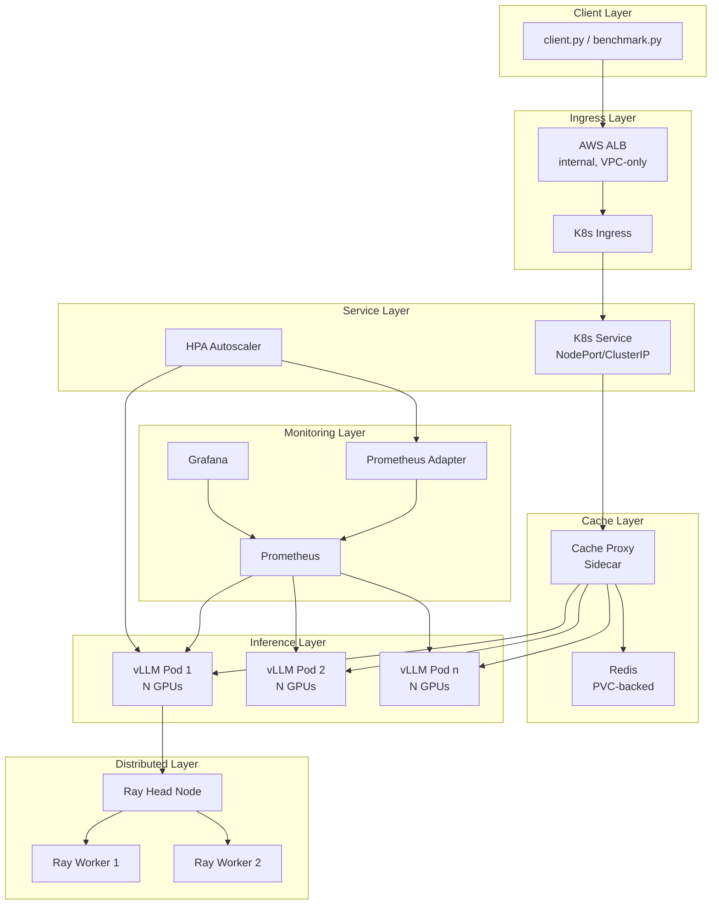
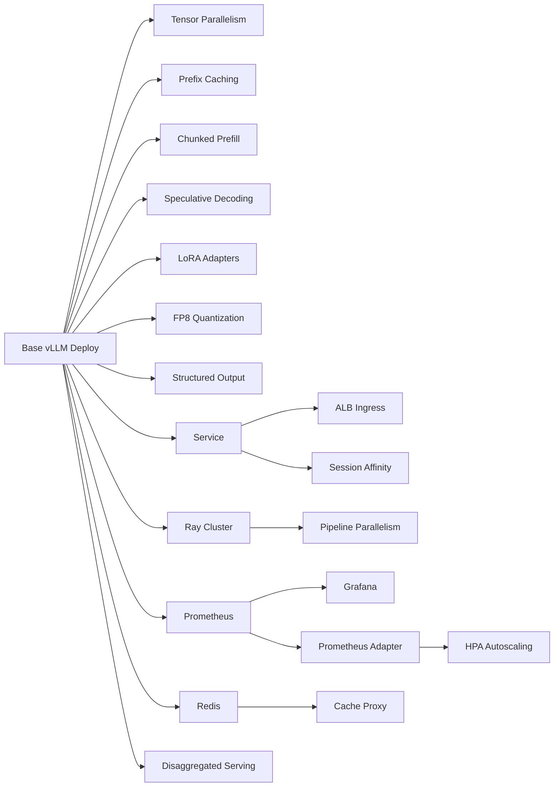

# Design Document: Advanced vLLM Inference on HyperPod EKS

## Overview

This design describes the architecture for `hyperpod_eks_vllm_advanced`, a modular showcase project that demonstrates production-grade vLLM inference patterns on Amazon SageMaker HyperPod EKS. The project graduates from the basic single-GPU experiment (`hyperpod_eks_vllm_basic`) into a comprehensive reference implementation covering multi-GPU/multi-node parallelism, VPC-native networking with ALB, distributed KV cache sharing, and a suite of vLLM optimization techniques.

The core design principle is **modularity**: every advanced technique is a separate Kubernetes manifest file with a corresponding Makefile target, deployable and removable independently. The base vLLM deployment works standalone; each feature layers on top without coupling.

### Key Design Decisions

1. **Separate manifests per feature** rather than a monolithic deployment.yaml — enables independent toggling and clear learning progression
2. **Commented vLLM arg blocks** in the base deployment — users uncomment features rather than writing args from scratch
3. **KubeRay for multi-node** — Ray is vLLM's native distributed backend; KubeRay provides Kubernetes-native lifecycle management
4. **Redis as L3 cache proxy** — a sidecar/proxy pattern that intercepts requests and caches prompt metadata, bypassing Redis gracefully when unavailable
5. **Prometheus + Grafana via raw manifests** — avoids Helm dependency; keeps the project self-contained and educational
6. **Single Docker image** with all dependencies — simplifies deployment; features are toggled via vLLM CLI args, not image variants

## Architecture

### High-Level Component Diagram



### Request Flow

1. Client sends request to ALB DNS endpoint (or port-forward for local dev)
2. ALB routes to Kubernetes Ingress → Service → vLLM pod(s)
3. Optional cache proxy checks Redis for prompt prefix metadata; on hit, adds routing hints
4. vLLM processes the request using configured optimizations (tensor parallelism, prefix caching, chunked prefill, speculative decoding, etc.)
5. For multi-node: Ray coordinates pipeline parallelism across worker nodes
6. Prometheus scrapes `/metrics` from all vLLM pods; Grafana visualizes dashboards
7. HPA reads custom metrics via Prometheus Adapter and scales replicas

## Components and Interfaces

### Project Directory Layout

```
hyperpod_eks_vllm_advanced/
├── README.md                          # Comprehensive learning guide
├── Makefile                           # Per-feature deploy/delete targets
├── Dockerfile                         # Advanced image with Ray, Redis deps
├── requirements.txt                   # Pinned Python dependencies
├── .gitignore                         # Standard exclusions
├── client.py                          # Advanced inference client
├── benchmark.py                       # Performance benchmarking tool
├── cache_proxy.py                     # Redis L3 cache proxy script
├── manifests/
│   ├── vllm-deployment.yaml           # Base vLLM deployment (multi-GPU ready)
│   ├── vllm-service.yaml              # NodePort/ClusterIP service
│   ├── alb-ingress.yaml               # ALB Ingress with health checks
│   ├── ray-cluster.yaml               # KubeRay head + workers
│   ├── redis.yaml                     # Redis with PVC
│   ├── prometheus.yaml                # Prometheus with service discovery
│   ├── grafana.yaml                   # Grafana with pre-configured dashboard
│   ├── hpa.yaml                       # HPA with custom metrics
│   ├── prometheus-adapter.yaml        # Prometheus Adapter for custom metrics
│   └── disaggregated-serving.yaml     # Prefill/decode worker pools
└── schemas/
    ├── entity-extraction.json         # Example JSON schema
    ├── classification.json            # Example JSON schema
    └── structured-summary.json        # Example JSON schema
```

### Component Details

#### 1. Base vLLM Deployment (`manifests/vllm-deployment.yaml`)

The core Deployment manifest with commented arg blocks for each feature:

```yaml
# Container args structure (conceptual):
args:
  - "meta-llama/Llama-3.1-8B-Instruct"
  - "--tensor-parallel-size"
  - "1"                              # Change to 2/4/8 for multi-GPU
  - "--gpu-memory-utilization"
  - "0.9"
  - "--host"
  - "0.0.0.0"
  - "--port"
  - "8000"
  ## --- Prefix Caching ---
  # - "--enable-prefix-caching"
  ## --- Chunked Prefill ---
  # - "--enable-chunked-prefill"
  ## --- Speculative Decoding ---
  # - "--speculative-model"
  # - "meta-llama/Llama-3.2-1B"
  # - "--num-speculative-tokens"
  # - "5"
  ## --- LoRA Adapters ---
  # - "--enable-lora"
  # - "--max-loras"
  # - "4"
  # - "--max-lora-rank"
  # - "64"
  ## --- FP8 Quantization ---
  # - "--quantization"
  # - "fp8"
  ## --- Structured Output (enabled by default in vLLM) ---
```

GPU resources are configurable: `nvidia.com/gpu: 1` (default) up to 8 for tensor parallelism. Shared memory volume (`/dev/shm`) is mounted with `sizeLimit` scaled to GPU count.

#### 2. Kubernetes Service (`manifests/vllm-service.yaml`)

- Type: `NodePort` (default) with option to switch to `LoadBalancer`
- Port 8000 → targetPort 8000
- Label selector: `app: vllm-advanced-server`
- Readiness probe on `/health`

#### 3. ALB Ingress (`manifests/alb-ingress.yaml`)

- Annotations for AWS Load Balancer Controller:
  - `kubernetes.io/ingress.class: alb`
  - `alb.ingress.kubernetes.io/scheme: internal`
  - `alb.ingress.kubernetes.io/target-type: ip`
  - `alb.ingress.kubernetes.io/healthcheck-path: /health`
  - `alb.ingress.kubernetes.io/listen-ports: '[{"HTTP": 80}]'`
- Commented TLS annotations for HTTPS (ACM certificate ARN)
- Optional sticky session annotation: `alb.ingress.kubernetes.io/target-group-attributes: stickiness.enabled=true,stickiness.lb_cookie.duration_seconds=3600`

#### 4. Ray Cluster (`manifests/ray-cluster.yaml`)

- KubeRay `RayCluster` CRD with:
  - Head node: 1 replica, no GPU (coordination only)
  - Worker group: configurable replicas (default 2), each with N GPUs
  - `rayStartParams` configured for distributed vLLM
  - Same Docker image as vLLM pods
- vLLM connects to Ray via `RAY_ADDRESS` environment variable
- NCCL environment variables for GPU communication (`NCCL_SOCKET_IFNAME`, `NCCL_DEBUG`)

#### 5. Redis Cache (`manifests/redis.yaml`)

- Single-node Redis Deployment with PVC (1Gi default)
- Service exposing port 6379
- Resource limits for memory (512Mi default)
- No authentication (internal cluster use; documented as a simplification)

#### 6. Cache Proxy (`cache_proxy.py`)

- Python script that runs as a sidecar or standalone proxy
- Intercepts incoming inference requests on a configurable port
- Computes SHA-256 hash of prompt prefix tokens
- Checks Redis for cached metadata (prompt hash → token count, routing hints)
- On cache miss: forwards to vLLM, stores metadata in Redis with configurable TTL (default 3600s)
- On Redis failure: bypasses cache transparently, logs warning
- Exposes `/health` endpoint for readiness probes

#### 7. Prometheus (`manifests/prometheus.yaml`)

- Prometheus Deployment with ConfigMap for `prometheus.yml`
- Kubernetes service discovery (`kubernetes_sd_configs`) targeting pods with label `app: vllm-advanced-server`
- Scrape interval: 15s
- Scrape path: `/metrics` (vLLM's native Prometheus endpoint)
- Service on port 9090

#### 8. Grafana (`manifests/grafana.yaml`)

- Grafana Deployment with ConfigMap for:
  - Datasource provisioning (Prometheus URL)
  - Dashboard JSON (pre-built vLLM dashboard)
- Dashboard panels: request latency (P50/P95/P99), throughput (req/s, tokens/s), GPU memory utilization, KV cache utilization, batch size distribution, queue depth
- Service on port 3000

#### 9. HPA (`manifests/hpa.yaml`)

- HorizontalPodAutoscaler targeting the vLLM Deployment
- Metrics source: custom metrics via Prometheus Adapter
- Scaling metric: `vllm:num_requests_waiting` (pending queue depth)
- Min replicas: 1, Max replicas: 4
- Scale-up stabilization: 60s, Scale-down stabilization: 300s

#### 10. Prometheus Adapter (`manifests/prometheus-adapter.yaml`)

- Deployment of `prometheus-adapter` with ConfigMap rules
- Maps `vllm:num_requests_waiting` Prometheus metric to Kubernetes custom metrics API
- Registered as APIService for `custom.metrics.k8s.io`

#### 11. Disaggregated Serving (`manifests/disaggregated-serving.yaml`)

- Separate Deployments for prefill and decode worker pools
- Prefill workers: optimized for prompt processing (higher batch size, more compute)
- Decode workers: optimized for token generation (lower latency)
- Documented as experimental; requires vLLM v0.6.0+

#### 12. Client Script (`client.py`)

Extended from the basic client with:
- `--url` flag supporting ALB endpoint URLs
- `--lora` flag to specify LoRA adapter name in the `model` field
- `--json-mode` flag to enable `response_format: {"type": "json_object"}`
- `--schema` flag to pass a JSON schema file path for `guided_json`
- `--streaming` flag for SSE streaming responses

#### 13. Benchmark Script (`benchmark.py`)

- Configurable concurrency (`--concurrency N`)
- Measures: throughput (tokens/s), time-to-first-token (TTFT), end-to-end latency, inter-token latency (ITL)
- `--compare` mode: runs same workload with two configurations, outputs side-by-side table
- Output formats: human-readable table (default) and JSON (`--output json`)
- Uses `asyncio` + `aiohttp` for concurrent request generation

#### 14. Dockerfile

```dockerfile
FROM nvidia/cuda:12.4.1-devel-ubuntu22.04
# Install Python, vLLM with Ray support, redis-py
# Pin versions in requirements.txt for reproducibility
# ENTRYPOINT ["vllm", "serve"]
```

Key additions over basic image:
- `ray[default]` for distributed inference
- `redis` (redis-py) for L3 cache integration
- `aiohttp` for benchmark script
- Pinned versions in `requirements.txt`

#### 15. Makefile Targets

| Category | Target | Description |
|----------|--------|-------------|
| Build | `build` | Build Docker image `hyperpod-eks-vllm-advanced` |
| Build | `login` | ECR login |
| Build | `tag` | Tag image for ECR |
| Build | `push` | Push to ECR |
| Core | `deploy` | Deploy base vLLM + service |
| Core | `delete` | Delete base vLLM + service |
| Core | `list-pods` | List vLLM pods |
| Core | `watch-logs` | Tail vLLM logs |
| Core | `get-endpoint` | Print service endpoint URL |
| Feature | `deploy-alb` / `delete-alb` | ALB Ingress |
| Feature | `deploy-ray` / `delete-ray` | Ray cluster |
| Feature | `deploy-redis` / `delete-redis` | Redis cache |
| Feature | `deploy-monitoring` / `delete-monitoring` | Prometheus + Grafana |
| Feature | `deploy-hpa` / `delete-hpa` | HPA + Prometheus Adapter |
| Feature | `deploy-disaggregated` / `delete-disaggregated` | Disaggregated serving |
| Test | `test-inference` | Run client.py |
| Test | `benchmark` | Run benchmark.py |
| Utility | `port-forward` | Port-forward vLLM service |
| Utility | `port-forward-grafana` | Port-forward Grafana |
| Utility | `deploy-all` | Deploy all components |
| Utility | `delete-all` | Delete all components |


## Data Models

### Kubernetes Resource Labels

All resources use a consistent labeling scheme:

```yaml
labels:
  app: vllm-advanced-server          # Primary selector
  component: <component-name>        # e.g., vllm, redis, prometheus, grafana, ray-head, ray-worker
  part-of: hyperpod-eks-vllm-advanced
```

### vLLM Container Args Model

Each feature maps to a set of vLLM CLI arguments. The deployment manifest organizes these as commented blocks:

| Feature | vLLM Arguments | Manifest File |
|---------|---------------|---------------|
| Tensor Parallelism | `--tensor-parallel-size N` | `vllm-deployment.yaml` |
| Pipeline Parallelism | `--pipeline-parallel-size M` | `vllm-deployment.yaml` + `ray-cluster.yaml` |
| Prefix Caching | `--enable-prefix-caching` | `vllm-deployment.yaml` |
| Chunked Prefill | `--enable-chunked-prefill` | `vllm-deployment.yaml` |
| Speculative Decoding | `--speculative-model <model>`, `--num-speculative-tokens N` | `vllm-deployment.yaml` |
| LoRA Adapters | `--enable-lora`, `--max-loras N`, `--max-lora-rank N` | `vllm-deployment.yaml` |
| FP8 Quantization | `--quantization fp8` | `vllm-deployment.yaml` |
| Structured Output | Native (no extra args needed) | N/A |
| Disaggregated Serving | Separate deployment configs | `disaggregated-serving.yaml` |

### Redis Cache Data Model

```
Key:    "prefix:<sha256_hash>"
Value:  JSON string {
          "token_count": int,
          "model": string,
          "created_at": ISO8601 timestamp,
          "routing_hint": string (pod name that computed this prefix)
        }
TTL:    Configurable (default 3600 seconds)
```

### Benchmark Output Schema

```json
{
  "config": {
    "url": "string",
    "concurrency": "int",
    "num_requests": "int",
    "prompt": "string"
  },
  "results": {
    "throughput_tokens_per_sec": "float",
    "avg_ttft_ms": "float",
    "p50_latency_ms": "float",
    "p95_latency_ms": "float",
    "p99_latency_ms": "float",
    "avg_itl_ms": "float",
    "total_duration_sec": "float",
    "successful_requests": "int",
    "failed_requests": "int"
  }
}
```

### Grafana Dashboard Data Model

The pre-configured dashboard queries these Prometheus metrics:

| Panel | Prometheus Query | Description |
|-------|-----------------|-------------|
| Request Latency | `histogram_quantile(0.95, rate(vllm:request_duration_seconds_bucket[5m]))` | P95 end-to-end latency |
| Throughput | `rate(vllm:request_success_total[5m])` | Requests per second |
| Token Throughput | `rate(vllm:generation_tokens_total[5m])` | Generated tokens per second |
| GPU Memory | `vllm:gpu_cache_usage_perc` | GPU KV cache memory utilization |
| KV Cache Usage | `vllm:gpu_cache_usage_perc` | Percentage of KV cache blocks in use |
| Batch Size | `vllm:num_requests_running` | Current running batch size |
| Queue Depth | `vllm:num_requests_waiting` | Pending requests in queue |

### Feature Dependency Graph




## Correctness Properties

*A property is a characteristic or behavior that should hold true across all valid executions of a system — essentially, a formal statement about what the system should do. Properties serve as the bridge between human-readable specifications and machine-verifiable correctness guarantees.*

This project is primarily infrastructure (Kubernetes manifests, Dockerfiles, documentation). Most acceptance criteria are static content checks (SMOKE) or require a live cluster (INTEGRATION). Property-based testing applies to the Python logic components: the cache proxy, the client request builder, and the benchmark tool.

### Property 1: Cache key determinism and consistency

*For any* prompt string, computing the cache key (SHA-256 hash of the prompt prefix) twice SHALL produce the same key, and different prompts SHALL produce different keys with high probability.

**Validates: Requirements 9.4**

### Property 2: Client request payload completeness

*For any* combination of valid client configuration options (LoRA adapter name, JSON mode flag, JSON schema object), the constructed OpenAI-compatible request payload SHALL contain all specified fields: the adapter name in the `model` field when LoRA is specified, `response_format` with `type: json_object` when JSON mode is enabled, and the schema in `guided_json` when a schema is provided.

**Validates: Requirements 14.3, 17.1**

### Property 3: Benchmark percentile computation correctness

*For any* non-empty list of latency measurements, the computed P50 value SHALL be less than or equal to P95, P95 SHALL be less than or equal to P99, and P99 SHALL be less than or equal to the maximum value in the list.

**Validates: Requirements 18.4**

### Property 4: Benchmark results serialization round-trip

*For any* valid benchmark results object, serializing to JSON and deserializing back SHALL produce an object with identical field values (throughput, TTFT, latency percentiles, ITL, duration, request counts).

**Validates: Requirements 18.5**

## Error Handling

### Cache Proxy Error Handling

| Error Condition | Behavior | Recovery |
|----------------|----------|----------|
| Redis connection refused | Bypass cache, forward request directly to vLLM | Log warning, continue serving without cache |
| Redis timeout | Bypass cache after timeout (default 100ms) | Log warning, continue serving |
| Redis returns corrupted data | Treat as cache miss, recompute | Log error, store fresh entry |
| vLLM server unavailable | Return HTTP 502 to client | Rely on Kubernetes readiness probe to remove pod from service |
| Invalid prompt (empty body) | Return HTTP 400 with error message | No retry needed |

### Kubernetes Resource Error Handling

| Error Condition | Behavior | Recovery |
|----------------|----------|----------|
| vLLM pod OOM | Pod killed by OOM killer | Kubernetes restarts pod; README documents reducing `--gpu-memory-utilization` or using FP8 |
| Ray worker disconnection | Ray head logs disconnection | vLLM health endpoint reports unhealthy; Kubernetes restarts worker pod |
| ALB health check failure | ALB removes pod from target group | Pod continues running; readiness probe must pass before re-added |
| Prometheus scrape failure | Missing metrics for affected pod | Prometheus retries on next scrape interval (15s) |
| HPA metric unavailable | HPA maintains current replica count | Prometheus Adapter reconnects; HPA resumes scaling on next evaluation |
| Redis PVC full | Redis evicts keys per maxmemory-policy | README documents monitoring Redis memory and increasing PVC size |
| Model download failure | vLLM pod fails to start | Kubernetes restarts pod; README documents checking HF token and network |

### Client and Benchmark Error Handling

| Error Condition | Behavior | Recovery |
|----------------|----------|----------|
| Connection refused | Print error message with URL, exit 1 | User checks endpoint URL and port-forward |
| HTTP 4xx from vLLM | Print status code and error body | User checks request format |
| HTTP 5xx from vLLM | Print status code and error body | User checks vLLM logs |
| Timeout during benchmark | Record as failed request in results | Configurable timeout (default 120s) |
| Invalid JSON schema file | Print parse error, exit 1 | User fixes schema file |

## Testing Strategy

### Testing Approach

This project has two distinct testing surfaces:

1. **Static content validation** (majority of requirements): Verify that files exist, manifests contain expected fields, documentation includes required sections. These are best served by example-based smoke tests.

2. **Python logic validation** (cache proxy, client, benchmark): Verify correctness of hashing, request construction, and statistical computation. These benefit from property-based testing.

### Unit Tests (Example-Based)

Focus areas:
- Cache proxy: Redis bypass on connection failure (mock Redis raising `ConnectionError`)
- Cache proxy: Correct metadata structure stored in Redis (mock Redis, verify stored JSON)
- Client: Request construction with each flag combination (--lora, --json-mode, --schema)
- Client: Fallback from chat completion to text completion on 4xx
- Benchmark: Output format (table vs JSON) for sample data
- Benchmark: `--compare` mode produces side-by-side output

### Property-Based Tests

Library: [Hypothesis](https://hypothesis.readthedocs.io/) (Python)

Each property test runs a minimum of 100 iterations.

| Property | Test Description | Tag |
|----------|-----------------|-----|
| Property 1 | Generate random prompt strings, verify SHA-256 cache key is deterministic and collision-resistant | Feature: advanced-vllm-inference, Property 1: Cache key determinism |
| Property 2 | Generate random (adapter_name, json_mode, schema) tuples, verify request payload contains all specified fields | Feature: advanced-vllm-inference, Property 2: Client request payload completeness |
| Property 3 | Generate random non-empty float lists, compute percentiles, verify P50 ≤ P95 ≤ P99 ≤ max | Feature: advanced-vllm-inference, Property 3: Benchmark percentile ordering |
| Property 4 | Generate random benchmark result dicts, serialize to JSON, deserialize, verify equality | Feature: advanced-vllm-inference, Property 4: Benchmark results round-trip |

### Smoke Tests (Static Validation)

Verify project structure and manifest content without requiring a live cluster:

- Directory structure: `hyperpod_eks_vllm_advanced/` exists with expected files
- Manifest files: Each feature has a YAML file in `manifests/`
- Makefile targets: All required targets (build, deploy, delete, per-feature targets) exist
- Deployment manifest: Contains commented arg blocks for each feature
- .gitignore: Contains expected exclusion patterns
- README.md: Contains required sections (Quick Start, prerequisites, troubleshooting, feature matrix, learning path)
- Dockerfile: Uses CUDA 12.4+ base, installs vLLM + Ray + redis-py
- requirements.txt: Has pinned versions
- schemas/: Contains expected JSON schema files

### Integration Tests (Require Live Cluster)

These are documented in the README as manual verification steps:

- Deploy base vLLM, verify `/health` endpoint
- Deploy/delete each feature manifest independently, verify base still healthy
- Deploy ALB, verify DNS endpoint accessible within VPC
- Deploy monitoring, verify Grafana dashboard loads
- Deploy HPA, generate load, verify replica scaling
- Deploy Redis + cache proxy, verify cache hit/miss behavior

