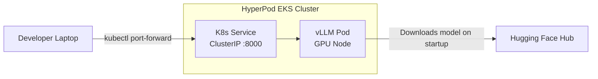
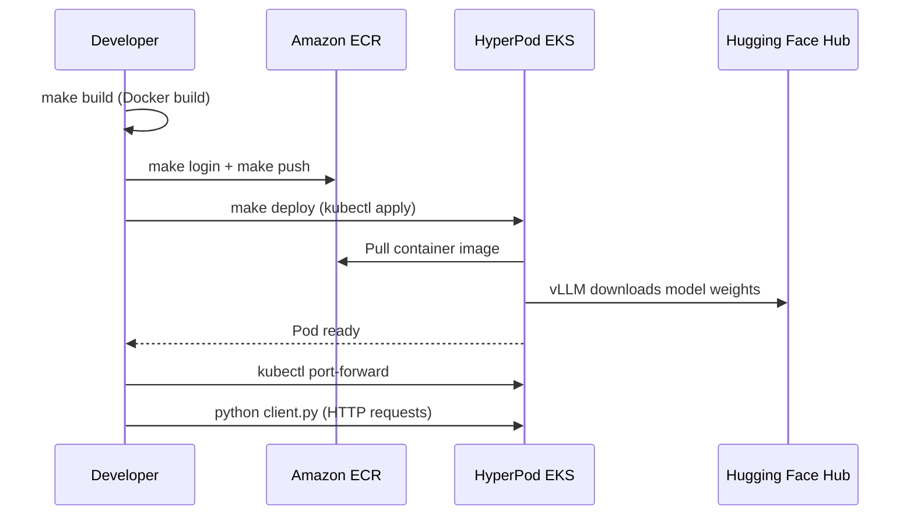

# Design Document

## Overview

This design describes a learning-focused experimental project for running vLLM inference on a HyperPod EKS cluster. The project follows the repository's standard layout under `_experiments/hyperpod_eks_vllm` and provides a minimal, self-contained setup: a Dockerfile that builds a vLLM-ready container image, a Kubernetes manifest that deploys it with GPU resources, a Python client script for interacting with the OpenAI-compatible API, and a Makefile that ties the workflow together.

### Design Decision: Official vLLM Image vs Custom Dockerfile

Two approaches exist for the container image:

1. **Use the official `vllm/vllm-openai` image directly** in the K8s manifest (no Dockerfile needed)
2. **Build a custom image** from an NVIDIA CUDA base, installing vLLM via pip

We choose option 2 (custom Dockerfile) because:
- The requirements explicitly call for a Dockerfile in the project
- It teaches the learner how vLLM dependencies work (CUDA, PyTorch, vLLM pip package)
- It allows pinning specific versions for reproducibility
- It follows the existing workspace pattern where projects build and push their own images to ECR
- The Makefile build/login/tag/push workflow is a core learning objective

The Dockerfile uses `nvidia/cuda:12.4.1-devel-ubuntu22.04` as the base image, installs Python 3.10, then installs vLLM via pip. The entrypoint runs the `vllm serve` command.

### Design Decision: vLLM Server Configuration

vLLM exposes configuration through CLI arguments to `vllm serve`. Rather than baking configuration into the Docker image, we pass all tunable parameters (model name, tensor parallelism, GPU memory utilization) as container command arguments in the K8s manifest. This means changing a model only requires editing the manifest and running `make deploy` — no image rebuild needed.

### Design Decision: Default Model

We use `facebook/opt-1.3b` as the default model because:
- It fits on a single GPU with modest memory (~3GB)
- It does not require Hugging Face authentication (not a gated model)
- It supports chat completions through vLLM's OpenAI-compatible API
- It downloads quickly, making the first deployment fast

## Architecture

The system has three components connected in a linear flow:



### Deployment Flow



## Components and Interfaces

### 1. Dockerfile

Builds a container image with vLLM installed on an NVIDIA CUDA base.

| Aspect | Detail |
|--------|--------|
| Base image | `nvidia/cuda:12.4.1-devel-ubuntu22.04` |
| Python | 3.10 (installed via apt) |
| Key packages | `vllm` (pip install) |
| Entrypoint | `python -m vllm.entrypoints.openai.api_server` |
| Exposed port | 8000 |

The image does NOT bundle any model weights. Models are downloaded at runtime from Hugging Face Hub, keeping the image small and model-agnostic.

### 2. Kubernetes Manifest (`deployment.yaml`)

A single YAML file containing both a Deployment and a Service.

**Deployment spec:**
- Label: `app: vllm-server`
- Replicas: 1
- GPU request: `nvidia.com/gpu: 1`
- Toleration: `nvidia.com/gpu` (Exists/NoSchedule) for scheduling on GPU nodes
- Shared memory: emptyDir with `medium: Memory` mounted at `/dev/shm` (required for PyTorch tensor operations)
- Container args: `--model`, `--tensor-parallel-size`, `--gpu-memory-utilization`, `--host 0.0.0.0`, `--port 8000`
- Environment variables for optional HF token (`HUGGING_FACE_HUB_TOKEN`)

**Service spec:**
- Type: ClusterIP
- Port: 8000 → 8000
- Selector: `app: vllm-server`

### 3. Makefile

Follows the workspace standard targets pattern observed in existing projects.

| Target | Command | Purpose |
|--------|---------|---------|
| `build` | `docker build --tag hyperpod-eks-vllm .` | Build the Docker image |
| `login` | `aws ecr get-login-password ... \| docker login ...` | Authenticate to ECR |
| `tag` | `docker tag hyperpod-eks-vllm:latest {ecr}/hyperpod-eks-vllm:latest` | Tag for ECR |
| `push` | `docker push {ecr}/hyperpod-eks-vllm:latest` | Push to ECR |
| `deploy` | `kubectl apply -f deployment.yaml` | Deploy to cluster |
| `delete` | `kubectl delete -f deployment.yaml` | Remove deployment |
| `list-pods` | `kubectl get pods -l app=vllm-server -o wide` | List vLLM pods |
| `watch-logs` | `kubectl logs -f -l app=vllm-server` | Stream pod logs |
| `port-forward` | `kubectl port-forward svc/vllm-server 8000:8000` | Forward API port locally |

ECR path: `842413447717.dkr.ecr.us-west-2.amazonaws.com/hyperpod-eks-vllm:latest`

### 4. Client Script (`client.py`)

A simple Python script using the `requests` library.

**Behavior:**
1. Query `/v1/models` to display the currently loaded model name
2. Send a chat completion request to `/v1/chat/completions`
3. Print the response text to stdout
4. On HTTP errors, print status code and response body to stderr

**Interface:**
- `--url` argument (default: `http://localhost:8000`) — the vLLM server base URL
- Uses only the `requests` library (listed in `requirements.txt`)

### 5. README.md

Structured documentation covering:
- Overview and purpose
- Prerequisites (kubectl, Docker, AWS CLI, GPU nodes)
- Build and push instructions
- Deploy instructions
- Port-forward and client usage
- vLLM configuration options (model, tensor parallelism, GPU memory)
- Model switching guide with recommended models table
- Gated model authentication
- Troubleshooting tips

### 6. Supporting Files

- `requirements.txt`: Contains `requests` (for client.py)
- `.gitignore`: Excludes `__pycache__/`, `*.pyc`, `.venv/`, `.DS_Store`

## Data Models

This project has no persistent data models. All state is ephemeral:

- **Model weights**: Downloaded by vLLM at pod startup into the container's filesystem (lost on pod restart)
- **Inference requests/responses**: Stateless HTTP request-response over the OpenAI-compatible API

### API Interface (vLLM OpenAI-Compatible)

The vLLM server exposes these endpoints (provided by vLLM, not implemented by us):

| Endpoint | Method | Purpose |
|----------|--------|---------|
| `/v1/models` | GET | List currently loaded models |
| `/v1/chat/completions` | POST | Chat completion inference |
| `/health` | GET | Health check |

**Chat completion request body** (sent by client.py):
```json
{
  "model": "facebook/opt-1.3b",
  "messages": [
    {"role": "user", "content": "What is machine learning?"}
  ],
  "max_tokens": 256,
  "temperature": 0.7
}
```

**Chat completion response body** (returned by vLLM):
```json
{
  "id": "cmpl-...",
  "object": "chat.completion",
  "model": "facebook/opt-1.3b",
  "choices": [
    {
      "index": 0,
      "message": {"role": "assistant", "content": "..."},
      "finish_reason": "stop"
    }
  ],
  "usage": {"prompt_tokens": 10, "completion_tokens": 50, "total_tokens": 60}
}
```

## Error Handling

Since this is a learning-focused project, error handling is kept simple and informative:

| Component | Error Scenario | Handling |
|-----------|---------------|----------|
| Dockerfile | Build failure (pip install) | Build fails with pip error output; user reads error and fixes |
| vLLM Server | Model download failure | vLLM logs descriptive error including the model identifier that failed; pod enters CrashLoopBackOff; user checks logs via `make watch-logs` |
| vLLM Server | Insufficient GPU memory | vLLM logs OOM error; user adjusts `--gpu-memory-utilization` or switches to a smaller model |
| vLLM Server | Invalid HF token for gated model | vLLM logs authentication error; user verifies token in K8s secret/env var |
| Client Script | Connection refused | `requests.ConnectionError` caught; prints message suggesting port-forward is not running |
| Client Script | HTTP error (4xx/5xx) | Prints status code and response body to stderr |
| Client Script | vLLM server not ready | Connection timeout; prints message suggesting waiting for model load |
| K8s Deployment | Pod not scheduling | No GPU nodes available or taint not tolerated; user checks `kubectl describe pod` |

## Testing Strategy

### Why Property-Based Testing Does Not Apply

This project consists of:
- **Infrastructure configuration** (Dockerfile, K8s manifest, Makefile) — declarative files, not functions
- **A thin HTTP client script** — a simple wrapper around `requests` with no meaningful input variation
- **Documentation** (README)

There are no pure functions with clear input/output behavior, no parsers, no serializers, no algorithms, and no business logic that would benefit from property-based testing. The client script is a straightforward HTTP call with fixed structure.

### Recommended Testing Approach

**Manual smoke testing** is the appropriate strategy for this learning project:

1. **Docker build verification**: `make build` completes without errors
2. **ECR push verification**: `make push` succeeds and image appears in ECR
3. **Deployment verification**: `make deploy` creates pod; `make list-pods` shows Running status
4. **API verification**: `make port-forward` then `python client.py` returns a model response
5. **Model switching verification**: Change model identifier in `deployment.yaml`, `make deploy`, verify new model loads
6. **Error path verification**: Deploy with invalid model name, verify descriptive error in `make watch-logs`

**Makefile target validation** (can be checked by inspection):
- All required targets exist: `build`, `login`, `tag`, `push`, `deploy`, `delete`, `list-pods`, `watch-logs`
- ECR path follows workspace convention
- `kubectl` commands use correct labels and selectors

No automated test suite is needed for this experimental project. The value is in the learning experience of building, deploying, and interacting with the system.
