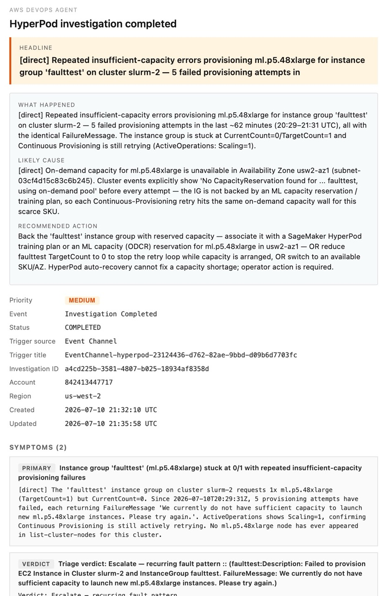

# HyperPod x AWS DevOps Agent

Keep 24/7 watch over an expensive SageMaker HyperPod GPU fleet by wiring it into
[AWS DevOps Agent](https://docs.aws.amazon.com/devopsagent/) — so the failures
HyperPod's built-in resiliency *doesn't* self-heal get auto-detected, triaged,
root-caused, and delivered as a human-readable verdict email, with room to add
your own detection rules.

## Why this exists

GPU clusters are expensive and must be watched around the clock. SageMaker
HyperPod's built-in resiliency already detects and self-heals **instance-level
GPU failures** — a bad GPU is drained, replaced, and the job resumes without a
human. That covers a lot.

But clusters still fail for reasons that layer doesn't catch:

- **Configuration errors** — a broken lifecycle script, a misconfigured mount, an
  auth-mode change that quietly breaks provisioning.
- **Capacity shortages** — a replacement that can't find an instance in the pool,
  so a "self-healing" replacement silently never completes.
- **Unnaturally high-frequency hardware faults** — each fault self-heals
  correctly, but the *same* Xid signature recurring across 3+ replacements on one
  instance group in a week is a hardware/capacity-pool problem no single
  auto-recovery can fix.
- **Workload-level problems** — a Pod stuck in CrashLoopBackOff for hours, nodes
  sitting NotReady, GPU allocation chronically low.

Today these force operators into round-the-clock manual triage: someone gets
paged at 2 a.m., SSHes around, correlates events across the SageMaker control
plane, EKS, and CloudWatch, and decides whether HyperPod is *still recovering* or
*actually stuck*. This solution does that correlation automatically and only
pages a human when something truly needs one — **complementing** HyperPod
resiliency rather than replacing it.

### Example use cases

- **Silent capacity failure.** A node fails; HyperPod tries to replace it but the
  instance pool is empty. No further events fire, so nothing pages anyone — the
  cluster just runs degraded. This solution catches the stalled replacement and
  escalates with "auto-recovery started 90 min ago and never completed."
- **Recurring hardware fault.** The same GPU Xid error hits the same instance
  group three times in a week. Each replacement succeeds, so each looks fine in
  isolation — but the pattern says "pull this hardware / exclude this pool." The
  solution surfaces the recurrence as a single escalation.
- **Configuration regression.** A lifecycle-script change starts failing
  provisioning on new nodes. The solution root-causes it to the LCS failure and
  points the operator at the script instead of the symptom.
- **Custom workload rule.** You add a rule (a plain-English *skill*) that
  escalates when any Pod is in CrashLoopBackOff longer than 4 hours, or when an
  instance group's GPU allocation stays low — issues specific to *your* workloads
  that no generic monitor knows about.
- **Quiet nights.** On a healthy cluster, nothing pages. A once-a-day heartbeat
  confirms the pipeline is alive; everything else is suppressed.

## What you get

- **Auto-detection** of HyperPod faults beyond resiliency's self-healing scope,
  from the live SageMaker event stream and a periodic Kubernetes-state audit.
- **Triage + root-cause analysis** by the DevOps Agent, taught HyperPod's
  operational model via two custom *skills* — it reconstructs the incident
  timeline and decides whether HyperPod is still recovering or genuinely stuck.
- **Human-readable verdict emails** — `Monitor` (recovery in flight, here's the
  ETA), `Escalate` (you need to act, here's why and what to do), or `Resolved`
  (auto-recovery closed the loop) — with the noise filtered out.
- **Extensibility** — add your own detection rules as plain-English skills; no
  code change to the pipeline.

Every investigation lands in the DevOps Agent console, where HyperPod events are
triaged into linked, skipped, and completed investigations (left); each verdict
email leads with a headline, then a *what happened / likely cause / recommended
action* breakdown (right):

<p>
  
  
</p>

## Architecture

The whole solution deploys as **one CloudFormation stack per cluster**. Two event
paths feed the DevOps Agent, and one path carries its verdicts back out to you.

```
                          SageMaker HyperPod cluster (EKS or Slurm)
                          │                                    ▲
       cluster/node/      │                                    │ read-only
       capacity events    │                                    │ describe-cluster,
                          ▼                                    │ list-cluster-*,
                  ┌───────────────┐                            │ kubectl, HMA logs
                  │  EventBridge  │  source: aws.sagemaker     │
                  │  (aws.        │                            │
                  │   sagemaker)  │                            │
                  └───────┬───────┘                            │
                          │  3 HyperPod detail-types           │
                          ▼        (Info-level dropped)        │
          ┌───────────────────────────────┐                    │
          │  Webhook bridge (Lambda)      │                    │
          │  event → investigation payload│──┐                 │
          └───────────────────────────────┘  │ HMAC-signed     │
                                             │ POST            │
          ┌───────────────────────────────┐  │                 │
   every  │  Periodic audit (Lambda)      │  │                 │
   15 min │  K8s CrashLoop / NotReady     │──┤                 │
   ─────► │  fires only on a real issue   │  │                 │
          │  + daily heartbeat            │  │                 │
          └───────────────────────────────┘  │                 │
                                             ▼                 │
                              ┌───────────────────────────────┐│
                              │      AWS DevOps Agent         ││
                              │      (Agent Space)            │┘
                              │                               │
                              │  triage skill  → LINK/SKIP/   │
                              │                   PROCEED     │
                              │  RCA skill     → Suppress /   │
                              │                   Monitor /   │
                              │                   Escalate /  │
                              │                   Resolved    │
                              └───────────────┬───────────────┘
                                              │ Investigation Completed
                                              ▼  (source: aws.aidevops)
                              ┌───────────────────────────────┐
                              │  Email notifier (Lambda)      │
                              │  reads journal → SES email    │
                              │  dedup + Suppress-filter      │
                              └───────────────┬───────────────┘
                                              ▼
                                     operator's inbox
                                 (+ DevOps Agent web console,
                                  + optional Slack/PagerDuty)
```

**Event flow, in words:**

1. **Live faults** — HyperPod emits cluster-state, node-health, and cluster
   events to EventBridge. The **webhook bridge** Lambda drops routine `Info`
   noise, maps the rest into a DevOps Agent investigation payload, and POSTs it
   (HMAC-signed) to the agent's generic webhook.
2. **Workload faults** — the **periodic audit** Lambda checks Kubernetes state
   (CrashLoopBackOff pods, NotReady nodes) every 15 minutes and only POSTs when it
   finds a real issue, plus one daily heartbeat. (Nothing in the HyperPod event
   stream covers Pod/Node state.)
3. **Investigation** — the DevOps Agent runs the **triage skill** (decide whether
   this is a new incident or a duplicate) then the **RCA skill** (reconstruct the
   timeline, classify against HyperPod's recovery time budgets, write a verdict).
4. **Notification** — the agent emits an `Investigation Completed` event; the
   **email notifier** Lambda composes an email from the investigation journal,
   filters `Suppress` verdicts and duplicates, and sends via SES.

### The building blocks

| Block | What it does |
| --- | --- |
| **Foundation** | The DevOps Agent *Agent Space* + IAM roles + AWS-monitor association (topology discovery). For EKS clusters, a read-only EKS access entry so the agent can run `kubectl`. Slurm skips the EKS step automatically. |
| **Webhook bridge** | EventBridge rule on `aws.sagemaker` HyperPod events → Lambda → HMAC-signed webhook POST. Supports a cluster allowlist for multi-cluster accounts. |
| **Triage + RCA skills** | Two plain-English skills that teach the agent HyperPod's operational model: `hyperpod-incident-triage` (LINK / SKIP / PROCEED) and `hyperpod-incident-rca` (timeline → Suppress / Monitor / Escalate / Resolved verdict). |
| **Periodic audit** | `AWS::Scheduler::Schedule` → Lambda that inspects Kubernetes state and fires an investigation only on a real issue, plus a daily heartbeat. |
| **Email notifier** | EventBridge rule on `aws.aidevops` `Investigation Completed` → Lambda → SES email, with S3-marker dedup and Suppress-verdict filtering. |

The two skills are where HyperPod knowledge lives, and where **you add your own
rules**: drop a new skill directory under `skills/` and redeploy. See
[IMPLEMENTATION.md](IMPLEMENTATION.md#authoring-your-own-skill-custom-detection-rules).

> **Implementation details** — the resource-by-resource CloudFormation breakdown,
> the event→payload mapping, how the skills are authored (and the lessons behind
> why they're written the way they are), the DevOps Agent behaviors we
> reverse-engineered, the permission-guardrail findings, and the anti-spam dedup
> design all live in **[IMPLEMENTATION.md](IMPLEMENTATION.md)**.

## Prerequisites

- AWS CLI v2 configured for the target account, with a region set (`aws configure set region <region>`) or `Region` in `params.json`.
- An existing HyperPod cluster (EKS or Slurm orchestrator). For Slurm, **Continuous Provisioning is required** for `list-cluster-events` and the correct EventBridge event format (see the Slurm note in [deploy/README.md](deploy/README.md)).
- Permission to create IAM roles, Secrets Manager secrets, CloudFormation stacks, `aidevops:*`, `eks:CreateAccessEntry`, and (for email) `ses:SendEmail` from a verified sender.
- An SES-verified sender identity in the target region (and, in SES sandbox, verified recipients).

## Quick start

Everything deploys as **one CloudFormation stack per cluster**:

```bash
cp deploy/params.example.json deploy/params.json
# edit: HyperPodClusterName, EmailSender, EmailRecipients (see params.example.json)

make deploy            # sync skills -> embed Lambdas -> deploy the whole stack
make stack-outputs     # console URL, webhook secret ARN, marker bucket, ...
```

`make deploy` auto-discovers the underlying EKS cluster name from the HyperPod
cluster (empty ⇒ Slurm ⇒ EKS access skipped), ensures the S3 assets bucket,
syncs the skills, embeds the Lambda code, and deploys. For multiple clusters use
per-cluster params files:

```bash
PARAMS_FILE=deploy/params.<cluster>.json make deploy
```

Operate + tear down:

```bash
make stack-status
make bridge-logs / make audit-logs / make email-logs   # tail a Lambda
make audit-test                                         # invoke the audit Lambda once
make import-upstream-skills                             # stage curated upstream skills, then: make deploy
make teardown-stack                                     # delete stack + assets bucket
```

Full deploy mechanics, parameters, multi-cluster naming, and the Slurm notes are
in **[deploy/README.md](deploy/README.md)**.

## Cleaning up

```bash
make teardown-stack   # delete the stack (custom resources disassociate the
                      # webhook + delete skills BEFORE the AgentSpace), then
                      # remove the assets bucket
```

The email dedup-marker bucket (`hpda-markers-<slug>-<account>-<region>`) is part
of the stack and is removed with it.

## Layout

```
.
├── Makefile          - unified make targets (deploy / teardown-stack / *-logs / import-upstream-skills)
├── README.md         - this file (value, architecture, quick start)
├── IMPLEMENTATION.md - design decisions, DevOps Agent findings, skill-authoring lessons
├── docs/
│   ├── devops-agent-mental-model.md          - undocumented DevOps Agent behaviors (read before changing skills)
│   └── lambda-side-audit-detection-design.md - periodic-audit design + as-built
├── deploy/           - the single-template deployment (see deploy/README.md)
│   ├── hyperpod_devops_agent.template.yaml   - the one template (with # *_CODE_PLACEHOLDER markers)
│   ├── hyperpod_devops_agent.yaml            - generated: template with Lambda code embedded
│   ├── lambda/
│   │   ├── webhook_bridge.py        - HyperPod event -> DevOps Agent payload
│   │   ├── periodic_audit.py        - K8s-state audit (CrashLoop/NotReady) + heartbeat
│   │   ├── email_notifier.py        - Investigation event -> formatted SES email
│   │   ├── cr_webhook_provisioner.py- custom resource: register/associate eventChannel + write secret
│   │   ├── cr_skill_uploader.py     - custom resource: upload skill assets from S3
│   │   └── cfnresponse.py           - CFN response shim for the S3-packaged skill uploader
│   ├── prepare_deployment.py        - embed Lambda code; sync skills to S3
│   ├── deploy.sh / teardown.sh      - one-command deploy / teardown
│   ├── import_upstream_skills.sh    - stage curated awslabs/agent-plugins hyperpod-* skills
│   └── params.example.json          - copy to params.json (or params.<cluster>.json) and edit
├── skills/
│   ├── hyperpod-incident-triage/    - INCIDENT_TRIAGE skill (LINKED/SKIPPED/PROCEED)
│   ├── hyperpod-incident-rca/       - INCIDENT_RCA skill (investigation + verdict + summary)
│   └── upstream/                    - awslabs/agent-plugins clone (git-ignored)
├── extract_pdf.py / requirements.txt- PDF -> .txt helper for the docs
```

The `hyperpod-mental-model.md` reference doc is bundled into the RCA skill at
sync time from `../../docs/hyperpod-mental-model.md` (single source of truth).

## What's next

- **Customize the verdict thresholds** — the recovery time budgets and recurrence
  thresholds live in the RCA skill (sourced from the HyperPod mental model). Edit
  and redeploy.
- **Add your own detection rules** — author a new skill (see
  [IMPLEMENTATION.md](IMPLEMENTATION.md#authoring-your-own-skill-custom-detection-rules)).
- **Fan out notifications** — Slack / ServiceNow / PagerDuty / Microsoft Teams all
  listen on the same `aws.aidevops` event stream the email notifier uses.

Slack notifications can be added via DevOps Agent's built-in Slack integration or
via a sibling stack that listens on the same `aws.aidevops` event stream (paused
pending workspace 3P approval).
