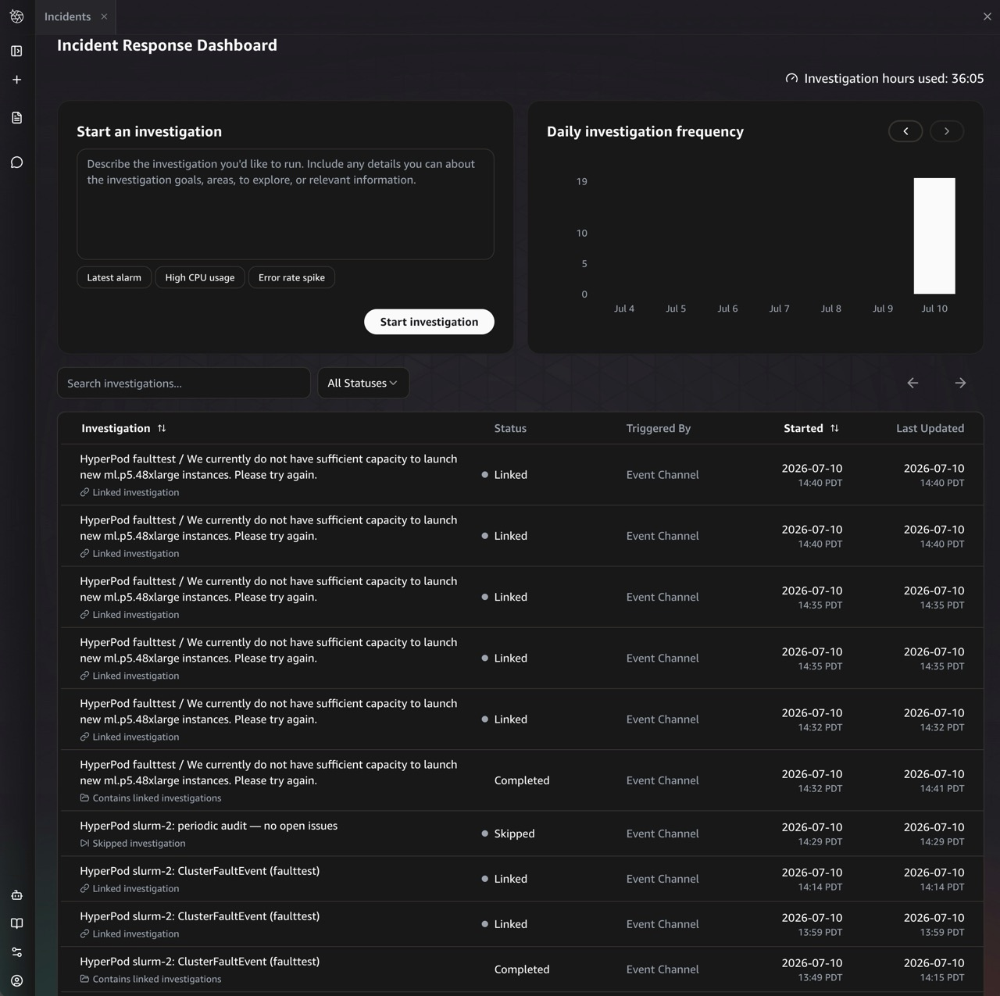

# HyperPod x AWS DevOps Agent

Keep 24/7 watch over a large-scale SageMaker HyperPod GPU fleet by wiring it into
[AWS DevOps Agent](https://docs.aws.amazon.com/devopsagent/) — so the operational
conditions that call for a human decision get auto-detected, triaged, root-caused,
and delivered as a human-readable verdict email, with room to add your own
detection rules.

## Why this exists

SageMaker HyperPod's built-in resiliency automatically detects and self-heals
**instance-level GPU failures** — a bad GPU is drained, replaced, and the job
resumes without a human. This solution **complements** that resiliency by
watching for the operational conditions where a human still wants to be in the
loop or decide:

- **Configuration issues** — a lifecycle-script change, a misconfigured mount, or
  an auth-mode change that affects provisioning on new nodes.
- **Capacity conditions** — a replacement waiting on capacity in the pool, so the
  operator knows recovery is in flight and can decide whether to intervene.
- **Recurring hardware faults** — each fault self-heals correctly, but the *same*
  Xid signature recurring across 3+ replacements on one instance group in a week
  is a pattern worth surfacing to an operator as a single signal.
- **Workload-level conditions** — a Pod stuck in CrashLoopBackOff for hours, nodes
  sitting NotReady, GPU allocation chronically low.

Without automation, these conditions push operators into round-the-clock manual
triage: correlating events across the SageMaker control plane, EKS, and
CloudWatch, and deciding whether HyperPod is *still recovering* or needs a hand.
This solution does that correlation automatically and only pages a human when
something truly needs one — **complementing** HyperPod resiliency, not replacing
it.

### Example use cases

- **Capacity-bound recovery.** A node fails and HyperPod initiates a replacement
  that is waiting on capacity in the pool. This solution tracks the in-flight
  recovery and, if it stays pending past its expected window, surfaces it so an
  operator can decide whether to intervene.
- **Recurring hardware fault.** The same GPU Xid error hits the same instance
  group three times in a week. Each replacement succeeds, so each looks routine in
  isolation — the solution surfaces the recurrence as a single signal an operator
  can act on.
- **Configuration change.** A lifecycle-script change starts affecting
  provisioning on new nodes. The solution root-causes it to the LCS step and
  points the operator at the script instead of the symptom.
- **Custom workload rule.** You add a rule (a plain-English *skill*) that
  escalates when any Pod is in CrashLoopBackOff longer than 4 hours, or when an
  instance group's GPU allocation stays low — conditions specific to *your*
  workloads that no generic monitor knows about.
- **Quiet nights.** On a healthy cluster, nothing pages. A once-a-day heartbeat
  confirms the pipeline is alive; everything else is suppressed.

## What you get

- **Auto-detection** of HyperPod conditions that complement resiliency's
  self-healing, from the live SageMaker event stream and a periodic
  Kubernetes-state audit.
- **Triage + root-cause analysis** by the DevOps Agent, taught HyperPod's
  operational model via two custom *skills* — it reconstructs the incident
  timeline and decides whether HyperPod is still recovering or needs an operator.
- **Human-readable verdict emails** — `Monitor` (recovery in flight, here's the
  ETA), `Escalate` (you need to act, here's why and what to do), or `Resolved`
  (auto-recovery closed the loop) — with the noise filtered out.
- **Extensibility** — add your own detection rules as plain-English skills; no
  code change to the pipeline.

Every investigation lands in the DevOps Agent console, where HyperPod events are
triaged into linked, skipped, and completed investigations (left); each verdict
email leads with a headline, then a *what happened / likely cause / recommended
action* breakdown (right):

<p>
  
  
</p>

## Architecture

The whole solution deploys as **one CloudFormation stack per cluster**. Two event
paths feed the DevOps Agent, and one path carries its verdicts back out to you.

```
                          SageMaker HyperPod cluster (EKS or Slurm)
                          │                                    ▲
       cluster/node/      │                                    │ read-only
       capacity events    │                                    │ describe-cluster,
                          ▼                                    │ list-cluster-*,
                  ┌───────────────┐                            │ kubectl, HMA logs
                  │  EventBridge  │  source: aws.sagemaker     │
                  │  (aws.        │                            │
                  │   sagemaker)  │                            │
                  └───────┬───────┘                            │
                          │  3 HyperPod detail-types           │
                          ▼        (Info-level dropped)        │
          ┌───────────────────────────────┐                    │
          │  Webhook bridge (Lambda)      │                    │
          │  event → investigation payload│──┐                 │
          └───────────────────────────────┘  │ HMAC-signed     │
                                             │ POST            │
          ┌───────────────────────────────┐  │                 │
   every  │  Periodic audit (Lambda)      │  │                 │
   15 min │  K8s CrashLoop / NotReady     │──┤                 │
   ─────► │  fires only on a real issue   │  │                 │
          │  + daily heartbeat            │  │                 │
          └───────────────────────────────┘  │                 │
                                             ▼                 │
                              ┌───────────────────────────────┐│
                              │      AWS DevOps Agent         ││
                              │      (Agent Space)            │┘
                              │                               │
                              │  triage skill  → LINK/SKIP/   │
                              │                   PROCEED     │
                              │  RCA skill     → Suppress /   │
                              │                   Monitor /   │
                              │                   Escalate /  │
                              │                   Resolved    │
                              └───────────────┬───────────────┘
                                              │ Investigation Completed
                                              ▼  (source: aws.aidevops)
                              ┌───────────────────────────────┐
                              │  Email notifier (Lambda)      │
                              │  reads journal → SES email    │
                              │  dedup + Suppress-filter      │
                              └───────────────┬───────────────┘
                                              ▼
                                     operator's inbox
                                 (+ DevOps Agent web console,
                                  + optional Slack/PagerDuty)
```

**Event flow, in words:**

1. **Live faults** — HyperPod emits cluster-state, node-health, and cluster
   events to EventBridge. The **webhook bridge** Lambda drops routine `Info`
   noise, maps the rest into a DevOps Agent investigation payload, and POSTs it
   (HMAC-signed) to the agent's generic webhook.
2. **Workload faults** — the **periodic audit** Lambda checks Kubernetes state
   (CrashLoopBackOff pods, NotReady nodes) every 15 minutes and only POSTs when it
   finds a real issue, plus one daily heartbeat. (Nothing in the HyperPod event
   stream covers Pod/Node state.)
3. **Investigation** — the DevOps Agent runs the **triage skill** (decide whether
   this is a new incident or a duplicate) then the **RCA skill** (reconstruct the
   timeline, classify against HyperPod's expected recovery time budgets, write a
   verdict).
4. **Notification** — the agent emits an `Investigation Completed` event; the
   **email notifier** Lambda composes an email from the investigation journal,
   filters `Suppress` verdicts and duplicates, and sends via SES.

### The building blocks

| Block | What it does |
| --- | --- |
| **Foundation** | The DevOps Agent *Agent Space* + IAM roles + AWS-monitor association (topology discovery). For EKS clusters, a read-only EKS access entry so the agent can run `kubectl`. Slurm skips the EKS step automatically. |
| **Webhook bridge** | EventBridge rule on `aws.sagemaker` HyperPod events → Lambda → HMAC-signed webhook POST. Supports a cluster allowlist for multi-cluster accounts. |
| **Triage + RCA skills** | Two plain-English skills that teach the agent HyperPod's operational model: `hyperpod-incident-triage` (LINK / SKIP / PROCEED) and `hyperpod-incident-rca` (timeline → Suppress / Monitor / Escalate / Resolved verdict). |
| **Periodic audit** | `AWS::Scheduler::Schedule` → Lambda that inspects Kubernetes state and fires an investigation only on a real issue, plus a daily heartbeat. |
| **Email notifier** | EventBridge rule on `aws.aidevops` `Investigation Completed` → Lambda → SES email, with S3-marker dedup and Suppress-verdict filtering. |

The two skills are where HyperPod knowledge lives, and where **you add your own
rules**: drop a new skill directory under `skills/` and redeploy. See
[IMPLEMENTATION.md](IMPLEMENTATION.md#authoring-your-own-skill-custom-detection-rules).

> **Implementation details** — the resource-by-resource CloudFormation breakdown,
> the event→payload mapping, how the skills are authored, the permission-guardrail
> behavior, and the anti-spam dedup design all live in
> **[IMPLEMENTATION.md](IMPLEMENTATION.md)**.

### Two custom resources

Everything is deployed with official CloudFormation resource types **except** two
gaps that CloudFormation cannot express:

1. **eventChannel webhook** — `AWS::DevOpsAgent::Service` has no `eventChannel`
   ServiceType, and `AWS::DevOpsAgent::Association` with an `EventChannel`
   configuration does not expose the generated webhook URL / HMAC secret as a
   `Fn::GetAtt`. → `Custom::WebhookProvisioner` (register/associate + stash the
   secret into Secrets Manager).
2. **Skill assets** — there is no `AWS::DevOpsAgent::Asset` resource type.
   → `Custom::SkillUploader` (create/update/delete skill assets from S3).

The EKS access grant is the native `AWS::EKS::AccessEntry` (skipped automatically
for Slurm clusters).

## Prerequisites

- AWS CLI v2 configured for the target account, with a region set (`aws configure set region <region>`) or `Region` in `params.json`.
- Python 3.9+ with **boto3 ≥ 1.40.0** installed in the environment you run `make deploy` from — it's bundled into the skill-uploader Lambda (the Lambda runtime's built-in boto3 predates the DevOps Agent Asset API). The deploy fails fast with an install hint if it's missing or too old; it never installs boto3 for you. Install it into a venv, e.g. `python3 -m venv .venv && source .venv/bin/activate && pip install 'boto3>=1.40.0'`.
- An existing HyperPod cluster (EKS or Slurm orchestrator). For Slurm, **Continuous Provisioning is required** for `list-cluster-events` and the correct EventBridge event format (see [Slurm clusters](#slurm-clusters) below).
- Permission to create IAM roles, Secrets Manager secrets, CloudFormation stacks, `aidevops:*`, `eks:CreateAccessEntry`, and (for email) `ses:SendEmail` from a verified sender.
- An SES-verified sender identity in the target region (and, in SES sandbox, verified recipients).

## Quick start

Everything deploys as **one CloudFormation stack per cluster**:

```bash
cd hyperpod_devops_agent

# 1. Deploy from a Python env that has boto3 >= 1.40.0 (bundled into the
#    skill-uploader Lambda). A venv is the simplest way; make deploy fails fast
#    with an install hint if boto3 is missing or too old.
python3 -m venv .venv && source .venv/bin/activate && pip install 'boto3>=1.40.0'

# 2. Fill in your cluster + email (the SES sender must be verified first).
cp deploy/params.example.json deploy/params.json
# edit: HyperPodClusterName, EmailSender, EmailRecipients (see params.example.json)

# 3. Deploy.
make deploy            # sync skills -> embed Lambdas -> deploy the whole stack
make stack-outputs     # console URL, webhook secret ARN, marker bucket, ...
```

Before touching any AWS resources, `make deploy` pre-flights that boto3 is present
(it never installs it for you). It then auto-discovers the underlying EKS cluster
name from the HyperPod cluster's `Orchestrator.Eks.ClusterArn` (empty ⇒ Slurm ⇒
EKS access skipped) — you never set it by hand — pre-flights the EKS auth mode
(must be `API` or `API_AND_CONFIG_MAP`, aborting with the corrective command if
not), ensures the S3 assets bucket, syncs the skills, embeds the Lambda code, and
deploys. For multiple clusters use per-cluster params files:

```bash
PARAMS_FILE=deploy/params.<cluster>.json make deploy
```

## Updating

- **Parameters / thresholds:** edit `deploy/params.json`, re-run `make deploy`.
- **Skills or the mental-model doc:** edit the file under `skills/` (or
  `../docs/hyperpod-mental-model.md`), then `make deploy`. `sync-skills`
  recomputes the content hash (`SkillsVersion`); the change makes CloudFormation
  re-run `SkillUploader`, which re-uploads only what changed.

## Operating

```bash
make stack-status                                      # show the stack status
make bridge-logs / make audit-logs / make email-logs   # tail a Lambda's logs
make audit-test                                         # invoke the audit Lambda once
make import-upstream-skills                             # stage curated upstream skills, then: make deploy
```

## Cleaning up

```bash
make teardown-stack   # delete the stack (custom resources disassociate the
                      # webhook + delete skills BEFORE the AgentSpace), then
                      # remove the assets bucket
```

The email dedup-marker bucket (`hpda-markers-<slug>-<account>-<region>`) is part
of the stack and is removed with it.

## Parameters

`params.json` is a **flat JSON key→value map** that `make deploy` converts into
CloudFormation `--parameter-overrides`. Copy `deploy/params.example.json` to
`deploy/params.json` and edit it.

### Minimal (the only three required keys)

```jsonc
{
  "Region": "us-west-2",                          // optional; falls back to the AWS CLI default region
  "HyperPodClusterName": "my-hyperpod-cluster",   // the cluster this stack monitors
  "EmailSender": "alerts@example.com",            // SES-verified From address (verify it first)
  "EmailRecipients": "oncall@example.com,team@example.com"  // comma-separated; in the SES sandbox each must be verified too
}
```

That is a complete, deployable file. Everything else has a safe default.

`EksClusterName`, `AssetsBucket`, `SkillsVersion`, `SkillsManifest`,
`SkillUploaderS3Bucket`, and `SkillUploaderS3Key` are **filled in automatically**
by `make deploy` — do **not** set them in `params.json`.

### Optional parameters

To override an optional parameter, add it as a normal key. In
`params.example.json` the optional keys ship with an `__off_` prefix (and keys
starting with `__` are ignored) so the example stays at defaults — **remove the
`__off_` prefix to activate one**. For example, to page sooner on CrashLoopBackOff
and only forward events for two named clusters:

```jsonc
{
  "Region": "us-west-2",
  "HyperPodClusterName": "my-hyperpod-cluster",
  "EmailSender": "alerts@example.com",
  "EmailRecipients": "oncall@example.com",

  "CrashLoopHoursThreshold": "1",
  "ClusterFilter": "my-hyperpod-cluster,my-other-cluster"
}
```

| Parameter | Default | What it controls |
| --- | --- | --- |
| `Region` | AWS CLI default | Target region. Read by `deploy.sh`; not a CloudFormation parameter. |
| **Periodic audit** | | |
| `EnablePeriodicAudit` | `true` | Deploy the 15-minute audit Scheduler + Lambda. `false` = live event bridging only. |
| `AuditSchedule` | `rate(15 minutes)` | EventBridge Scheduler expression for the periodic audit. |
| `HeartbeatSchedule` | `cron(0 12 * * ? *)` | Scheduler expression for the daily "all clear" heartbeat. |
| `K8sChecksEnabled` | `true` | Master switch for the Kubernetes-state checks (CrashLoopBackOff, NotReady). |
| `CrashLoopHoursThreshold` | `4` | Escalate if a Pod is CrashLoopBackOff longer than this many hours. `0` = fire on any. |
| `NotReadyNodePercentThreshold` | `10` | Escalate if ≥ this percent of nodes are NotReady (after the duration gate). |
| `NotReadyDurationMinutes` | `15` | A node must be NotReady this long to count toward the percent threshold. |
| `IgnoreNamespaces` | `kube-public,kube-node-lease` | Namespaces skipped entirely. Must not overlap `SystemNamespaces`. |
| `SystemNamespaces` | `kube-system,aws-hyperpod,amazon-cloudwatch` | Platform namespaces; CrashLoops here are tagged `system-workload`. |
| **Webhook bridge** | | |
| `ClusterFilter` | `""` (this stack's cluster) | Comma-separated allowlist of cluster names to forward. Empty = only `HyperPodClusterName`. |
| `DropEventLevels` | `Info` | Comma-separated `EventLevel`s to drop (drops noisy Info-level events by default). |
| **Email notifier** | | |
| `EmailDetailTypes` | `Investigation Completed` | Comma-separated detail-types to email on (default: one email per incident lifecycle). |
| `ConsoleUrlTemplate` | `https://%agent_space_id%.aidevops.global.app.aws/investigation/%task_id%` | Per-investigation link in emails. Tokens: `%region%`, `%account%`, `%agent_space_id%`, `%task_id%`. |
| `ForceSend` | `false` | Bypass all email filters (dedup, no-findings, suppress). Debugging only. |
| `MarkerExpirationDays` | `30` | Retention (days) for the per-execution email dedup markers. |
| **Advanced** | | |
| `AgentSpaceName` | auto (`hyperpod-<cluster>-devops-agent`) | Friendly Agent Space name. |
| `AgentSpaceDescription` | auto-generated | Free-text Agent Space description. |
| `AgentSpaceRoleName` / `WebappRoleName` | auto-named per stack | Fixed IAM role names (only set if you need them stable). |
| `LcsBucketArnPattern` | `arn:aws:s3:::sagemaker-*-bucket` | ARN pattern of lifecycle-script buckets the RCA skill may read (`on_create.sh`). `""` to skip. |

The template's inline `Description` fields and the `AWS::CloudFormation::Interface`
groups in `deploy/hyperpod_devops_agent.template.yaml` remain the authoritative
source for every parameter.

## Multiple clusters in one account/region

Every collision-prone name is scoped per cluster, so you can deploy this stack
for several HyperPod clusters side by side without conflicts:

- **Stack name** defaults to `hyperpod-devops-agent-<slug>` (override with
  `STACK_NAME=...`).
- **S3 buckets** — `hpda-markers-<slug>-<account>-<region>` (created by the
  stack) and `hpda-assets-<slug>-<account>-<region>` (created by `make deploy`).
- **IAM roles** — the Agent Space + Webapp roles are CloudFormation
  auto-named by default (unique per stack). Set `AgentSpaceRoleName` /
  `WebappRoleName` only if you need fixed names.
- **Webhook secret** and **Agent Space** already include the cluster name.

`<slug>` is a lowercased, hyphenated, ≤20-char form of `HyperPodClusterName`
(e.g. `My_Prod-Cluster_01` → `my-prod-cluster-01`), derived identically by the
Makefile, `deploy.sh`, and `teardown.sh`. Everything else (Lambdas, EventBridge
rules, execution roles, the scheduler) is unnamed and CloudFormation auto-names
it per stack.

## Periodic audit

**Division of labor:** HyperPod control-plane faults (node health, capacity
errors, lifecycle-script failures, cluster state changes) are handled
**event-driven by the webhook bridge** — it reads the native `EventLevel` from the
EventBridge event and forwards the real FailureMessage, for both EKS and Slurm.
The periodic audit covers only what the event stream **cannot**: Kubernetes
Pod/Node state, which is not in the HyperPod event stream.

The audit runs on a schedule (default every 15 min): the Lambda inspects
Kubernetes state — CrashLoopBackOff pods and NotReady nodes (via read-only EKS API
access) — and POSTs the DevOps Agent webhook **only when a real issue is found**.
On a healthy cluster nothing is POSTed, so **no investigation runs and no cost is
incurred**. A separate daily `AuditHeartbeatSchedule` fires one "all clear"
investigation per day so operators can see the pipeline is alive. **On Slurm (no
kubectl) the audit has nothing to poll, so it fires only the heartbeat** — HyperPod
faults on Slurm still flow through the event-driven bridge.

The audit deliberately does **not** re-scan `list-cluster-events` for faults: that
duplicated the bridge from a worse data source (the Lambda runtime's boto3 omits
`EventLevel` on that API, which would force fragile hardcoded fault-string
matching).

The audit Lambda has its **own** read-only `AWS::EKS::AccessEntry` (distinct
principal from the Agent Space role) carrying `AmazonAIOpsAssistantPolicy` — note
**not** `AmazonEKSViewPolicy`, whose `view` role excludes cluster-scoped `nodes`
and can't satisfy the NotReady-node check. The Lambda calls the K8s API directly
(SigV4 token + stdlib `urllib`) — no `kubernetes` client or Lambda layer.

Audit investigation **titles are issue-descriptive and timestamp-free** (e.g.
`HyperPod my-cluster: CrashLoopBackOff (my-namespace/my-pod)`), so a
recurring issue produces an identical title and the platform/triage skill LINK or
SKIP the repeat instead of emailing every cycle.

Relevant params: `AuditSchedule` (`rate(15 minutes)`), `HeartbeatSchedule`
(`cron(0 12 * * ? *)`), `K8sChecksEnabled` (`true`), `CrashLoopHoursThreshold` (4),
`NotReadyNodePercentThreshold` (10), `NotReadyDurationMinutes` (15).

## Slurm clusters

**Continuous Provisioning is a prerequisite for Slurm clusters.** Without it
(`NodeProvisioningMode` != `Continuous` in `describe-cluster`):

- `list-cluster-events` is **not supported** — the RCA skill reconstructs its
  incident timeline (replacement attempts, including failed ones) from this API,
  so its verdicts degrade badly without it.
- The HyperPod **EventBridge event format differs** from what the webhook bridge
  and skills expect, so live event bridging is unreliable.

`make deploy` checks `NodeProvisioningMode` for Slurm clusters and prints a loud
warning (but does not hard-fail) when it isn't `Continuous`. EKS-orchestrated
clusters are always Continuous, so this only affects Slurm. Enable Continuous
Provisioning on the cluster before relying on investigations.

Beyond that prerequisite: `make deploy` detects a Slurm cluster (no
`Orchestrator.Eks.ClusterArn`) and skips both EKS access entries (the Agent
Space role's and the audit Lambda's). On Slurm the periodic audit has no
Kubernetes to poll, so it fires **only the daily heartbeat** — all HyperPod
faults (capacity, node health, lifecycle-script, cluster state) flow through the
**event-driven bridge**, which works on Slurm as long as Continuous Provisioning
is enabled. On a Continuous Slurm cluster, a capacity-error fault is caught and
notified via the bridge with a specific "What happened" email subject; the audit
stays out of it and the heartbeat fires as expected.

## Layout

```
.
├── Makefile          - unified make targets (deploy / teardown-stack / *-logs / import-upstream-skills)
├── README.md         - this file (value, architecture, deploy, operate)
├── IMPLEMENTATION.md - design decisions and skill-authoring notes
├── deploy/           - the single-template deployment
│   ├── hyperpod_devops_agent.yaml            - the deployable template (Lambda code inlined; committed — the file you deploy directly)
│   ├── hyperpod_devops_agent.template.yaml   - the source template (with # *_CODE_PLACEHOLDER markers)
│   ├── lambda/
│   │   ├── webhook_bridge.py         - HyperPod event -> DevOps Agent payload
│   │   ├── periodic_audit.py         - K8s-state audit (CrashLoop/NotReady) + heartbeat
│   │   ├── email_notifier.py         - Investigation event -> formatted SES email
│   │   ├── cr_webhook_provisioner.py - custom resource: register/associate eventChannel + write secret
│   │   ├── cr_skill_uploader.py      - custom resource: upload skill assets from S3
│   │   └── cfnresponse.py            - CFN response shim for the S3-packaged skill uploader
│   ├── prepare_deployment.py         - embed Lambda code into the template; sync skills to S3
│   ├── deploy.sh / teardown.sh       - one-command deploy / teardown (called by make)
│   ├── import_upstream_skills.sh     - stage curated awslabs/agent-plugins hyperpod-* skills
│   └── params.example.json           - copy to params.json (or params.<cluster>.json) and edit
└── skills/
    ├── hyperpod-incident-triage/     - INCIDENT_TRIAGE skill (LINKED/SKIPPED/PROCEED)
    ├── hyperpod-incident-rca/        - INCIDENT_RCA skill (investigation + verdict + summary)
    └── upstream/                     - awslabs/agent-plugins clone (git-ignored)
```

`prepare_deployment.py embed` inlines each `lambda/*.py` at its
`# <NAME>_CODE_PLACEHOLDER` marker in `hyperpod_devops_agent.template.yaml`,
producing the deployable `hyperpod_devops_agent.yaml` (committed). The
`hyperpod-mental-model.md` reference doc is bundled into the RCA skill at sync
time from `../docs/hyperpod-mental-model.md` (single source of truth).

## What's next

- **Customize the verdict thresholds** — the recovery time budgets and recurrence
  thresholds live in the RCA skill (sourced from the HyperPod mental model). Edit
  and redeploy.
- **Add your own detection rules** — author a new skill (see
  [IMPLEMENTATION.md](IMPLEMENTATION.md#authoring-your-own-skill-custom-detection-rules)).
- **Fan out notifications** — Slack / ServiceNow / PagerDuty / Microsoft Teams all
  listen on the same `aws.aidevops` event stream the email notifier uses. Add them
  via DevOps Agent's built-in integrations or a sibling stack on the same stream.
```
