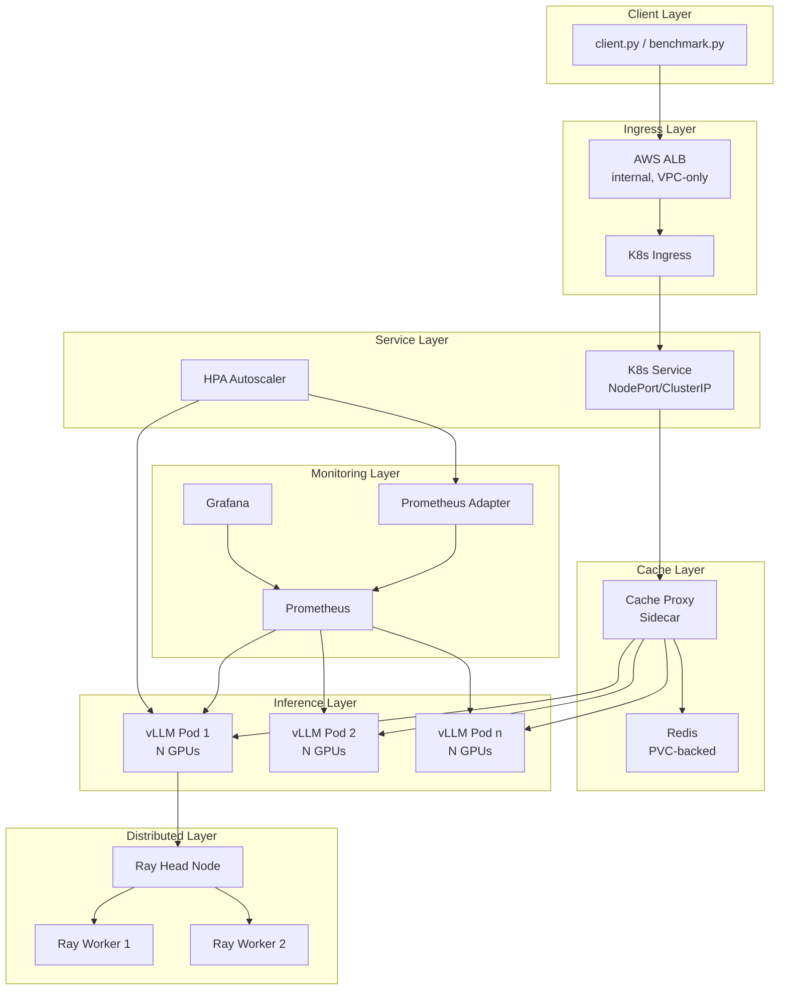
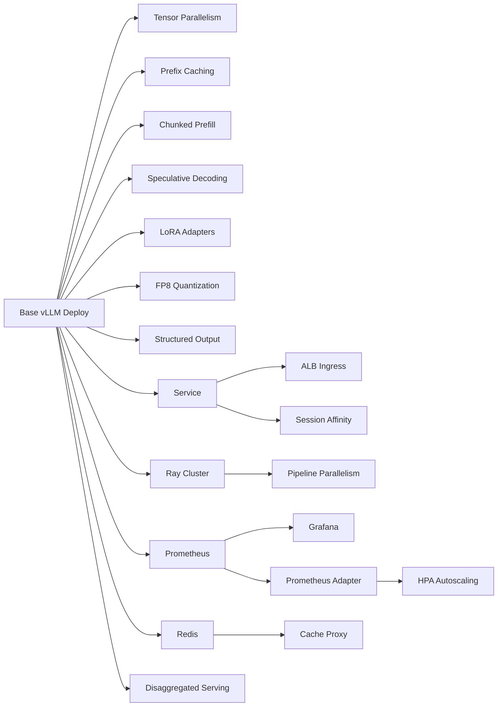

# Advanced vLLM Inference on HyperPod EKS

A modular showcase project demonstrating production-grade vLLM inference patterns on Amazon SageMaker HyperPod EKS. This project graduates from the basic single-GPU experiment ([`hyperpod_eks_vllm_basic`](../hyperpod_eks_vllm_basic/)) into a comprehensive reference implementation covering:

- **Multi-GPU / multi-node parallelism** — tensor and pipeline parallelism for large models
- **VPC-native networking** — ALB ingress with health checks and optional TLS
- **Distributed KV cache sharing** — Redis L3 cache with a transparent proxy
- **vLLM optimization suite** — prefix caching, chunked prefill, speculative decoding, FP8 quantization, LoRA adapters, structured output, disaggregated serving
- **Observability** — Prometheus + Grafana monitoring with pre-built dashboards
- **Autoscaling** — HPA driven by custom vLLM metrics via Prometheus Adapter

Every advanced technique is a separate Kubernetes manifest with a corresponding Makefile target — deployable and removable independently. The base vLLM deployment works standalone; each feature layers on top without coupling.

---

## Architecture

### Component Diagram



### Request Flow

1. Client sends a request to the ALB DNS endpoint (or via `kubectl port-forward` for local dev).
2. ALB routes through the Kubernetes Ingress → Service → vLLM pod(s).
3. The optional cache proxy checks Redis for prompt prefix metadata; on a hit it adds routing hints.
4. vLLM processes the request using configured optimizations (tensor parallelism, prefix caching, chunked prefill, speculative decoding, etc.).
5. For multi-node setups, Ray coordinates pipeline parallelism across worker nodes.
6. Prometheus scrapes `/metrics` from all vLLM pods; Grafana visualizes the dashboards.
7. HPA reads custom metrics via Prometheus Adapter and scales replicas accordingly.

### Project Structure

```
hyperpod_eks_vllm_advanced/
├── README.md                          # This file
├── Makefile                           # Per-feature deploy/delete targets
├── Dockerfile                         # CUDA 12.4 image with vLLM + Ray + Redis
├── requirements.txt                   # Pinned Python dependencies
├── .gitignore                         # Standard exclusions
├── client.py                          # Advanced inference client
├── benchmark.py                       # Performance benchmarking tool
├── cache_proxy.py                     # Redis L3 cache proxy script
├── manifests/
│   ├── vllm-deployment.yaml           # Base vLLM deployment (multi-GPU ready)
│   ├── vllm-service.yaml              # NodePort/ClusterIP service
│   ├── alb-ingress.yaml               # ALB Ingress with health checks
│   ├── ray-cluster.yaml               # KubeRay head + workers
│   ├── redis.yaml                     # Redis with PVC
│   ├── prometheus.yaml                # Prometheus with service discovery
│   ├── grafana.yaml                   # Grafana with pre-configured dashboard
│   ├── hpa.yaml                       # HPA with custom metrics
│   ├── prometheus-adapter.yaml        # Prometheus Adapter for custom metrics
│   └── disaggregated-serving.yaml     # Prefill/decode worker pools
└── schemas/
    ├── entity-extraction.json         # Example JSON schema
    ├── classification.json            # Example JSON schema
    └── structured-summary.json        # Example JSON schema
```

---

## Prerequisites

Before deploying, verify the following components are available on your HyperPod EKS cluster.

### Required

| Component | Purpose | Verify |
|-----------|---------|--------|
| HyperPod EKS cluster with GPU nodes | Run vLLM inference pods | `kubectl get nodes -l node.kubernetes.io/instance-type -o wide` |
| NVIDIA GPU device plugin | Expose GPUs to pods | `kubectl get pods -n kube-system -l name=nvidia-device-plugin-ds` |
| `kubectl` configured | Interact with the cluster | `kubectl cluster-info` |
| Docker installed | Build container images | `docker --version` |
| ECR repository created | Store the vLLM image | `aws ecr describe-repositories --repository-names hyperpod-eks-vllm-advanced` |

### Required for Specific Features

| Component | Feature | Verify |
|-----------|---------|--------|
| AWS Load Balancer Controller | ALB Ingress (`make deploy-alb`) | `kubectl get deployment -n kube-system aws-load-balancer-controller` |
| KubeRay operator | Multi-node Ray cluster (`make deploy-ray`) | `kubectl get crd rayclusters.ray.io` |
| Prometheus Adapter | HPA autoscaling (`make deploy-hpa`) | Deployed by `make deploy-hpa` (self-contained) |

### Optional

| Component | Purpose | Notes |
|-----------|---------|-------|
| Hugging Face token | Access gated models (e.g., Llama) | Create a K8s secret: `kubectl create secret generic hf-token --from-literal=token=hf_...` |
| Python 3.10+ | Run client/benchmark locally | `python3 --version` |

### Quick Verification

Run these commands to confirm your cluster is ready:

```bash
# Cluster reachable
kubectl cluster-info

# GPU nodes available
kubectl get nodes -l nvidia.com/gpu.present=true

# NVIDIA device plugin running
kubectl get pods -n kube-system -l name=nvidia-device-plugin-ds

# ECR repository exists (create if needed)
aws ecr describe-repositories --repository-names hyperpod-eks-vllm-advanced 2>/dev/null || \
  aws ecr create-repository --repository-name hyperpod-eks-vllm-advanced

# Docker available
docker --version
```

---

## Quick Start

Deploy a basic single-GPU vLLM inference server in five steps. Once running, you can layer on additional features (multi-GPU, ALB, monitoring, etc.) one at a time.

### 1. Clone and Navigate

```bash
git clone <repository-url>
cd hyperpod_eks_vllm_advanced
```

### 2. Build and Push the Docker Image

```bash
# Build the image (linux/amd64 for EKS nodes)
make build

# Authenticate with ECR
make login

# Tag and push
make tag
make push
```

### 3. Deploy to the Cluster

This applies the base vLLM Deployment and Service manifests:

```bash
make deploy
```

Wait for the pod to become ready (model download + loading takes a few minutes):

```bash
# Watch pod status
kubectl get pods -l app=vllm-advanced-server -w

# Check logs for "Uvicorn running on http://0.0.0.0:8000"
make watch-logs
```

### 4. Port-Forward and Test

In a separate terminal, forward the service port:

```bash
make port-forward
```

Then send a test request:

```bash
make test-inference
```

Or use curl directly:

```bash
curl -s http://localhost:8000/v1/completions \
  -H "Content-Type: application/json" \
  -d '{
    "model": "meta-llama/Llama-3.1-8B-Instruct",
    "prompt": "What is machine learning?",
    "max_tokens": 128
  }' | python3 -m json.tool
```

### 5. Verify Health

```bash
curl -s http://localhost:8000/health
# Expected: {"status":"ok"} (or 200 response)
```

### What's Next?

With the base deployment running, you can enable additional features independently. Each feature has its own manifest and Makefile target — see the feature sections below for details.

```bash
# Examples — pick any combination:
make deploy-alb            # Expose via ALB (requires AWS LB Controller)
make deploy-monitoring     # Add Prometheus + Grafana
make deploy-redis          # Add Redis L3 cache
make deploy-ray            # Add Ray cluster for multi-node
make deploy-hpa            # Add autoscaling (requires monitoring)
make deploy-all            # Deploy everything at once
```

To tear down:

```bash
make delete-all            # Remove all components
# or selectively:
make delete                # Remove only base vLLM + service
```


---

## Feature Matrix

| Technique | Makefile Target | Manifest File | vLLM Arguments |
|-----------|----------------|---------------|----------------|
| Tensor Parallelism | `make deploy` (edit manifest) | `vllm-deployment.yaml` | `--tensor-parallel-size N` |
| Pipeline Parallelism | `make deploy-ray` | `vllm-deployment.yaml` + `ray-cluster.yaml` | `--pipeline-parallel-size M` |
| ALB Ingress | `make deploy-alb` | `alb-ingress.yaml` | N/A |
| Prefix Caching | `make deploy` (edit manifest) | `vllm-deployment.yaml` | `--enable-prefix-caching` |
| Redis L3 Cache | `make deploy-redis` | `redis.yaml` | N/A (uses `cache_proxy.py`) |
| Speculative Decoding | `make deploy` (edit manifest) | `vllm-deployment.yaml` | `--speculative-model <model>`, `--num-speculative-tokens N` |
| Chunked Prefill | `make deploy` (edit manifest) | `vllm-deployment.yaml` | `--enable-chunked-prefill` |
| LoRA Adapters | `make deploy` (edit manifest) | `vllm-deployment.yaml` | `--enable-lora`, `--max-loras N`, `--max-lora-rank N` |
| FP8 Quantization | `make deploy` (edit manifest) | `vllm-deployment.yaml` | `--quantization fp8` |
| Structured Output / JSON Mode | `make deploy` (default) | N/A | None (built-in); client uses `response_format` / `guided_json` |
| Disaggregated Serving | `make deploy-disaggregated` | `disaggregated-serving.yaml` | Separate prefill/decode configs |
| Monitoring (Prometheus + Grafana) | `make deploy-monitoring` | `prometheus.yaml` + `grafana.yaml` | N/A |
| Autoscaling (HPA) | `make deploy-hpa` | `hpa.yaml` + `prometheus-adapter.yaml` | N/A |

---

## Feature Dependencies

Features that require other features to be deployed first:



Key dependency chains:

- **Pipeline Parallelism** → requires Ray Cluster (`make deploy-ray`) before enabling `--pipeline-parallel-size`
- **HPA Autoscaling** → requires Prometheus Adapter → requires Prometheus (`make deploy-monitoring` then `make deploy-hpa`)
- **Grafana** → requires Prometheus (both deployed together via `make deploy-monitoring`)
- **Cache Proxy** → requires Redis (`make deploy-redis`)
- **ALB Ingress** → requires the base Service (deployed via `make deploy`) and the AWS Load Balancer Controller on the cluster
- **Session Affinity** → requires ALB Ingress

All other features (tensor parallelism, prefix caching, chunked prefill, speculative decoding, LoRA, FP8, structured output, disaggregated serving) depend only on the base deployment.

---

## Model Configuration

Recommended tensor parallelism degree and GPU count for common models:

| Model | Parameters | Tensor Parallel Size | GPUs per Pod | Notes |
|-------|-----------|---------------------|--------------|-------|
| Llama-3.1-8B-Instruct | 8B | 1 | 1 | Default configuration; fits on a single GPU |
| Llama-3.2-1B | 1B | 1 | 1 | Small model; useful as speculative decoding draft |
| Llama-2-13B | 13B | 2 | 2 | Requires 2-GPU tensor parallelism |
| Llama-2-70B | 70B | 4 | 4 | Requires 4-GPU tensor parallelism |
| Llama-3.1-70B-Instruct | 70B | 4 | 4 | 4 GPUs; or 8 GPUs for higher throughput |
| Llama-2-70B (FP8) | 70B | 2 | 2 | FP8 quantization halves memory; fits on 2 GPUs |
| Llama-3.1-405B | 405B | 8 | 8 | Single-node max; or use pipeline parallelism across nodes |

For multi-node pipeline parallelism, total GPUs = `pipeline-parallel-size` × `tensor-parallel-size`. For example, Llama-3.1-405B across 2 nodes with 8 GPUs each: `--pipeline-parallel-size 2 --tensor-parallel-size 8` (16 GPUs total).

---

## Features

### Tensor Parallelism

Shards model layers across multiple GPUs within a single node, enabling models that exceed single-GPU memory.

**Prerequisites:**
- Base deployment running (`make deploy`)
- Node with multiple GPUs (e.g., p5.48xlarge with 8× H100)

**Configuration:**

Edit `manifests/vllm-deployment.yaml`:

1. Change `--tensor-parallel-size` from `"1"` to the desired GPU count (e.g., `"4"`):
   ```yaml
   - "--tensor-parallel-size"
   - "4"
   ```

2. Update the GPU resource requests to match:
   ```yaml
   resources:
     limits:
       nvidia.com/gpu: "4"
     requests:
       nvidia.com/gpu: "4"
   ```

3. Optionally update the model to one that benefits from multi-GPU (see Model Configuration table above).

4. Re-deploy:
   ```bash
   make deploy
   ```

**Verification:**

```bash
# Check pod is running with correct GPU count
kubectl describe pod -l app=vllm-advanced-server | grep "nvidia.com/gpu"

# Check vLLM logs confirm tensor parallelism
make watch-logs
# Look for: "tensor_parallel_size=4"

# Test inference
make port-forward   # in a separate terminal
make test-inference
```

---

### Pipeline Parallelism (with Ray)

Distributes model layers sequentially across multiple nodes, each contributing one or more GPUs. Uses Ray as the distributed backend.

**Prerequisites:**
- Base deployment running (`make deploy`)
- KubeRay operator installed (`kubectl get crd rayclusters.ray.io`)
- Multiple GPU nodes available

**Configuration:**

1. Deploy the Ray cluster:
   ```bash
   make deploy-ray
   ```

2. Wait for Ray head and workers to be ready:
   ```bash
   kubectl get pods -l component=ray-head
   kubectl get pods -l component=ray-worker
   ```

3. Edit `manifests/vllm-deployment.yaml` — uncomment the pipeline parallelism block:
   ```yaml
   ## --- Pipeline Parallelism ---
   - "--pipeline-parallel-size"
   - "2"
   ```

4. Set tensor parallelism per node (total GPUs = pipeline × tensor):
   ```yaml
   - "--tensor-parallel-size"
   - "4"
   ```
   This example uses 2 nodes × 4 GPUs = 8 GPUs total.

5. Re-deploy:
   ```bash
   make deploy
   ```

**Verification:**

```bash
# Verify Ray cluster is healthy
kubectl get rayclusters
kubectl logs -l component=ray-head | grep "Connected"

# Verify vLLM connected to Ray
make watch-logs
# Look for: "pipeline_parallel_size=2" and Ray connection messages

# Test inference
make port-forward
make test-inference
```

**Example — Llama-2-70B across 2 nodes:**
- Node 1: 4× GPU (tensor parallel)
- Node 2: 4× GPU (tensor parallel)
- `--pipeline-parallel-size 2 --tensor-parallel-size 4`

---

### ALB Ingress

Exposes the vLLM endpoint via an internal AWS Application Load Balancer with health checking and optional TLS.

**Prerequisites:**
- Base deployment running (`make deploy`)
- AWS Load Balancer Controller installed on the cluster:
  ```bash
  kubectl get deployment -n kube-system aws-load-balancer-controller
  ```

**Configuration:**

1. Deploy the ALB Ingress:
   ```bash
   make deploy-alb
   ```

2. Wait for the ALB to provision (1–3 minutes):
   ```bash
   kubectl get ingress vllm-advanced-ingress
   ```

3. For HTTPS/TLS, edit `manifests/alb-ingress.yaml` and uncomment the TLS annotations:
   ```yaml
   # alb.ingress.kubernetes.io/certificate-arn: arn:aws:acm:us-west-2:842413447717:certificate/<cert-id>
   # alb.ingress.kubernetes.io/listen-ports: '[{"HTTPS": 443}]'
   # alb.ingress.kubernetes.io/ssl-redirect: "443"
   ```

4. For session affinity (sticky sessions for KV cache reuse), uncomment:
   ```yaml
   # alb.ingress.kubernetes.io/target-group-attributes: stickiness.enabled=true,stickiness.lb_cookie.duration_seconds=3600
   ```

**Verification:**

```bash
# Get the ALB DNS name
make get-endpoint
# Look for the ALB hostname under "--- ALB (if deployed) ---"

# Test from within the VPC
curl -s http://<ALB_DNS>/health
curl -s http://<ALB_DNS>/v1/models

# Test inference through ALB
python client.py --url http://<ALB_DNS> "What is deep learning?"
```

**Routing trade-offs:**
- Round-robin (default): Even load distribution across replicas
- Session affinity (sticky sessions): Routes multi-turn conversations to the same instance for KV cache reuse, but may cause uneven load

---

### Prefix Caching

Reuses KV cache entries for requests sharing common prompt prefixes on the same vLLM instance. Reduces redundant computation for repeated prompt patterns (e.g., system prompts, few-shot examples).

**Prerequisites:**
- Base deployment running (`make deploy`)

**Configuration:**

Edit `manifests/vllm-deployment.yaml` — uncomment the prefix caching block:

```yaml
## --- Prefix Caching ---
- "--enable-prefix-caching"
```

Re-deploy:

```bash
make deploy
```

**Verification:**

```bash
# Confirm prefix caching is enabled in logs
make watch-logs
# Look for: "enable_prefix_caching=True"

# Demonstrate latency improvement with shared prefixes
# First request (cold):
time curl -s http://localhost:8000/v1/completions \
  -H "Content-Type: application/json" \
  -d '{"model":"meta-llama/Llama-3.1-8B-Instruct","prompt":"You are a helpful assistant. Explain quantum computing.","max_tokens":64}'

# Second request with same prefix (warm — should be faster):
time curl -s http://localhost:8000/v1/completions \
  -H "Content-Type: application/json" \
  -d '{"model":"meta-llama/Llama-3.1-8B-Instruct","prompt":"You are a helpful assistant. Explain machine learning.","max_tokens":64}'

# Benchmark with and without prefix caching
python benchmark.py --url http://localhost:8000 --num-requests 20 --prompt "You are a helpful assistant. Summarize this text:"
```

**Limitations:** Prefix caching is per-instance only. For cross-instance cache sharing, combine with session affinity (ALB sticky sessions) or the Redis L3 cache proxy.

---

### Redis L3 Cache

An external Redis cache layer that persists prompt metadata across pod restarts and enables cross-instance cache sharing via a transparent proxy.

**Prerequisites:**
- Base deployment running (`make deploy`)

**Configuration:**

1. Deploy Redis:
   ```bash
   make deploy-redis
   ```

2. Verify Redis is running:
   ```bash
   kubectl get pods -l component=redis
   kubectl get svc redis
   ```

3. Run the cache proxy (as a sidecar or standalone):
   ```bash
   python cache_proxy.py --listen-port 8080 --vllm-url http://localhost:8000 --redis-url redis://redis:6379 --ttl 3600
   ```

4. Point clients at the cache proxy port instead of vLLM directly.

**Verification:**

```bash
# Check Redis is accepting connections
kubectl exec -it $(kubectl get pod -l component=redis -o jsonpath='{.items[0].metadata.name}') -- redis-cli ping
# Expected: PONG

# Send requests through the cache proxy and check Redis for cached keys
kubectl exec -it $(kubectl get pod -l component=redis -o jsonpath='{.items[0].metadata.name}') -- redis-cli keys "prefix:*"

# Benchmark with vs. without cache proxy
python benchmark.py --url http://localhost:8080 --num-requests 50 --prompt "You are a helpful assistant."
python benchmark.py --url http://localhost:8000 --num-requests 50 --prompt "You are a helpful assistant."
```

**Architecture:** The cache proxy computes a SHA-256 hash of the prompt prefix, checks Redis for cached metadata (token count, routing hints), and forwards to vLLM on a miss. If Redis is unavailable, the proxy bypasses the cache transparently and logs a warning.

---

### Speculative Decoding

Uses a smaller draft model to generate candidate tokens that the main model verifies in parallel, reducing per-token latency.

**Prerequisites:**
- Base deployment running (`make deploy`)
- Sufficient GPU memory for both the target and draft models

**Configuration:**

Edit `manifests/vllm-deployment.yaml` — uncomment the speculative decoding block:

```yaml
## --- Speculative Decoding ---
- "--speculative-model"
- "meta-llama/Llama-3.2-1B"
- "--num-speculative-tokens"
- "5"
```

Re-deploy:

```bash
make deploy
```

**Verification:**

```bash
# Confirm speculative decoding is enabled
make watch-logs
# Look for: "speculative_model" and "num_speculative_tokens=5"

# Test inference
make port-forward
make test-inference

# Benchmark with vs. without speculative decoding
# Run benchmark with speculative decoding enabled:
python benchmark.py --url http://localhost:8000 --num-requests 20
# Then disable speculative decoding (comment out the args), redeploy, and benchmark again:
python benchmark.py --url http://localhost:8000 --num-requests 20
# Compare tokens/s and latency
```

**Trade-offs:**
- Reduced per-token latency (draft model generates candidates in parallel)
- Increased GPU memory usage (draft model loaded alongside target model)
- Best for latency-sensitive, low-concurrency workloads; less benefit under high concurrency

---

### Chunked Prefill

Breaks long prompt prefill into smaller chunks interleaved with decode steps, improving time-to-first-token (TTFT) for long prompts under concurrent load.

**Prerequisites:**
- Base deployment running (`make deploy`)

**Configuration:**

Edit `manifests/vllm-deployment.yaml` — uncomment the chunked prefill block:

```yaml
## --- Chunked Prefill ---
- "--enable-chunked-prefill"
```

Re-deploy:

```bash
make deploy
```

**Verification:**

```bash
# Confirm chunked prefill is enabled
make watch-logs
# Look for: "enable_chunked_prefill=True"

# Benchmark TTFT with and without chunked prefill
# With chunked prefill enabled:
python benchmark.py --url http://localhost:8000 --num-requests 20 --concurrency 4 --prompt "$(cat <<'EOF'
<long prompt with 500+ tokens here for testing TTFT improvement>
EOF
)"

# Compare avg_ttft_ms values with and without the feature
```

**How it works:** Without chunked prefill, a long prompt blocks the entire prefill phase before any decode can start. With chunked prefill, the prefill is split into chunks, allowing decode steps for other requests to proceed between chunks. This is most beneficial when serving concurrent requests with mixed prompt lengths.

---

### LoRA Adapters

Serves multiple fine-tuned LoRA adapters on a single base model at runtime. Clients specify the adapter name in the `model` field of the API request.

**Prerequisites:**
- Base deployment running (`make deploy`)
- LoRA adapter weights available (Hugging Face Hub or local path)

**Configuration:**

Edit `manifests/vllm-deployment.yaml` — uncomment the LoRA block:

```yaml
## --- LoRA Adapters ---
- "--enable-lora"
- "--max-loras"
- "4"
- "--max-lora-rank"
- "64"
```

To load specific adapters at startup, add `--lora-modules`:

```yaml
- "--lora-modules"
- "my-adapter=org/my-lora-adapter"
```

Re-deploy:

```bash
make deploy
```

**Verification:**

```bash
# Confirm LoRA is enabled
make watch-logs
# Look for: "enable_lora=True"

# List loaded models (includes base + adapters)
curl -s http://localhost:8000/v1/models | python3 -m json.tool

# Send a request specifying a LoRA adapter
python client.py --lora my-adapter "Translate this to French: Hello world"

# Or via curl:
curl -s http://localhost:8000/v1/chat/completions \
  -H "Content-Type: application/json" \
  -d '{"model":"my-adapter","messages":[{"role":"user","content":"Hello"}],"max_tokens":64}'
```

**Architecture:** vLLM loads the base model once and dynamically applies LoRA adapter weights per request. Each adapter adds minimal memory overhead (~tens of MB depending on rank). Up to `--max-loras` adapters can be loaded concurrently. Adding a new adapter does not require restarting the pod — update `--lora-modules` and redeploy, or use vLLM's dynamic adapter loading API.

---

### FP8 Quantization

Reduces model weights to 8-bit floating point, enabling larger models to fit on fewer GPUs with minimal quality degradation.

**Prerequisites:**
- Base deployment running (`make deploy`)
- NVIDIA H100 or L40S GPUs (FP8 requires Hopper or Ada Lovelace architecture)

**Configuration:**

Edit `manifests/vllm-deployment.yaml` — uncomment the FP8 block:

```yaml
## --- FP8 Quantization ---
- "--quantization"
- "fp8"
```

Re-deploy:

```bash
make deploy
```

**Verification:**

```bash
# Confirm FP8 quantization is active
make watch-logs
# Look for: "quantization=fp8"

# Verify the model loaded successfully
curl -s http://localhost:8000/v1/models | python3 -m json.tool

# Test inference quality
make test-inference

# Check GPU memory usage (should be ~50% of FP16)
kubectl exec -it $(kubectl get pod -l app=vllm-advanced-server -o jsonpath='{.items[0].metadata.name}') -- nvidia-smi
```

**GPU memory comparison (approximate):**

| Model | FP16 Memory | FP8 Memory | GPUs (FP16) | GPUs (FP8) |
|-------|------------|------------|-------------|------------|
| Llama-3.1-8B | ~16 GB | ~8 GB | 1 | 1 |
| Llama-2-70B | ~140 GB | ~70 GB | 4 | 2 |
| Llama-3.1-405B | ~810 GB | ~405 GB | 8+ (multi-node) | 8 (single node) |

**Trade-offs:**
- Reduced memory footprint (~50% of FP16)
- Potential throughput improvement (smaller weights → faster memory transfers)
- Minor quality degradation (typically <1% on benchmarks)

**Hardware compatibility:** FP8 requires NVIDIA GPUs with Hopper (H100, H200) or Ada Lovelace (L40S) architecture. Verify on your HyperPod nodes:

```bash
kubectl exec -it <pod> -- nvidia-smi --query-gpu=name --format=csv,noheader
# Should show H100, H200, or L40S
```

---

### Structured Output / JSON Mode

Guarantees model responses conform to a specified JSON schema or format using vLLM's guided decoding.

**Prerequisites:**
- Base deployment running (`make deploy`)
- No additional vLLM args needed — structured output is built into vLLM

**Configuration:**

Structured output is enabled by default. Use it via the client script or API:

1. **JSON mode** (guarantees valid JSON output):
   ```bash
   python client.py --json-mode "List 3 programming languages with their creators"
   ```

2. **Schema-constrained output** (guarantees output matches a JSON schema):
   ```bash
   python client.py --schema schemas/entity-extraction.json "Extract entities from: Apple CEO Tim Cook announced new products in Cupertino."
   ```

3. **Via curl:**
   ```bash
   # JSON mode
   curl -s http://localhost:8000/v1/chat/completions \
     -H "Content-Type: application/json" \
     -d '{
       "model": "meta-llama/Llama-3.1-8B-Instruct",
       "messages": [{"role":"user","content":"List 3 colors as JSON"}],
       "response_format": {"type": "json_object"},
       "max_tokens": 128
     }'

   # Schema-constrained
   curl -s http://localhost:8000/v1/chat/completions \
     -H "Content-Type: application/json" \
     -d '{
       "model": "meta-llama/Llama-3.1-8B-Instruct",
       "messages": [{"role":"user","content":"Extract entities from: Apple announced new products."}],
       "guided_json": "{\"type\":\"object\",\"properties\":{\"entities\":{\"type\":\"array\",\"items\":{\"type\":\"object\",\"properties\":{\"name\":{\"type\":\"string\"},\"type\":{\"type\":\"string\"}}}}}}",
       "max_tokens": 256
     }'
   ```

**Verification:**

```bash
# Verify JSON mode returns valid JSON
python client.py --json-mode "Return a JSON object with keys: name, age, city" | python3 -m json.tool

# Verify schema-constrained output matches the schema
python client.py --schema schemas/classification.json "Classify this text: The stock market rose sharply today."
```

**Available example schemas** in `schemas/`:
- `entity-extraction.json` — extracts named entities from text
- `classification.json` — classifies text into categories
- `structured-summary.json` — produces structured summaries

**How it works:** vLLM uses guided decoding (constrained generation) to ensure the output token sequence conforms to the specified JSON schema. This adds a small latency overhead per token but guarantees structural correctness.

---

### Disaggregated Serving

Separates prefill (prompt processing) and decode (token generation) into distinct worker pools, preventing long prompts from blocking token generation for other requests.

**Prerequisites:**
- Base deployment running (`make deploy`)
- vLLM v0.6.0 or later
- Sufficient GPU resources for separate prefill and decode pools

**Configuration:**

1. Deploy the disaggregated serving manifests:
   ```bash
   make deploy-disaggregated
   ```

2. This creates two separate Deployments:
   - **Prefill workers** — optimized for prompt processing (higher batch size)
   - **Decode workers** — optimized for token generation (lower latency)

**Verification:**

```bash
# Check both worker pools are running
kubectl get pods -l component=prefill-worker
kubectl get pods -l component=decode-worker

# Verify health endpoints
kubectl port-forward svc/vllm-prefill 8001:8000 &
kubectl port-forward svc/vllm-decode 8002:8000 &
curl -s http://localhost:8001/health
curl -s http://localhost:8002/health
```

**⚠️ Experimental:** Disaggregated serving is an experimental feature in vLLM. It requires vLLM v0.6.0+ and the API may change in future releases. Check the [vLLM documentation](https://docs.vllm.ai/) for the latest status.

**Benefits:**
- Long prompts processed by prefill workers don't block decode for other requests
- Each pool can be scaled independently based on workload characteristics
- Prefill workers can use higher batch sizes; decode workers optimize for low latency

**Resource allocation example:**
- Prefill pool: 2 replicas × 2 GPUs each (handles prompt processing)
- Decode pool: 4 replicas × 1 GPU each (handles token generation)

---

### Monitoring (Prometheus + Grafana)

Collects and visualizes inference metrics from vLLM pods using Prometheus for scraping and Grafana for dashboards.

**Prerequisites:**
- Base deployment running (`make deploy`)

**Configuration:**

1. Deploy Prometheus and Grafana:
   ```bash
   make deploy-monitoring
   ```

2. Wait for pods to be ready:
   ```bash
   kubectl get pods -l component=prometheus
   kubectl get pods -l component=grafana
   ```

3. Access the Grafana dashboard:
   ```bash
   make port-forward-grafana
   # Open http://localhost:3000 in your browser
   # Default credentials: admin / admin
   ```

**Verification:**

```bash
# Verify Prometheus is scraping vLLM metrics
kubectl port-forward svc/prometheus 9090:9090 &
curl -s http://localhost:9090/api/v1/targets | python3 -m json.tool
# Check that vLLM targets show state: "up"

# Verify Grafana datasource is connected
# Open http://localhost:3000 → Configuration → Data Sources → Prometheus → Test

# Generate some traffic and observe metrics
python benchmark.py --url http://localhost:8000 --num-requests 50 --concurrency 4
# Then check the Grafana dashboard for updated panels
```

**Dashboard panels:**

| Panel | Metric | Description |
|-------|--------|-------------|
| Request Latency | `vllm:request_duration_seconds` | P50, P95, P99 end-to-end latency |
| Throughput | `vllm:request_success_total` | Requests per second |
| Token Throughput | `vllm:generation_tokens_total` | Generated tokens per second |
| GPU Memory | `vllm:gpu_cache_usage_perc` | GPU KV cache memory utilization |
| KV Cache Usage | `vllm:gpu_cache_usage_perc` | Percentage of KV cache blocks in use |
| Batch Size | `vllm:num_requests_running` | Current running batch size |
| Queue Depth | `vllm:num_requests_waiting` | Pending requests in queue |

Prometheus uses Kubernetes service discovery to automatically detect new vLLM pods as they scale. The scrape interval is 15 seconds.

---

### Autoscaling (HPA)

Scales vLLM replicas automatically based on custom inference metrics (pending request queue depth) via Prometheus Adapter.

**Prerequisites:**
- Base deployment running (`make deploy`)
- Monitoring deployed (`make deploy-monitoring`) — Prometheus must be running for the Adapter to read metrics

**Configuration:**

1. Ensure monitoring is deployed:
   ```bash
   make deploy-monitoring
   ```

2. Deploy the HPA and Prometheus Adapter:
   ```bash
   make deploy-hpa
   ```

3. The HPA is configured with:
   - Scaling metric: `vllm:num_requests_waiting` (pending queue depth)
   - Min replicas: 1
   - Max replicas: 4
   - Scale-up stabilization: 60 seconds
   - Scale-down stabilization: 300 seconds

**Verification:**

```bash
# Check HPA status
kubectl get hpa vllm-advanced-server-hpa

# Check Prometheus Adapter is serving custom metrics
kubectl get --raw "/apis/custom.metrics.k8s.io/v1beta1" | python3 -m json.tool

# Load test to trigger scale-up
python benchmark.py --url http://localhost:8000 --num-requests 200 --concurrency 16

# Watch replicas scale
kubectl get hpa vllm-advanced-server-hpa -w
kubectl get pods -l app=vllm-advanced-server -w
```

**Autoscaling architecture:**

1. vLLM exposes `vllm:num_requests_waiting` via `/metrics`
2. Prometheus scrapes this metric every 15 seconds
3. Prometheus Adapter maps it to the Kubernetes custom metrics API
4. HPA reads the metric and adjusts replica count
5. Scale-up is fast (60s stabilization); scale-down is conservative (300s) to avoid flapping

**Tuning:** Edit `manifests/hpa.yaml` to adjust thresholds, min/max replicas, or stabilization windows. Edit `manifests/prometheus-adapter.yaml` to change the metric mapping or add additional scaling metrics.


---

## Troubleshooting

### OOM (Out of Memory) Errors

**Symptom:** Pod is killed with `OOMKilled` status or vLLM logs show `CUDA out of memory`.

**Solutions:**

1. **Reduce GPU memory utilization** — lower the allocation ceiling so vLLM reserves less VRAM:
   ```yaml
   # In manifests/vllm-deployment.yaml, change:
   - "--gpu-memory-utilization"
   - "0.85"   # default is 0.9; try 0.8 or lower
   ```

2. **Enable FP8 quantization** — halves model memory footprint:
   ```yaml
   - "--quantization"
   - "fp8"
   ```

3. **Increase GPU count** — spread the model across more GPUs with tensor parallelism:
   ```yaml
   - "--tensor-parallel-size"
   - "4"
   ```
   Remember to update `nvidia.com/gpu` resource requests to match.

4. **Increase shared memory** — if the OOM is on `/dev/shm`, increase the `sizeLimit` in the deployment manifest:
   ```yaml
   volumes:
     - name: shm
       emptyDir:
         medium: Memory
         sizeLimit: 16Gi   # increase as needed
   ```

5. Re-deploy after changes:
   ```bash
   make deploy
   ```

---

### Ray Cluster Connectivity Issues

**Symptom:** vLLM logs show `Cannot connect to Ray` or Ray workers fail to join the head node.

**Solutions:**

1. **Verify the Ray head is running:**
   ```bash
   kubectl get pods -l component=ray-head
   kubectl logs -l component=ray-head --tail=50
   ```

2. **Verify Ray workers can reach the head:**
   ```bash
   kubectl get pods -l component=ray-worker
   kubectl logs -l component=ray-worker --tail=50
   # Look for "Connected to Ray cluster" or connection errors
   ```

3. **Check the `RAY_ADDRESS` environment variable** in `manifests/vllm-deployment.yaml` — it must point to the Ray head service:
   ```yaml
   - name: RAY_ADDRESS
     value: "ray://ray-head-svc:10001"
   ```

4. **Check NCCL networking** — ensure NCCL environment variables are set correctly for your network interface:
   ```bash
   kubectl exec -it <ray-worker-pod> -- env | grep NCCL
   ```

5. **Restart the Ray cluster:**
   ```bash
   make delete-ray
   make deploy-ray
   ```

---

### ALB Health Check Failures

**Symptom:** ALB target group shows targets as `unhealthy`; requests return 502/503 errors.

**Solutions:**

1. **Check the vLLM pod readiness** — the `/health` endpoint must return 200 before the ALB routes traffic:
   ```bash
   kubectl get pods -l app=vllm-advanced-server
   # Pod should show READY 1/1

   # Test health directly
   kubectl port-forward svc/vllm-advanced-server 8000:8000 &
   curl -s http://localhost:8000/health
   ```

2. **Check model loading** — large models take several minutes to download and load. The health endpoint returns unhealthy until loading completes:
   ```bash
   make watch-logs
   # Wait for "Uvicorn running on http://0.0.0.0:8000"
   ```

3. **Verify Ingress annotations** — ensure the health check path matches:
   ```bash
   kubectl describe ingress vllm-advanced-ingress
   # Check: healthcheck-path should be /health
   ```

4. **Check security groups** — the ALB must be able to reach pod IPs on port 8000. Verify the node security group allows inbound traffic from the ALB security group.

5. **Increase health check grace period** if the model takes a long time to load:
   ```yaml
   # In manifests/vllm-deployment.yaml, increase initialDelaySeconds:
   readinessProbe:
     httpGet:
       path: /health
       port: 8000
     initialDelaySeconds: 300   # 5 minutes for large models
     periodSeconds: 10
   ```

---

### Redis Connection Timeouts

**Symptom:** Cache proxy logs show `Redis connection timed out` or `ConnectionError`.

**Solutions:**

1. **Verify Redis is running:**
   ```bash
   kubectl get pods -l component=redis
   kubectl get svc redis
   ```

2. **Test Redis connectivity from within the cluster:**
   ```bash
   kubectl exec -it $(kubectl get pod -l component=redis -o jsonpath='{.items[0].metadata.name}') -- redis-cli ping
   # Expected: PONG
   ```

3. **Check Redis resource limits** — if Redis is OOM-killed, increase memory limits in `manifests/redis.yaml`:
   ```yaml
   resources:
     limits:
       memory: "1Gi"   # increase from default 512Mi
   ```

4. **Check PVC storage** — if the PVC is full, Redis may reject writes:
   ```bash
   kubectl exec -it $(kubectl get pod -l component=redis -o jsonpath='{.items[0].metadata.name}') -- redis-cli info memory
   ```

5. **Note:** The cache proxy is designed to bypass Redis gracefully on failure. If Redis is down, inference still works — you just lose the caching benefit. Check cache proxy logs for bypass warnings:
   ```bash
   kubectl logs <cache-proxy-pod> | grep "WARNING"
   ```

---

### Model Download Failures

**Symptom:** vLLM pod stuck in `CrashLoopBackOff` with logs showing `401 Unauthorized` or `ConnectionError` during model download.

**Solutions:**

1. **Hugging Face token issues** — gated models (e.g., Llama) require a valid HF token:
   ```bash
   # Create or update the secret
   kubectl create secret generic hf-token --from-literal=token=hf_YOUR_TOKEN --dry-run=client -o yaml | kubectl apply -f -

   # Verify the secret exists
   kubectl get secret hf-token
   ```

2. **Verify the token has access** — ensure your HF token has been granted access to the model on [huggingface.co](https://huggingface.co). For Llama models, you must accept the license agreement on the model page.

3. **Network connectivity** — if pods cannot reach `huggingface.co`, check:
   ```bash
   # Test DNS resolution from a pod
   kubectl exec -it <pod> -- nslookup huggingface.co

   # Test HTTPS connectivity
   kubectl exec -it <pod> -- curl -sI https://huggingface.co
   ```

4. **Use a model cache** — pre-download the model to a shared volume (FSx or EFS) to avoid repeated downloads:
   ```bash
   # Set HF_HOME to a persistent volume path in the deployment manifest
   - name: HF_HOME
     value: "/mnt/models"
   ```

5. **Check pod events for resource issues:**
   ```bash
   kubectl describe pod -l app=vllm-advanced-server
   # Look for events like "Insufficient nvidia.com/gpu" or "Unschedulable"
   ```

---

## Recommended Learning Path

Work through the techniques in order of increasing complexity. Each step builds on the previous, and you can stop at any point — the base deployment is fully functional on its own.

| Step | Technique | What You Learn | Makefile Target |
|------|-----------|---------------|-----------------|
| 1 | **Basic single-GPU deployment** | Base vLLM serving, health checks, OpenAI-compatible API | `make deploy` |
| 2 | **Tensor parallelism** | Multi-GPU model sharding within a single node | Edit `vllm-deployment.yaml` → `make deploy` |
| 3 | **Prefix caching + chunked prefill** | KV cache reuse and TTFT optimization for concurrent workloads | Edit `vllm-deployment.yaml` → `make deploy` |
| 4 | **Monitoring (Prometheus + Grafana)** | Observability, metrics collection, dashboard visualization | `make deploy-monitoring` |
| 5 | **ALB Ingress** | VPC-native networking, health checks, TLS termination, session affinity | `make deploy-alb` |
| 6 | **Speculative decoding** | Latency reduction via draft model verification | Edit `vllm-deployment.yaml` → `make deploy` |
| 7 | **LoRA adapters + structured output** | Multi-tenant serving, JSON mode, schema-constrained generation | Edit `vllm-deployment.yaml` → `make deploy` |
| 8 | **Redis L3 cache** | External cache layer, cross-instance metadata sharing | `make deploy-redis` |
| 9 | **Autoscaling (HPA)** | Custom-metric-driven horizontal scaling | `make deploy-hpa` |
| 10 | **Pipeline parallelism with Ray** | Multi-node distributed inference for very large models | `make deploy-ray` + edit manifest |
| 11 | **Disaggregated serving** | Separate prefill/decode worker pools (experimental) | `make deploy-disaggregated` |
| 12 | **FP8 quantization** | Reduced memory footprint, hardware-specific optimization | Edit `vllm-deployment.yaml` → `make deploy` |

**Tips:**
- Start with steps 1–3 to get a solid single-node setup with optimizations.
- Add monitoring (step 4) early — it helps you understand the impact of every subsequent feature.
- Steps 10–12 are advanced topics that require specific hardware or are experimental.

---

## Benchmark Commands

Use `benchmark.py` to measure the impact of each optimization technique. All commands assume the vLLM server is accessible at `http://localhost:8000` (via `make port-forward`).

### Baseline (Single GPU, No Optimizations)

Establish a performance baseline before enabling any features:

```bash
python benchmark.py \
  --url http://localhost:8000 \
  --num-requests 50 \
  --concurrency 4 \
  --prompt "Explain the theory of relativity in simple terms."
```

Record the baseline throughput (tokens/s), TTFT, and P50/P95/P99 latency values.

### Tensor Parallelism

Compare single-GPU vs. multi-GPU throughput:

```bash
# Single GPU (baseline)
python benchmark.py --url http://localhost:8000 --num-requests 50 --concurrency 4

# After enabling tensor-parallel-size=4 and redeploying:
python benchmark.py --url http://localhost:8000 --num-requests 50 --concurrency 4
```

**What to look for:** Higher throughput (tokens/s) and lower latency with more GPUs. The improvement scales sub-linearly — expect ~2–3× throughput with 4 GPUs, not 4×.

### Prefix Caching

Measure latency improvement for repeated prompt prefixes:

```bash
# Use a shared system prompt prefix
python benchmark.py \
  --url http://localhost:8000 \
  --num-requests 50 \
  --concurrency 4 \
  --prompt "You are a helpful AI assistant specialized in Python programming. Please answer the following question:"
```

**What to look for:** Lower TTFT on subsequent requests sharing the same prefix. The first request is a cold start; subsequent requests should show reduced prefill time.

### Chunked Prefill

Measure TTFT improvement under concurrent load with long prompts:

```bash
# High concurrency with a long prompt
python benchmark.py \
  --url http://localhost:8000 \
  --num-requests 30 \
  --concurrency 8 \
  --prompt "$(python3 -c "print('Summarize the following long document: ' + 'Lorem ipsum dolor sit amet. ' * 100)")"
```

**What to look for:** Lower average TTFT (avg_ttft_ms) compared to the same workload without chunked prefill. The benefit is most visible under high concurrency with mixed prompt lengths.

### Speculative Decoding

Compare per-token latency with and without a draft model:

```bash
# Without speculative decoding (baseline):
python benchmark.py --url http://localhost:8000 --num-requests 30 --concurrency 1

# After enabling speculative decoding and redeploying:
python benchmark.py --url http://localhost:8000 --num-requests 30 --concurrency 1
```

**What to look for:** Lower inter-token latency (avg_itl_ms) and potentially higher tokens/s at low concurrency. At high concurrency, the benefit diminishes because the draft model competes for GPU resources.

### Redis L3 Cache

Compare latency with and without the cache proxy:

```bash
# Direct to vLLM (no cache):
python benchmark.py --url http://localhost:8000 --num-requests 50 --prompt "You are a helpful assistant."

# Through cache proxy:
python benchmark.py --url http://localhost:8080 --num-requests 50 --prompt "You are a helpful assistant."
```

**What to look for:** Lower TTFT on cache hits (second and subsequent requests with the same prefix). The first request is always a cache miss.

### Autoscaling Under Load

Generate sustained load to trigger HPA scale-up:

```bash
# Sustained high-concurrency load
python benchmark.py \
  --url http://localhost:8000 \
  --num-requests 200 \
  --concurrency 16 \
  --timeout 300

# In another terminal, watch replicas scale:
kubectl get hpa vllm-advanced-server-hpa -w
kubectl get pods -l app=vllm-advanced-server -w
```

**What to look for:** HPA increases replica count as `vllm:num_requests_waiting` exceeds the threshold. Throughput should increase as new replicas come online. Scale-down happens after the 300-second stabilization window.

### Compare Mode

Use `--compare` to run the same workload against two endpoints and get a side-by-side comparison:

```bash
python benchmark.py \
  --url http://localhost:8000 \
  --compare http://localhost:8001 \
  --num-requests 30 \
  --concurrency 4
```

**What to look for:** The side-by-side table shows throughput, TTFT, latency percentiles, and ITL for both configurations. Use this to directly compare any two setups (e.g., with/without prefix caching, FP16 vs. FP8).

### FP8 Quantization

Compare throughput and memory usage between FP16 and FP8:

```bash
# FP16 baseline:
python benchmark.py --url http://localhost:8000 --num-requests 50 --concurrency 4

# After enabling --quantization fp8 and redeploying:
python benchmark.py --url http://localhost:8000 --num-requests 50 --concurrency 4

# Check GPU memory reduction:
kubectl exec -it $(kubectl get pod -l app=vllm-advanced-server -o jsonpath='{.items[0].metadata.name}') -- nvidia-smi
```

**What to look for:** Similar or slightly higher throughput with FP8, and roughly 50% reduction in GPU memory usage. Quality degradation is typically minimal (<1% on standard benchmarks).

### Interpreting Results

Key metrics from `benchmark.py` output:

| Metric | Description | Good Values |
|--------|-------------|-------------|
| `throughput_tokens_per_sec` | Total generated tokens per second | Higher is better; scales with GPUs and optimizations |
| `avg_ttft_ms` | Average time to first token | Lower is better; chunked prefill and prefix caching help |
| `p50_latency_ms` | Median end-to-end request latency | Baseline for typical request performance |
| `p95_latency_ms` | 95th percentile latency | Should be within 2–3× of P50 for stable systems |
| `p99_latency_ms` | 99th percentile latency | Tail latency; high values indicate queuing or resource contention |
| `avg_itl_ms` | Average inter-token latency | Lower is better; speculative decoding targets this metric |
| `successful_requests` | Number of completed requests | Should equal `num_requests` for a healthy system |
| `failed_requests` | Number of failed requests | Should be 0; non-zero indicates errors or timeouts |

**General guidance:**
- Always establish a baseline before enabling optimizations.
- Change one variable at a time to isolate the impact of each technique.
- Run benchmarks multiple times and average the results — single runs can be noisy.
- Use `--output json` to save results for programmatic comparison across runs.
