# Installing Ray on HyperPod from the console — walkthrough

The SageMaker AI console has a **Ray** panel on the HyperPod cluster detail page
with an `Install` button, and a per-feature readiness table next to it. None of
this appears in the SageMaker AI Developer Guide, which still documents only
`helm repo add kuberay && helm install`. This document records what the console
path actually does, step by step.

It has a second purpose: deciding what is worth automating. Every step below
carries a **Friction** note, and the [Friction log](#friction-log) at the end
turns those notes into a verdict on which steps earn a CloudFormation template.
That verdict changed the repo: it removed one stack and added another.

**The headline result: the console does not install KubeRay.** The Ray panel's
`Install` button opens the developer-guide page
[Installing KubeRay on HyperPod Amazon EKS](https://docs.aws.amazon.com/sagemaker/latest/dg/sagemaker-hyperpod-ray-install-kuberay.html),
which documents `helm install` and nothing else. So the panel contributes
**discovery and status**, not automation, and a Helm install — by hand or via
`make install-kuberay` — remains the only way to get the operator onto a cluster. Details in [Step 3](#step-3--install-kuberay).

Keep two facts in view while reading:

- KubeRay on HyperPod is an **ordinary Helm release**. Not an EKS managed add-on
  (no `kuberay` in the add-on catalog), not a SageMaker API object (no `*AddOn*`
  operation in the API model). `helm list -A` is the ground truth.
- The `Ray features` rows **do** read real cluster state — proven below by the
  task-governance row differing correctly between two clusters. The panel is
  worth consulting even though it cannot act.

## Test cluster

| Field | Value |
|---|---|
| HyperPod cluster | `k8-ray-3` |
| EKS cluster | `sagemaker-k8-ray-3-6b1c5ff4-eks` |
| Region / account | `us-west-2` / 842413447717 |
| Created by | [aws/sagemaker-hyperpod-cluster-setup](https://github.com/aws/sagemaker-hyperpod-cluster-setup), root stack `sagemaker-k8-ray-3-6b1c5ff4` |
| Instance group | `worker1`, 2 × `ml.m5.xlarge`, `ThreadsPerCore: 1` |
| Node provisioning | `Continuous` |

Two `ThreadsPerCore: 1` nodes report 2 CPUs each, roughly 1.9 allocatable, and
the HyperPod daemonsets take a share of that. Enough for one small
`RayCluster`; not enough to run a standing cluster and a `RayJob` with its own
cluster at the same time. See the sizing note in [README.md](README.md).

## Before you start

Wait for the cluster-setup stack to finish. A cluster reports `InService` while
nested stacks are still landing add-ons — on this cluster, `cert-manager`
appeared as both an EKS add-on and a namespace several minutes after
`ClusterStatus` went `InService`. A baseline taken too early produces a diff full
of someone else's changes.

```bash
aws cloudformation describe-stacks --region us-west-2 \
  --query 'Stacks[?contains(StackName,`k8-ray-3`)].{Name:StackName,Status:StackStatus}' \
  --output table

aws sagemaker describe-cluster --cluster-name k8-ray-3 --region us-west-2 \
  --query 'InstanceGroups[].{Name:InstanceGroupName,Target:TargetCount,Current:CurrentCount}'
```

Proceed when every stack is `CREATE_COMPLETE` and `Current` equals `Target`.

Then point `kubectl` at the cluster and snapshot the starting state:

```bash
aws eks update-kubeconfig --name sagemaker-k8-ray-3-6b1c5ff4-eks \
  --region us-west-2 --alias k8-ray-3

bash scripts/capture-cluster-state.sh k8-ray-3 before
```

[scripts/capture-cluster-state.sh](scripts/capture-cluster-state.sh) records Helm
releases, Ray CRDs, namespaces, EKS add-ons, EKS access entries, non-system
workloads, Ray resources, and nodes. Every call is read-only. Re-run it with a
different label after each step and diff, so each step's effect is a reviewable
list rather than a recollection.

### Baseline on this cluster

Captured with all 16 stacks `CREATE_COMPLETE` and both nodes joined, before any
Ray action:

```
helm releases : dependencies (hyperpod-helm-chart-0.1.0, app 1.16.0) in kube-system
ray crds      : (none)
namespaces    : aws-hyperpod cert-manager default kube-node-lease kube-public
                kube-system kubeflow mpi-operator
eks addons    : amazon-sagemaker-hyperpod-training-operator cert-manager coredns
                eks-pod-identity-agent kube-proxy vpc-cni
access entries: Admin, the EKS and HyperPod service-linked roles, the cluster
                ExecRole, and three custom-resource roles (cert-manager, HPTO,
                Helm) created by the setup stacks
workloads     : health-monitoring-agent (+non-nvidia) and hp-training-operator in
                aws-hyperpod, cert-manager ×3, dependencies-training-operators
                in kubeflow
nodes         : hyperpod-i-0019556676310add9, hyperpod-i-0115d6347ad3a8425
                1930m allocatable CPU, 13269520Ki memory each
                Amazon Linux 2023.12.20260918
```

Three things to carry forward:

- **1930m allocatable CPU per node**, so 3.86 CPU for the whole cluster, minus
  whatever the Ray head reserves. This is the `ThreadsPerCore: 1` arithmetic from
  [README.md](README.md) showing up in practice: the `ml.m5.xlarge` label says
  4 vCPU, the node reports 2 and offers 1.93.
- `eks-pod-identity-agent` is already present, which satisfies a prerequisite of
  the HyperPod Ray Endpoint Operator later on.
- **The node AMI is dated 2026-09-18**, newer than the 2026-08-18 date the
  `Hung job detection` row asks for, and the cluster's AMI status reads
  `Up to date`. The row still says otherwise — see
  [Step 5d](#5d-hung-job-detection--the-ami-signal-does-not-add-up).

Note that the `ray resources` section of the capture reads
`error: the server doesn't have a resource type "rayclusters"`. That error *is*
the baseline: it is what the absence of CRDs looks like, and it should disappear
after Step 3.

## Step 1 — Find the Ray panel

Console → **Amazon SageMaker AI** → **Cluster management** → your cluster, then
the cluster's **add-ons** section. `Ray` is one panel in a list of add-on panels —
scroll past the others, each of which carries its own `Status`. The Ray panel has
a `New` badge, a `Status` line, and an `Install` dropdown on the right.

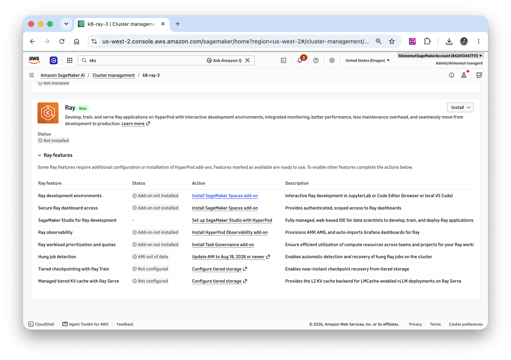

On a cluster with no KubeRay the status reads `Not installed`. So HyperPod tracks
KubeRay as cluster state rather than leaving it opaque — useful on a cluster you
did not set up yourself.

**Friction:** none. Zero inputs, and it is the discovery surface, which a
CloudFormation template cannot replace.

Whether the panel notices an install it did not perform is answered in
[Step 3](#the-panel-detects-a-hand-install): it does.

## Step 2 — Read the Ray features table

Expanding **Ray features** gives a row per capability with a `Status` and a
deep-link `Action`. This is the setup checklist, per cluster, which is what the
developer guide's prose is not.

Observed on `k8-ray-3`, created today and untouched, with `k8-1` (created
2026-06-15, task governance installed) alongside for contrast:

| Ray feature | Status on `k8-ray-3` | Status on `k8-1` | Action |
|---|---|---|---|
| Ray development environments | Add-on not installed | Add-on not installed | Install SageMaker Spaces add-on |
| Secure Ray dashboard access | Add-on not installed | Add-on not installed | Install SageMaker Spaces add-on |
| SageMaker Studio for Ray development | – | – | Set up SageMaker Studio with HyperPod |
| Ray observability | Add-on not installed | Add-on not installed | Install HyperPod Observability add-on |
| Ray workload prioritization and quotas | Add-on not installed | **Available** | Install Task Governance add-on |
| Hung job detection | AMI out of date | AMI out of date | Update AMI to Aug 18, 2026 or newer ↗ |
| Tiered checkpointing with Ray Train | Not configured | Not configured | Configure tiered storage ↗ |
| Managed tiered KV cache with Ray Serve | Not configured | Not configured | Configure tiered storage ↗ |

Four readings worth carrying forward.

**The add-on rows are accurate.** `Ray workload prioritization and quotas` is the
one row that differs between the two clusters, and it differs exactly as the
cluster state says it should: `k8-1` has the `amazon-sagemaker-hyperpod-taskgovernance`
EKS add-on, `k8-ray-3` was created with `CreateTaskGovernanceClusterPolicyStack:
false` and has no such add-on. So these rows read real cluster state rather than
a static list.

**`Secure Ray dashboard access` is attributed to the Spaces add-on**, not to the
Ray Endpoint Operator by name. The console collapses the dependency chain — the
Endpoint Operator needs Spaces with web browser access — into one action.

**The ↗ icon marks the boundary of what the console can do for you.** Rows
without it (`Install … add-on`, `Set up SageMaker Studio`) stay in the console.
Rows with it (`Update AMI`, `Configure tiered storage`) send you elsewhere. That
icon is a decent first filter for which steps are worth automating.

**`Hung job detection` is the one row that does not hold up.** See
[Step 5d](#5d-hung-job-detection--the-ami-signal-does-not-add-up).

**Friction:** none to read. The rows themselves are the work, below.

## Step 3 — Install KubeRay

Choose `Install` on the Ray panel. **It opens a documentation page**, verified on
`k8-ray-3` on 2026-10-05:
[Installing KubeRay on HyperPod Amazon EKS](https://docs.aws.amazon.com/sagemaker/latest/dg/sagemaker-hyperpod-ray-install-kuberay.html).
Nothing is installed, and nothing in the cluster changes. The live page is
substantively identical to the PDF chapter and offers only the Helm procedure —
no console path, and no mention of a chart version floor.

> TODO(capture): the dropdown's remaining items. `Install` is a dropdown
> (`Install ⌄`) and only one item was pressed. If another item performs a real
> install, record the **namespace**, **release name**, and **chart version** it
> uses — those decide whether it would collide with the stack's defaults (release
> `kuberay-operator` in namespace `kuberay-operator`).

So do the install yourself. Run the documented procedure verbatim — executed on
`k8-ray-3` on 2026-10-05, output below:

```bash
# Confirm which cluster you are about to change. helm acts on the current
# context, and nothing in the command names the cluster.
kubectl config current-context           # k8-ray-3

helm repo add kuberay https://ray-project.github.io/kuberay-helm/
helm repo update
helm install kuberay-operator kuberay/kuberay-operator
```

```
NAME: kuberay-operator
LAST DEPLOYED: Mon Oct  5 14:33:05 2026
NAMESPACE: default
STATUS: deployed
REVISION: 1
```

It takes seconds — **and you should not keep the result.** Two details the doc
page does not mention:

- **`latest` resolved to chart 1.7.1** (`helm search repo kuberay/kuberay-operator
  --versions` lists 1.7.1, 1.7.0, 1.6.2 … 1.5.1). Fine today — above the ≥ 1.6.0
  floor — but that is luck, not a guarantee.
- **It lands in the `default` namespace**, because the command names no namespace
  and takes the current context's.

A cluster-wide operator in `default` is not something to run for real. It shares a
namespace with whatever anyone else creates casually, it makes
`kubectl get all -n default` meaningless, and it gives the operator's RBAC and
lifecycle no boundary of their own. The documented command is a demonstration, not
a deployment.

### Reinstall into a dedicated namespace

```bash
# Nothing to lose: no Ray resources exist yet. Check anyway — uninstalling the
# operator while Ray resources exist leaves them unmanaged and undeletable.
kubectl get rayclusters,rayjobs,rayservices,raycronjobs -A

helm uninstall kuberay-operator --namespace default

helm install kuberay-operator kuberay/kuberay-operator \
  --namespace kuberay-operator --create-namespace --version 1.7.1
```

Pin `--version` explicitly. 1.7.1 is what this walkthrough validated; the stack in
this repo defaults to 1.7.0, so pass `KUBERAY_VERSION=1.7.1` if you later want the
two paths to agree.

What the uninstall leaves behind, verified:

| Object | Survives `helm uninstall`? |
|---|---|
| The four `ray.io` CRDs | **Yes** — Helm never deletes `crds/` contents |
| `ClusterRole`s / `ClusterRoleBinding`s | No — these are templated, so they go |
| The operator pod and deployment | No |

That split is what makes the reinstall work: the leftover CRDs carry no Helm
ownership annotations, so a new release in a different namespace adopts them
silently, while the cluster-scoped RBAC that *would* have conflicted is gone. It
also means CRDs accumulate across installs and uninstalls — harmless here, but it
is why uninstalling the operator never removes your Ray resource definitions.

Result:

```
NAME: kuberay-operator
LAST DEPLOYED: Mon Oct  5 14:38:31 2026
NAMESPACE: kuberay-operator
STATUS: deployed
REVISION: 1
```

```
NAME                                READY   IMAGE
kuberay-operator-8469775f94-gpm97   true    quay.io/kuberay/operator:v1.7.1
```

All of the above is now a single target, added to the Makefile as a result of this
walkthrough:

```bash
make install-kuberay
```

It pins the version, uses a dedicated namespace, is safe to re-run, and refuses if
KubeRay already exists in a different namespace rather than letting Helm fail
halfway. See [What this means for the CloudFormation
stack](#what-this-means-for-the-cloudformation-stack).

### The panel detects a hand install

Reload the cluster page afterwards. `Status` reads **`Installed`**, and the button
changes from `Install ⌄` to `Actions ⌄`:

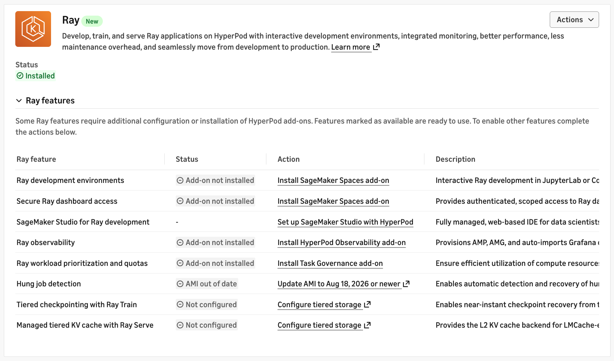

This is the useful answer to a question worth asking of any console status: does it
read the cluster, or only remember what the console itself did? **It reads the
cluster.** The install it detected was made by hand, with Helm, into a dedicated
namespace, with no console involvement at all. So the panel stays accurate on
clusters built by IaC, and the console coexists legibly with whatever installed
KubeRay — the panel reports, your tooling acts.

Note what did *not* change: every `Ray features` row is exactly as before,
including `Hung job detection`. Installing KubeRay satisfies none of them, which is
correct — they are about other add-ons.

> TODO(capture): the `Actions` dropdown's contents. If it offers uninstall or
> upgrade, the console can mutate a release it did not create, which would matter
> for anything managing that release as infrastructure.

Verify against the baseline rather than the console:

```bash
bash scripts/capture-cluster-state.sh k8-ray-3 after-kuberay
diff -u /tmp/hp-state-k8-ray-3-before.txt /tmp/hp-state-k8-ray-3-after-kuberay.txt
```

```bash
bash scripts/capture-cluster-state.sh k8-ray-3 after-kuberay-ns
diff -u /tmp/hp-state-k8-ray-3-before.txt /tmp/hp-state-k8-ray-3-after-kuberay-ns.txt
```

The whole footprint of KubeRay on the cluster is five things, and nothing else:

```diff
 ===== helm releases =====
+kuberay-operator	kuberay-operator	1	kuberay-operator-1.7.1	deployed

 ===== ray crds =====
-(none)
+rayclusters.ray.io
+raycronjobs.ray.io
+rayjobs.ray.io
+rayservices.ray.io

 ===== namespaces =====
+namespace/kuberay-operator

 ===== workloads outside kube-system =====
+kuberay-operator deployment.apps/kuberay-operator

 ===== ray resources =====
-error: the server doesn't have a resource type "rayclusters"
+No resources found
```

No EKS add-on, no access entry, no node change, nothing in `kube-system`.
`raycronjobs` being present is the cheapest confirmation that the chart is
≥ 1.6.0. And the `ray resources` line flipping from an error to `No resources
found` is the CRDs arriving — that error *was* the baseline.

Confirm the operator is serving, not merely scheduled. A freshly created pod
reports `0/1 Running` for a few seconds before readiness, so wait rather than
glance:

```bash
kubectl wait --for=condition=Available deployment/kuberay-operator \
  -n kuberay-operator --timeout=120s
```

Note that `helm list` shows an empty `APP VERSION` — this chart does not set one,
so the operator image tag (`quay.io/kuberay/operator:v1.7.1`) is the only place the
operator version appears.

### Running both paths

How a hand install and the stack interact depends entirely on whether they land on
the same coordinates, and the two cases fail very differently. Both were observed.

**Different namespaces — the second install refuses.** While the operator was
still in `default`, a server-side dry run of the stack's target namespace:

```console
$ helm install kuberay-operator kuberay/kuberay-operator \
    --namespace kuberay-operator --create-namespace --version 1.7.0 --dry-run=server
Error: INSTALLATION FAILED: unable to continue with install: ClusterRole
"raycronjob-editor-role" in namespace "" exists and cannot be imported into the
current release: invalid ownership metadata; annotation validation error: key
"meta.helm.sh/release-namespace" must equal "kuberay-operator": current value is
"default"
```

Helm releases are namespace-scoped, so those are two *different* releases — but the
chart's cluster-scoped RBAC is not, and it has one owner. The second install stops
rather than corrupting anything. Loud and safe.

**Same namespace — the second caller silently takes over.** Any installer using
`helm upgrade --install`, which is the only sane choice for something re-runnable,
**adopts** an existing release at the same coordinates rather than failing. It then
sets the chart to whatever version *it* specifies. The repo's deleted
CloudFormation stack did exactly this, and would have quietly downgraded the
operator from 1.7.1 to its own default of 1.7.0 while taking ownership of a release
it did not create — including on stack delete, where it ran `helm uninstall`.

`make install-kuberay` keeps the useful half of that behaviour and drops the
dangerous half. It still uses `helm upgrade --install`, so re-running it is a safe
no-op (verified: revision increments, the pod is not recreated). But it refuses up
front when the chart's cluster-scoped RBAC is owned by a release in a *different*
namespace, instead of leaving Helm to fail halfway:

```console
$ make install-kuberay KUBERAY_NAMESPACE=somewhere-else
KubeRay is already installed as release kuberay-operator in namespace kuberay-operator.
The chart's cluster-scoped RBAC has a single owner, so installing
into somewhere-else as well will be refused by Helm.
Delete your Ray resources, then:  helm uninstall kuberay-operator -n kuberay-operator
```

The guard reads the `meta.helm.sh/release-namespace` annotation on the
`raycronjob-editor-role` ClusterRole, which is the exact object the conflict fires
on — so there is no output parsing to get wrong.

The practical rule stands: **pick one path per cluster**, and if you switch, pass
the version you already have so the adoption is a no-op.

Either way, delete your Ray resources before any uninstall. Uninstalling the
operator stops reconciliation of every Ray resource in the cluster: running Ray
clusters keep running but are no longer managed, and deletions never complete.

**Friction:** moderate, and entirely on you. The console contributes a link. The
actual work needs `kubectl` configured against the right EKS cluster, `helm`
installed, the repo added, and a chart version chosen — where ≥ 1.6.0 is the
effective floor on HyperPod (`RayCronJob` and Ray's Kubernetes RBAC auth mode
need it), which **the documentation page does not mention**. That unstated floor
is the best argument for automating this step rather than leaving it to a reader
following the doc.

## Step 4 — Prove Ray actually runs

The operator being up says nothing about whether a Ray cluster can schedule. Do
this before the Studio steps, not after: Studio's Tasks tab is a view of Ray
workloads, so setting it up with nothing running proves very little.

### Check the arithmetic first

Do not apply the example and see what happens. Compute whether it fits, because
the failure mode is silent — a pod that asks for more than any node has left sits
`Pending` forever with `Insufficient cpu`, and a `RayJob` in that state waits in
`Initializing` rather than failing.

```bash
kubectl describe nodes | grep -A6 'Allocated resources'
```

On `k8-ray-3`, with KubeRay and the HyperPod daemonsets already placed:

| Node | Allocatable | Requested | Free |
|---|---|---|---|
| `…0add9` | 1930m | 380m | **1550m** |
| `…a8425` | 1930m | 1250m | **680m** |

[examples/ray-cluster-cpu.yaml](examples/ray-cluster-cpu.yaml) asks for 1 CPU per
pod — head plus two workers, so **3000m in 1000m chunks**. Only one such chunk
fits (node A), and the two workers would pin `Pending` indefinitely. The example
is sized for the four-node reference cluster in [README.md](README.md); two nodes
is below it.

### Shrink the request, not the shape

Halving the requests keeps all three Ray nodes — so the test still exercises
distribution — at 1500m total, which fits. Do it with a copy rather than editing
the shipped example:

```bash
sed -e 's/requests: { cpu: "1", memory: "4Gi" }/requests: { cpu: "500m", memory: "2Gi" }/' \
  examples/ray-cluster-cpu.yaml > /tmp/ray-cluster-cpu-small.yaml

kubectl apply -f /tmp/ray-cluster-cpu-small.yaml
```

All three pods scheduled immediately, spread across both nodes, and the cluster
reached `ready` in about 60 seconds once the `rayproject/ray:2.55.1` image was
pulled:

```
NAME              DESIRED WORKERS   AVAILABLE WORKERS   CPUS    MEMORY   GPUS   STATUS   AGE
ray-example-cpu   2                 2                   1500m   6Gi      0      ready    74s
```

### Confirm Ray itself, not just Kubernetes

`ready` means KubeRay is satisfied. Ask Ray:

```bash
HEAD=$(kubectl get pod -l ray.io/cluster=ray-example-cpu,ray.io/node-type=head -o name | head -1)
kubectl exec $HEAD -- ray status
```

```
Idle:
 2 cpu-workers
 1 headgroup
Resources
 0.0/6.0 CPU
 0B/31.81GiB memory
```

**6 logical CPUs against 1500m of actual request.** That gap is deliberate —
`num-cpus: "2"` in the manifest sets Ray's own scheduling budget, which is not a
cgroup limit — and the example's comments explain why. Useful for a demo, wrong
for anything you are timing.

Then prove tasks actually distribute, which neither `ready` nor `ray status` tells
you:

```bash
kubectl exec $HEAD -- python -c "
import ray, collections
ray.init(address='auto', log_to_driver=False)
@ray.remote(num_cpus=1)
def where():
    import time; time.sleep(2)
    return ray.util.get_node_ip_address()
print(collections.Counter(ray.get([where.remote() for _ in range(12)])))
"
```

12 tasks landed 4/4/4 across the three Ray nodes. Ignore one bit of noise on the
way: the raylet logs `There are tasks with infeasible resource requests` while the
queue drains, even though the tasks are feasible and complete.

### Leave it running

Keep this cluster up for the Studio steps — it is what makes the Tasks tab worth
looking at. Tear it down with `kubectl delete -f /tmp/ray-cluster-cpu-small.yaml`
when you no longer need it, and before running anything that brings its own
cluster: two nodes cannot hold a standing cluster and a `RayJob`'s own cluster at
once.

**Friction:** not a console step at all, and the one place a console-only user is
stranded without an error message. Nothing to automate here — but it is the
strongest argument for keeping the sizing guidance in this repo's docs, because
the console offers none.

## Step 5 onward — the optional features

Each row of the features table is a separate install with its own prerequisites.
Do them one at a time, capturing state before and after each, and fill in the
friction note as you go. Order matters: Spaces before the Endpoint Operator.

### 5a. SageMaker Studio for Ray development

Two separate things: a SageMaker AI domain, then granting that domain access to the
cluster. The second is the Ray-relevant half, and it is what creates the EKS access
entry.

#### Gather the inputs first

This is the step where the console asks for values you cannot guess, so collect
them before opening the wizard. On `k8-ray-3`:

```bash
# Existing domains — check before creating another
aws sagemaker list-domains --region us-west-2 \
  --query 'Domains[].{Name:DomainName,Id:DomainId,Status:Status}' --output text

# The VPC and subnets behind the EKS cluster
aws eks describe-cluster --name sagemaker-k8-ray-3-6b1c5ff4-eks --region us-west-2 \
  --query 'cluster.resourcesVpcConfig.{Vpc:vpcId,Subnets:subnetIds}'
```

| Input | Value used | Why |
|---|---|---|
| Domain name | `hyperpod-ray` | An account may already have unrelated domains — this one had `dataprep-beta`. Quota is 500, so a dedicated domain costs nothing. |
| Authentication | **IAM** | Shortest path in a single account. IAM Identity Center is the choice for a multi-person session, and enabling it is usually the slow part in a shared account. |
| Network access | **PublicInternetOnly** | Little effect on Ray: the Spaces add-on runs spaces as pods *on the HyperPod cluster*, not as classic Studio apps, and the EKS endpoint is public so the Tasks tab reaches it. In this mode the subnets mainly carry the domain's EFS mount targets. |
| VPC | `vpc-0d61d46134ab2b6f4` | The cluster's own VPC. |
| Subnets | the four EKS private subnets | Same AZs as the cluster, so EFS stays next to it. |
| Execution role | create new | This role is the principal that gets the EKS access entry — see below. |

`VpcOnly` was also viable here without adding interface endpoints, because the VPC
has a NAT gateway and the private subnets route through it. It buys a more
production-like posture at the cost of more to debug, and nothing in the Ray path
needs it.

Note the subnet layout, because picking from the console's list is otherwise
guesswork — this VPC has three families of subnet:

| CIDR family | What it is |
|---|---|
| `10.192.0.0/24`, `.32`, `.64`, `.96` | public subnets (`…-Public-Subnet1-4`) |
| `10.192.16.0/24`, `.48`, `.80`, `.112` | **the EKS cluster's four private subnets** |
| `10.1.0.0/16` … `10.4.0.0/16` | the HyperPod node subnets, one per AZ |

#### Same VPC as the cluster, but not the node subnets

Worth settling explicitly, because "put it next to the instances" is the intuitive
answer and it is wrong on the second half.

**The domain's subnets carry no Ray traffic.** The Spaces add-on runs spaces as
pods *on the HyperPod cluster*, so a space reaching its Ray cluster is in-cluster
networking. Observed on `k8-ray-3`: the node sits at `10.1.238.192` in
`subnet-0866801c4576c0d09` (`10.1.0.0/16`) and the Ray pods took `10.1.255.125`,
`10.1.146.216`, `10.1.215.66` — VPC CNI assigns pod IPs **from the node subnet**,
with no custom networking in play.

That is also the reason to avoid those subnets for the domain: the oversized `/16`
is the pod IP pool. EFS mount targets or (under `VpcOnly`) Studio ENIs placed there
consume the same space the pods draw from. Harmless at this scale, pointless at any
scale. The EKS `/24`s are the better home — 251 usable addresses each, and EFS needs
only one mount target per AZ.

**Same VPC still matters**, even though under `PublicInternetOnly` the subnets are
little more than somewhere to put EFS mount targets. It preserves options you
otherwise lose to VPC peering or a rebuild:

- switching the domain to `VpcOnly` later,
- making the EKS endpoint private-only, which then requires Studio to have a network
  path to the API,
- reaching in-VPC resources such as FSx from a Studio app.

#### Step 1: create the domain

From the Ray features table, `Set up SageMaker Studio with HyperPod`, or
**Amazon SageMaker AI** → **Domains** → `Create domain`.

> TODO(capture): which path the features-table link actually lands on, whether it
> offers a quick setup, how long creation takes, and the execution role ARN it
> creates.

#### Step 2: grant the domain access to the cluster

Two separate grants, and conflating them is what makes this step hard. Both are
documented in
[Setting up an Amazon EKS cluster in Studio](https://docs.aws.amazon.com/sagemaker/latest/dg/sagemaker-hyperpod-studio-setup-eks.html),
which the Ray chapter points to as *"Setting up an Amazon EKS cluster"* — follow
that link rather than working from the Ray chapter alone.

| Grant | What it does | Where it lives |
|---|---|---|
| An **IAM policy** on the execution role | Lets the role call AWS APIs. Grants nothing inside Kubernetes. | IAM, attached by you |
| **EKS cluster-access policies** | Grant permissions *inside* the cluster. | Attached from `Manage access`, which creates the EKS access entry for you |

##### The IAM policy is the easy one to miss

The developer guide gives the policy verbatim; the statement that matters most is:

```json
{
  "Sid": "UseEksClusterPermissions",
  "Effect": "Allow",
  "Action": ["eks:DescribeCluster", "eks:AccessKubernetesApi", "eks:MutateViaKubernetesApi"],
  "Resource": "arn:aws:eks:<region>:<account>:cluster/<eks-cluster-name>"
}
```

Without `eks:AccessKubernetesApi` the EKS authorizer refuses every call **before
RBAC is consulted**, so no amount of cluster-access-policy work helps.
`AmazonSageMakerFullAccess` contains **no `eks:` actions at all** — verified by
searching its 24 KB document for `eks:` and finding nothing — so a role built from
that managed policy alone cannot reach the cluster.

Two details in the policy that are easy to get wrong:

- **Two different cluster ARNs.** `sagemaker:DescribeCluster` is scoped to the
  *HyperPod* cluster; the `eks:` actions to the *EKS* cluster. The guide warns that
  leaving the example ARNs in place means Studio cannot describe your cluster and
  the Tasks tab does not load. This is why
  [cfn/sagemaker-domain.yaml](cfn/sagemaker-domain.yaml) takes both
  `EKSClusterName` and `HyperPodClusterName`.
- **`eks:DescribeAddon` is scoped to a sub-resource**, `cluster/<name>/*`, so it is
  a separate statement. It is how Studio detects the Spaces add-on.

The policy also carries `ssm:StartSession` / `ssm:TerminateSession`, which is how a
space is reached from a local IDE over SSH-over-SSM when browser access is not
configured, plus `ec2:Describe*`, `ecr:*` and `cloudwatch:*`.

##### What goes wrong when the IAM policy is missing

Worth recording because the symptom points at the wrong thing entirely:

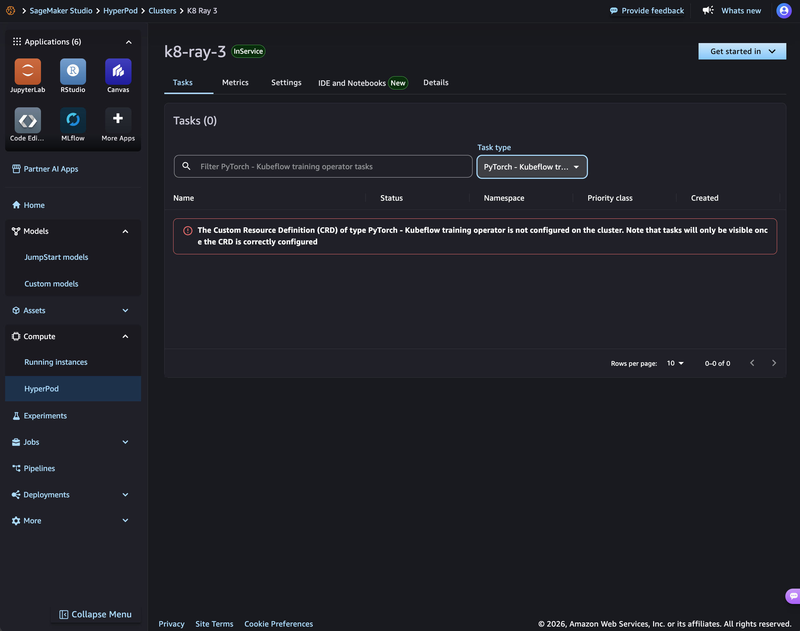

The CRD named in that message exists. So does every Ray CRD. Nor is UI support
missing — the task-type picker offers all three Ray kinds:

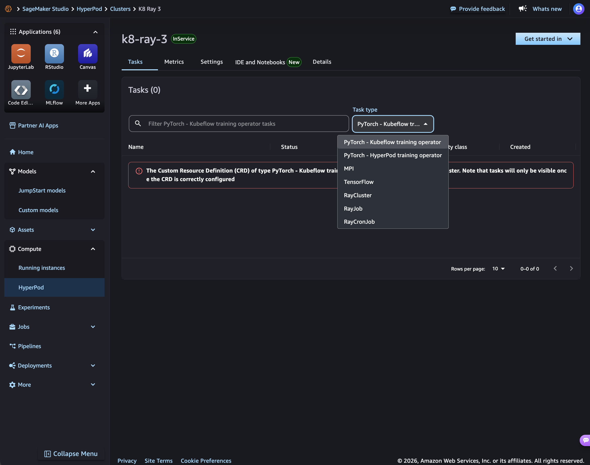

Selecting one changes nothing and the banner keeps naming the previous task type,
which reads like a UI bug. It is not: every request is being refused, so there is
nothing to redraw.

**A 403 is reported as a configuration problem.** On this cluster that sent the
investigation through three wrong hypotheses in order — a missing CRD, then a stale
Helm chart, then the wrong access-policy scope — before the IAM policy turned out
to be the whole story. The permissions the UI uses for feature detection are
`apiextensions.k8s.io/customresourcedefinitions get` and
`authorization.k8s.io/selfsubjectaccessreviews create`, both granted by
`AmazonSagemakerHyperpodUserClusterPolicy`; when the probe itself is refused, its
failure is rendered as absence. This is the one finding here worth reporting as a
bug.

##### Cluster-access policies, and their non-uniform scopes

`Manage access` → select the execution role → select policies → choose namespace or
cluster scope. The guide recommends attaching **all** of them: each covers a
different part of the experience, so leaving one off removes that capability.

| Policy | Grants | Scope |
|---|---|---|
| `AmazonSagemakerHyperpodTrainingPolicy` | Full access to `RayCluster`, `RayJob`, `RayCronJob`, `HyperPodPyTorchJob`, Kubeflow `PyTorchJob`/`MPIJob`/`TFJob`, jobs and pods. **This is what makes Ray workloads visible.** | yours |
| `AmazonSagemakerHyperpodInferencePolicy` | Full access to `RayCluster` and `RayService`, `JumpStartModel`, `InferenceEndpointConfig` | yours |
| `AmazonSagemakerHyperpodSpacePolicy` | Spaces; grants the `WorkspaceConnection` that opens one | yours |
| `AmazonSagemakerHyperpodSpaceTemplatePolicy` | Reads the shared space templates | **`jupyter-k8s-shared`**, where the templates live — not where your users work |
| `AmazonSagemakerHyperpodUserClusterPolicy` | The cluster-wide reads the UI needs to render: namespaces, nodes, CRD get, self-access checks | **cluster**, always |

The last two columns are the trap: the scopes are **not uniform**, and a template
that applies one scope to all five policies is wrong. Scoping to a namespace also
restricts which tasks those users see in Studio, which is the intended way to
divide a shared cluster.

Ray needs no custom RBAC. `AmazonSagemakerHyperpodTrainingPolicy` covers
`ray.io` outright — confirmed by deleting a hand-written `ray.io` ClusterRole and
reloading Studio, which kept working. The guide does document a **custom Kubernetes
RBAC role** route for granting a narrower set of verbs than a policy provides; that
is the only reason `cfn/sagemaker-domain.yaml` keeps a `KubernetesGroups`
parameter, and it is empty by default.

##### Step 2b: this is a cluster-creation setting

On `k8-ray-3` none of this existed, because the cluster was created with
`DataScientistRole1` … `DataScientistRole10` all empty. That makes
`DataScientistSetupCondition` false and skips the whole `DataScientistSetupStack`,
which is what attaches the IAM policy and creates the access entry. **If you create
a cluster from the official assets and intend anyone to use Studio, populate those
parameters at creation time.**

Its implementation is worth reading if you are debugging this —
`s3://aws-sagemaker-hyperpod-cluster-setup-<region>-prod/1/resources/data-scientist-setup/lambda_function/lambda_function.py`
— because it shows the custom-RBAC route in use: it attaches an IAM policy
`HyperPodDataScientistUI-<cluster>`, creates an access entry with
`kubernetesGroups` and no access policies, and applies its own ClusterRole and
per-namespace Role. That RBAC covers `kubeflow.org/pytorchjobs` and
`inference.sagemaker.aws.amazon.com` but **not `ray.io`** — so a cluster set up
that way shows PyTorch tasks and not Ray ones. Use the cluster-access policies for
Ray.
##### Putting it together

```bash
make deploy-domain \
  EKS_CLUSTER_NAME=sagemaker-k8-ray-3-6b1c5ff4-eks \
  HYPERPOD_CLUSTER_NAME=k8-ray-3 \
  DOMAIN_VPC_ID=vpc-0d61d46134ab2b6f4 \
  DOMAIN_SUBNET_IDS=subnet-00b6978bdf50c082c,subnet-0a4518fc497779703,subnet-082b41d61be62fde4,subnet-0179fe7d919a98355
```

One stack does both grants. Add `ACCESS_SCOPE_NAMESPACES=default` to confine the
training, inference and space policies to a namespace; the space-template and
user-cluster policies keep their own required scopes either way.

Verify from EKS rather than from the console:

```console
$ make domain-access EKS_CLUSTER_NAME=sagemaker-k8-ray-3-6b1c5ff4-eks
TrainingPolicy       cluster
InferencePolicy      cluster
SpacePolicy          cluster
SpaceTemplatePolicy  namespace  jupyter-k8s-shared
UserClusterPolicy    cluster
```

```bash
aws iam get-role-policy --role-name <exec-role> \
  --policy-name hyperpod-studio-cluster-access --query 'PolicyDocument.Statement[].Sid'
```

Expect seven statements, including `UseEksClusterPermissions` and
`DescribeSpacesAddon`.

Do **not** try to verify cluster-access policies with `kubectl auth can-i --as`.
The EKS authorizer evaluates them outside of Kubernetes RBAC, so impersonation
reports `no` for permissions that work — a trap that produced a wrong conclusion
during this walkthrough. Only group-bound RBAC, the custom-role route, is testable
that way.

###### A CloudFormation trap worth knowing

`aws cloudformation deploy` keeps the **previous value** of any parameter it is not
given. Two consequences, both hit here:

- A variable the Makefile passes only when non-empty can be set but never cleared.
- Changing a parameter's *default in the template* does nothing to an existing
  stack. `AttachSpaceTemplatePolicy` stayed `false` through a redeploy after its
  default became `true`, so the policy silently never attached.

The Makefile therefore passes every parameter on every deploy. If you are
hand-rolling the CLI call, pass them all or check
`describe-stacks --query 'Stacks[0].Parameters'` afterwards.
#### Step 3: verify end to end

**Amazon SageMaker AI** → **Domains** → your domain → `Open Studio`, which asks
which user profile to launch as:

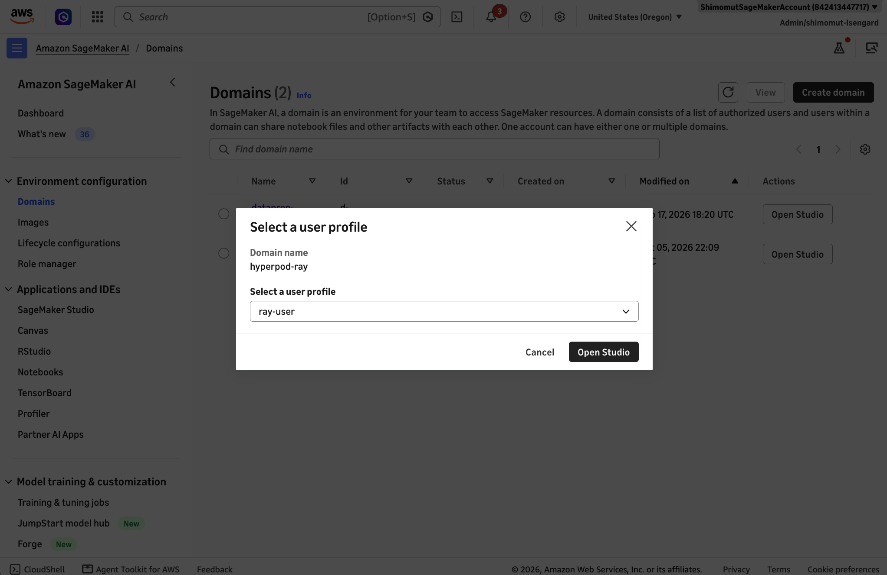

Inside Studio, go to **Compute** → **HyperPod** and pick the cluster:

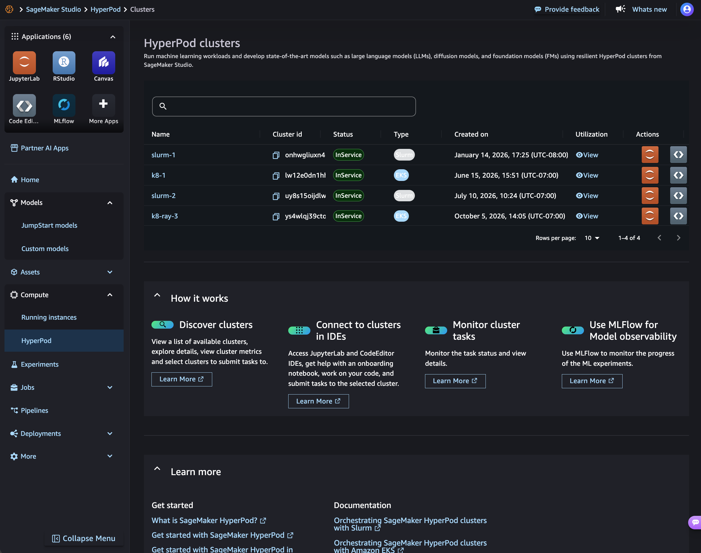

Then **Tasks**. Allow a few seconds for the IAM change to take effect, and **reload
the page** — the Tasks tab does not re-check permissions on its own, which is why a
correct fix can still look like a failure.

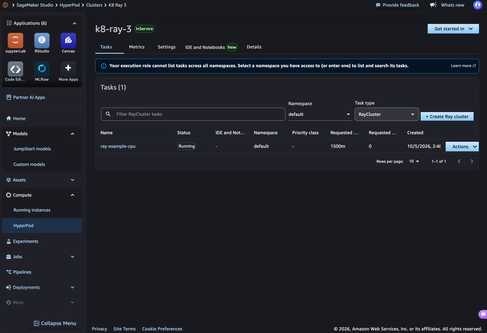

`ray-example-cpu` appears as `Running` in namespace `default` with its 1500m
request, and a `+ Create Ray cluster` button appears alongside the task-type
picker. This is why [Step 4](#step-4--prove-ray-actually-runs) comes before the
Studio steps: an empty Tasks tab cannot tell you whether the integration works.

One banner remains:

> Your execution role cannot list tasks across all namespaces. Select a namespace
> you have access to (or enter one) to list and search its tasks.

A `Namespace` picker appears next to the task type and defaults to `default`, and
listing within it works. The likely cause is that the access policies were
attached with `AccessScopeNamespaces=default`, so the EKS authorizer confines them
to that namespace even though the group-bound ClusterRole allows cluster-wide
reads. Untested: re-deploying with `ACCESS_SCOPE_NAMESPACES` empty would show
whether cluster scope clears the banner. Cosmetic either way if your users work in
one namespace.

**Friction:** the highest of the walkthrough, and the only step where the console
genuinely acts. An IAM policy you attach by hand in a second console, two different
cluster ARNs to get right, VPC and subnet IDs that are pure lookup, five policies
with three different scoping rules, an IAM role and an EKS access entry created, and
all of it repeated per team and per namespace — with a failure mode that reports an
authorization problem as a missing CRD. Everything needed is documented, which is
the point: this is not hard because of missing information, it is hard because
nothing checks your work until Studio either renders or does not.

### 5b. SageMaker AI Spaces add-on

This is what makes Ray on HyperPod feel like Ray on a laptop: a JupyterLab or Code
Editor space attached to a `RayCluster`, where `ray.init()` connects to it.

Cluster → **IDE and notebooks** tab → **Amazon SageMaker Spaces** → `Install`.

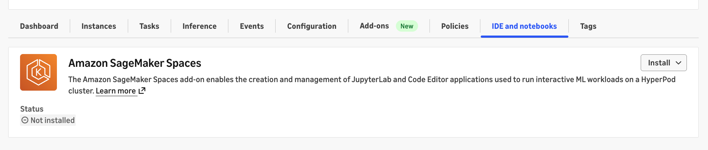

#### Read the confirmation dialog

Unusually for a console confirmation, it enumerates exactly what it will create,
and it is worth reading rather than clicking past:

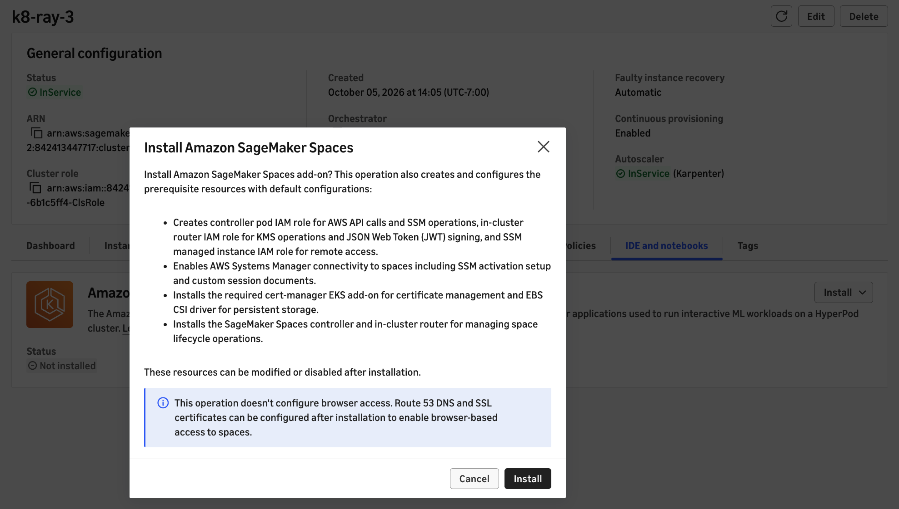

Three IAM roles (controller pod for AWS APIs and SSM, in-cluster router for KMS and
JWT signing, and an SSM managed-instance role for remote access), SSM connectivity
including custom session documents, the **cert-manager** and **EBS CSI driver** EKS
add-ons as prerequisites, and then the Spaces controller and router themselves.

It also states plainly that browser access is not configured, and that Route 53 DNS
and SSL certificates can be added later. That matches this repo's scope: without a
customer-owned domain you reach a space from a local IDE over SSH-over-SSM.

#### What it actually created

```bash
bash scripts/capture-cluster-state.sh k8-ray-3 after-spaces
diff -u /tmp/hp-state-k8-ray-3-before-spaces.txt /tmp/hp-state-k8-ray-3-after-spaces.txt
```

```diff
 ===== namespaces =====
+namespace/jupyter-k8s-system

 ===== eks addons =====
+amazon-sagemaker-spaces
+aws-ebs-csi-driver

 ===== workloads outside kube-system =====
+jupyter-k8s-system deployment.apps/jupyter-k8s-controller-manager
```

So it arrives as a genuine **EKS managed add-on**, unlike KubeRay. Note the version:

```console
$ aws eks describe-addon --cluster-name <eks> --addon-name amazon-sagemaker-spaces \
    --query 'addon.{Status:status,Version:addonVersion}'
ACTIVE   v0.2.0-eksbuild.2
```

`Quick Install` picked **v0.2.0-eksbuild.2** even though the catalog offers
`v0.2.1-eksbuild.1`. It clears the ≥ 0.2.0 floor that Ray interactive development
needs, but **Quick Install is not "latest"** — check the version rather than
assuming, and upgrade through the add-on if you need 0.2.1.

Four CRDs appear under `workspace.jupyter.org` — `workspaces`,
`workspacetemplates`, `workspaceaccessstrategies`, `workspaceintegrationtemplates`
— which line up exactly with what `AmazonSagemakerHyperpodSpacePolicy` is documented
to grant. There is also a `jupyter-k8s-jwt-rotator` CronJob on `*/15 * * * *`, the
JWT signing machinery the dialog mentioned.

#### The documented template namespace is wrong

The developer guide says to scope `AmazonSagemakerHyperpodSpaceTemplatePolicy` to
**`jupyter-k8s-shared`**, "where the templates live". On this add-on version they do
not live there:

```console
$ kubectl get workspacetemplates -A
NAMESPACE            NAME                             APP TYPE      DEFAULT IMAGE
jupyter-k8s-system   sagemaker-code-editor-template   Code Editor   public.ecr.aws/sagemaker/sagemaker-distribution:latest-cpu
jupyter-k8s-system   sagemaker-jupyter-template       JupyterLab    public.ecr.aws/sagemaker/sagemaker-distribution:latest-cpu

$ kubectl get ns jupyter-k8s-shared
Error from server (NotFound): namespaces "jupyter-k8s-shared" not found
```

The access strategy and the `ray-integration` integration template are also in
`jupyter-k8s-system`. Scoping an access policy to a namespace that does not exist is
accepted and simply grants nothing, so the failure here is silent. Possibly
`jupyter-k8s-shared` is for templates *you* create and share; nothing on this
cluster puts anything there.

[cfn/sagemaker-domain.yaml](cfn/sagemaker-domain.yaml) therefore scopes that policy
to **both** namespaces, which costs nothing and does not depend on which is right:

```console
$ aws eks list-associated-access-policies … --query '…[?contains(policyArn,`SpaceTemplate`)].accessScope'
{ "type": "namespace", "namespaces": ["jupyter-k8s-system", "jupyter-k8s-shared"] }
```

#### Confirm before creating a space

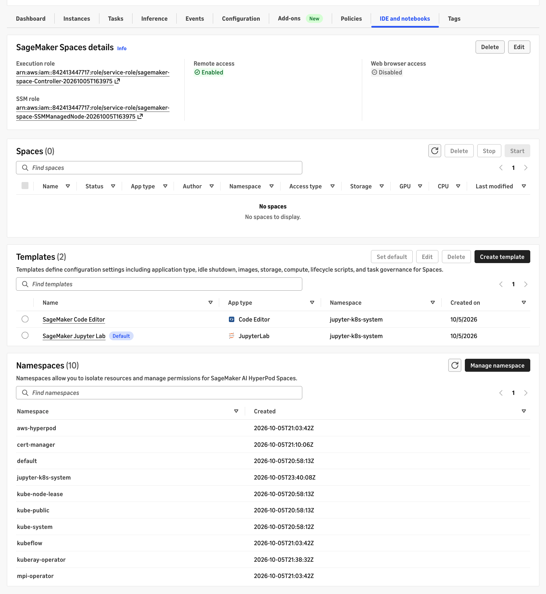

**Remote access: Enabled**, **Web browser access: Disabled** — the expected state
without Route 53. Two templates are registered, with `SageMaker Jupyter Lab` marked
`Default`. The controller and SSM roles are named
`sagemaker-space-Controller-*` and `sagemaker-space-SSMManagedNode-*`.

#### How the Ray attachment works

Worth understanding before you hit a version error, because the mechanism answers
half the version question for you. The `ray-integration` integration template injects
a **sidecar** into the space pod, and takes its image from the `RayCluster` itself:

```yaml
image: '{{ resource "rayCluster" "{.spec.headGroupSpec.template.spec.containers[0].image}" }}'
```

```bash
ray start --address=<head-service>.<namespace>.svc.cluster.local:<gcs-port> \
  --num-cpus=0 --num-gpus=0 --object-store-memory=1073741824 --temp-dir=/tmp/ray --block
```

So the space joins the Ray cluster as a node contributing **zero** CPU and GPU: it
is a driver, not a worker. The sidecar can never mismatch the cluster's Ray version,
because it *is* the cluster's head image. It retries `ray start` 30 times at 10s
intervals before failing, so a head that is not up yet is tolerated.

**What can still mismatch is the space's own container.** `ray.init()` runs in the
JupyterLab container, built from `sagemaker-distribution:latest-cpu`, and its `ray`
Python package must match the cluster's — patch version included, per the developer
guide. That is the thing to check once a space is running:

```bash
kubectl exec -n <namespace> <space-pod> -c <jupyter-container> -- \
  python -c "import ray, sys; print(ray.__version__, sys.version)"
```

Compare against the cluster, which this walkthrough built on Ray **2.55.1** with
Python 3.10.

Budget for the sidecar when sizing: it requests 250m CPU / 512Mi and may burst to
1 CPU / 1536Mi, on top of the JupyterLab container itself. On
`ThreadsPerCore: 1` nodes that is a real fraction of a node — this walkthrough
scaled the cluster from two nodes to four before attempting a space.

#### Creating a space

Spaces are **not** created from the console tab you just used. There are two tabs
with the same name and different powers:

| Where | What it does |
|---|---|
| AWS console → cluster → **IDE and notebooks** | Start / Stop / Delete existing spaces, templates, namespaces |
| **Studio** → HyperPod → Clusters → *cluster* → **IDE and Notebooks** | **Creates** spaces, and attaches them to a Ray cluster |

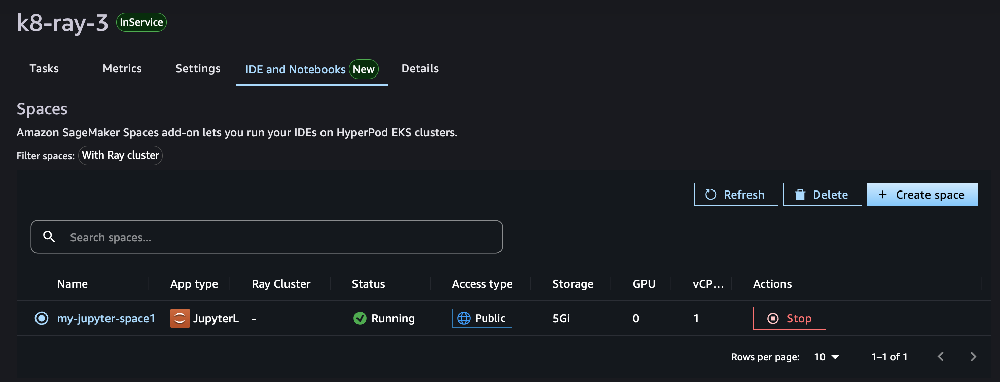

In Studio, `Create space`:

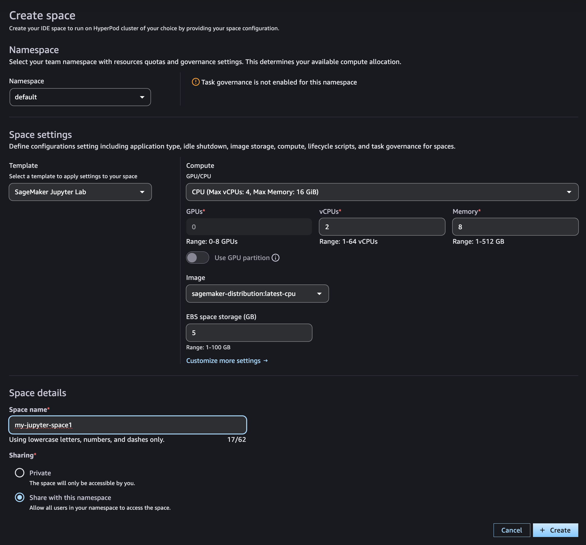

Two fields decide whether this works.

**Namespace must be the one holding the Ray cluster.** The integration template
builds the head address as `<head-service>.{{ .Workspace.Namespace }}.svc.cluster.local`,
so a space in another namespace cannot resolve it. `default` here.

**vCPUs is a request against a real node, not the instance type.** The form offers
`CPU (Max vCPUs: 4, Max Memory: 16 GiB)` and defaults to 2, but on
`ThreadsPerCore: 1` nodes allocatable is **1930m**, so a 2-vCPU request can never be
scheduled on any node. Set it to **1**. Budget for the two sidecars on top:

```console
$ kubectl get pod <space-pod> -o jsonpath='{range .spec.containers[*]}{.name} {.resources.requests.cpu}{"\n"}{end}'
workspace          1
ray-sidecar        250m      # only after a Ray cluster is attached
ssm-agent-sidecar  100m      # the "Remote access: Enabled" machinery
```

The `Task governance is not enabled for this namespace` warning on the form is
expected here and can be ignored — see [5e](#5e-deliberately-skipped).

The pod reached `2/2 Running` in about 60 seconds. It is `3/3` once Ray is attached.

#### Attaching the Ray cluster

Open the space by clicking its **name** — the list view has no Connect action — then
the **Ray cluster** tab:

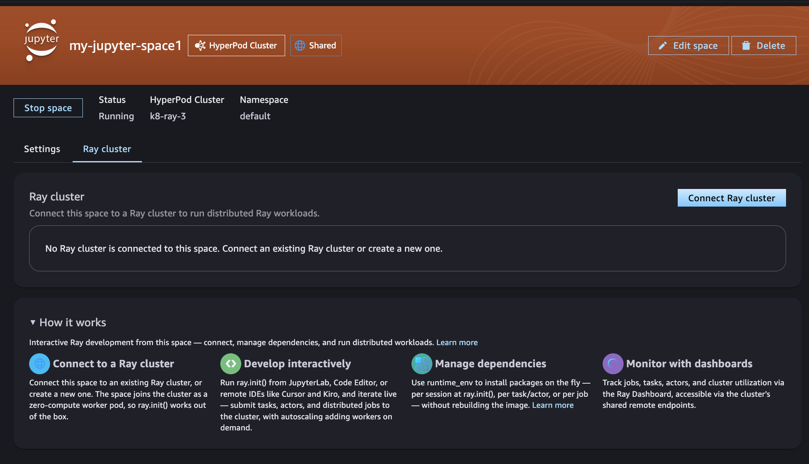

Its "How it works" panel confirms the mechanism independently: *"The space joins the
cluster as a zero-compute worker pod, so ray.init() works out of the box."*

`Connect Ray cluster` → pick the cluster → `Save and restart`.

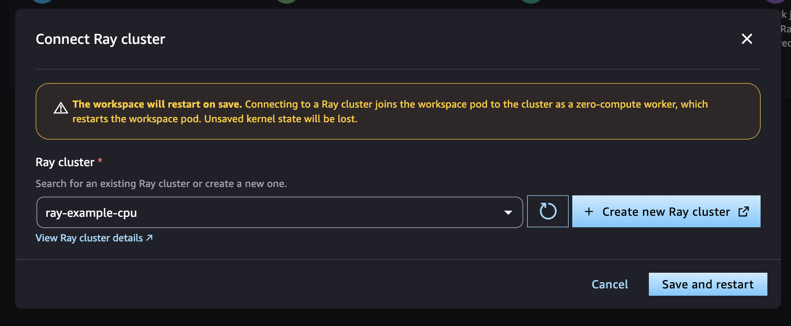

#### The version trap

**This is the one place where following the developer guide verbatim produces a
broken setup.** The dialog above accepted the cluster with no warning and the tab
then reported `Connected`:

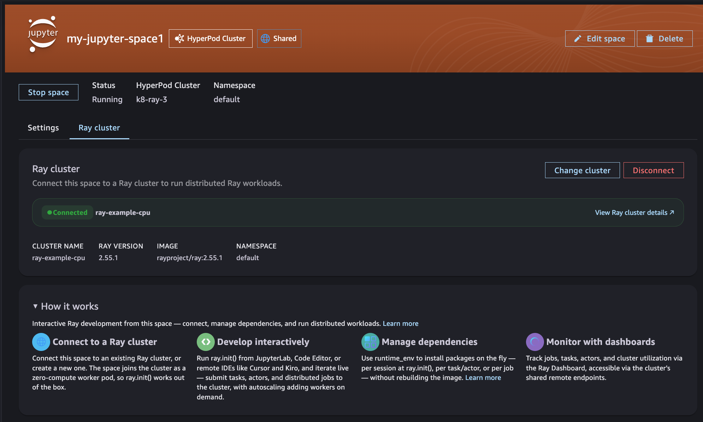

Note what that panel shows while claiming success: `IMAGE rayproject/ray:2.55.1`,
against a space on `sagemaker-distribution`. Everything needed to spot the problem
is on screen, and nothing flags it. `ray.init()` then failed:

```
RuntimeError: Version mismatch: The cluster was started with:
    Ray: 2.55.1
    Python: 3.10.20
This process on node 10.1.151.109 was started with:
    Ray: 2.55.1
    Python: 3.12.14
```

Where the mismatch comes from, with both halves taken straight from the
documentation:

| Side | Source | Python |
|---|---|---|
| Ray cluster | the guide's own `RayCluster` examples use `rayproject/ray:2.55.1` (and `2.56.1` elsewhere) | 3.10 |
| Space | the default space template's `sagemaker-distribution:latest-cpu` | 3.12 |

The Ray versions match at 2.55.1, which is what makes this so easy to walk into.
The guide does state the requirement — *"The Python version must match as well,
including the patch version"* — and also claims that **"When the versions differ,
Studio shows a warning and offers to create a compatible cluster instead."** On
add-on v0.2.0-eksbuild.2 no warning appeared. The validation seems to compare
`rayVersion` only.

So `Connected` does not mean usable. It is accurate about what it describes: the
space pod genuinely joins the cluster, and the `ray-sidecar` cannot mismatch because
it runs the cluster's own head image. The only thing refused is the user's Python
process. Ray's `check_version_info()` catches it at `ray.init()` — a good failure,
loud and immediate, but it arrives three console screens after the decision that
caused it.

#### The fix: one image on both sides

The guide's own recommendation, and the only reliable one: *"choose the same
SageMaker AI Distribution image for both the Ray cluster and the Space Image."*
That is [examples/ray-cluster-space.yaml](examples/ray-cluster-space.yaml):

```bash
make deploy-example EXAMPLE_FLAVOR=space
```

It pins the image **by digest** rather than using `latest-cpu`. The whole point is
that both sides run byte-identical Python, and a moving tag defeats that the next
time the space image is rebuilt. Read the digest off a running space:

```bash
kubectl get pod <space-pod> -n <ns> \
  -o jsonpath='{.status.containerStatuses[?(@.name=="workspace")].imageID}'
```

Then `Change cluster` in the Ray cluster tab. The pod restarts; no image pull,
because that node already has it.

#### Verified end to end

```console
$ kubectl exec <space-pod> -c workspace -- python -c "..."
driver python 3.12.14 ray 2.55.1
Connecting to ray-example-space-head-svc.default.svc.cluster.local:6379
CONNECTED
ray nodes alive: 4
cluster CPU: 6.0
tasks: {'10.1.111.52': 3, '10.1.228.186': 3, '10.1.176.37': 3}
```

Three things to read off that:

- **`ray.init()` takes no address.** The sidecar ran `ray start` inside the same pod,
  so the driver finds the session locally and follows it to the head. That is what
  "works out of the box" means mechanically.
- **Four nodes, six CPUs.** The space is the fourth node and contributes nothing —
  head 2 + worker 2 + worker 2.
- **Nine tasks landed on three nodes, not four.** The space has no CPU to offer, so
  it never receives work. It is a driver, which is the intent.

The `infeasible resource requests` warning from the raylet while the queue drains is
the same harmless noise as in [Step 4](#step-4--prove-ray-actually-runs).

**Friction:** the add-on itself is one click plus reading one dialog, and the console
creates three IAM roles, two prerequisite add-ons and the controller for you. **Not
worth a template** — the clearest case in this walkthrough of console automation a
CloudFormation stack would only reimplement badly.

The friction is all downstream of it, and none of it is automatable away:

- `Quick Install` is **not** latest (`v0.2.0-eksbuild.2` while the catalog offered
  `v0.2.1-eksbuild.1`). Check the version.
- The documented template namespace is wrong — templates are in
  `jupyter-k8s-system`, not `jupyter-k8s-shared`, and scoping a policy to a
  non-existent namespace fails silently.
- The space form's vCPU default cannot be scheduled on `ThreadsPerCore: 1` nodes.
- The image-version trap, which the guide walks you into and the console does not
  catch.

What *is* worth keeping in this repo is
[examples/ray-cluster-space.yaml](examples/ray-cluster-space.yaml): a cluster whose
image matches the space's, pinned by digest.
### 5c. HyperPod Observability add-on

Needs **1.0.6 or later** for Ray metrics; the catalog currently offers
`v1.3.0-eksbuild.1`. Also needs an Amazon Managed Grafana workspace, whose
IAM Identity Center or SAML setup is usually the slow part in a shared account.

Worth checking first: the cluster-setup template already carries observability
parameters, including `RayMetricLevel` (default `ADVANCED`) alongside
`ClusterMetricLevel`, `NodeMetricLevel` and friends. On `k8-ray-3` they are inert
because `EnableObservabilityFeature` is `false`, but it means **Ray metrics are
already a first-class knob at cluster-creation time** — so for a fresh cluster
this may be a stack parameter rather than a console step.

> TODO(capture): whether installing from the console produces the same result as
> setting `EnableObservabilityFeature=true` with `RayMetricLevel=ADVANCED` at
> creation.

**Friction:** _TODO_ — the Grafana workspace is the expensive part, and it is
exactly what CloudFormation is good at.

### 5d. Hung job detection — the AMI signal does not add up

**Unresolved. Do not plan around this row.**

The row reads `AMI out of date` with the action `Update AMI to Aug 18, 2026 or
newer`. The obvious hypothesis — an old cluster has an old AMI, create a fresh one
and the row clears — is **falsified**. `k8-ray-3` was created on 2026-10-05 from
the current cluster-setup assets and still reports `AMI out of date`, identically
to `k8-1` from 2026-06-15.

The node is demonstrably not out of date:

| Evidence | Value |
|---|---|
| `osImage` | `Amazon Linux 2023.12.20260918` — 2026-09-18, a month past the floor |
| `kernelVersion` | `6.12.103-129.197.amzn2023` |
| Kernel in the **August 29, 2026** EKS AMI release notes | `6.12.100-125.179.amzn2023` — *older* |
| `kubeletVersion` | `v1.34.2-eks-ecaa3a6` |
| `LastSoftwareUpdateTime` | `2026-10-05T14:07:49-07:00`, equal to `LaunchTime` |

**The console contradicts itself.** The cluster's own AMI status, shown elsewhere
in the console, reads **`Up to date`** for `k8-ray-3`. Only the
`Hung job detection` row in the Ray features table claims otherwise. So this is
not an AMI problem at all — it is a problem with this one row.

Possible explanations, none verified:

1. The required on-node component is not in any released AMI yet, and the feature
   is ahead of the AMI pipeline — the row's wording would then be a stand-in for
   "not available yet".
2. The row reads a different signal from the cluster's AMI status check, and one
   of the two is stale.
3. The row is simply wrong.

What we could not determine locally: the node's actual AMI ID. HyperPod instances
live in a service-managed account — `aws ec2 describe-instances` on the node's
instance ID returns `InvalidInstanceID.NotFound` — and neither
`describe-cluster-node` nor the Kubernetes node object exposes an `ImageId` or a
HyperPod AMI version. There is no customer-visible field to compare against
2026-08-18, which is itself worth knowing: **you cannot self-serve an answer to
"is my AMI recent enough?"**

> TODO(ask the service team): why the `Hung job detection` row reports
> `AMI out of date` on a cluster whose AMI status reads `Up to date`. Either the
> row means something other than what it says, or it is a bug. `k8-ray-3` is a
> clean reproduction either way.

**Carry on past this row.** Nothing else in the Ray setup depends on it, and
hung job detection is a runtime safety net rather than a prerequisite — the rest
of the walkthrough proceeds unaffected.

**Friction:** unknown, and currently unactionable — following the stated remedy on
a cluster created today would be a no-op. Not a candidate for a Ray-specific
template either way: AMI currency is a cluster-lifecycle concern, and the
developer guide already covers updating a cluster's AMI version on a schedule.

### 5e. Deliberately skipped

- **HyperPod Ray Endpoint Operator** and browser access to spaces — both need a
  customer-owned domain with a public Route 53 hosted zone. Out of scope here;
  use `make dashboard` (`kubectl port-forward`) instead of an authenticated
  public URL.
- **Task governance** — not installed on `k8-ray-3`, and deliberately left that
  way. The row offers `Install Task Governance add-on`, but once governance is on,
  a namespace without a compute allocation holds a Ray workload unadmitted with no
  pods at all, and preemption deletes a whole Ray cluster including its head.
  Useful in production; in a hands-on session it only adds failure modes. Note
  that the cluster-setup template has
  `CreateTaskGovernanceClusterPolicyStack` for the create-time path.
- **Tiered checkpointing / managed tiered KV cache** — both need HyperPod Tiered
  Storage configured.

## Friction log

Fill one row per step as you go. The last two columns are the whole point: a
step that is one click with no inputs does not need a template, and a step that
makes you collect ARNs from three consoles does.

| Step | Clicks | Inputs you must look up | Repeated per cluster / team / namespace? | Creates IAM or trust? | Worth CloudFormation? |
|---|---|---|---|---|---|
| 3. KubeRay install | 0 — console only links to docs | chart version (floor ≥ 1.6.0, undocumented) | per cluster | no | **Scripted, not CFN** — `make install-kuberay`. Creates no AWS resources, so a stack bought nothing a target does not |
| 5a. Studio access | 2 consoles, ~15 fields | HyperPod **and** EKS cluster ARNs, VPC + subnet IDs, 5 policies with 3 scoping rules | per team and namespace | yes (IAM role + EKS access entry) | **Yes** — [cfn/sagemaker-domain.yaml](cfn/sagemaker-domain.yaml). Nothing validates the config until Studio renders or does not |
| 5b. Spaces add-on | 1 click + 1 dialog, then a space form | the space image's digest, if you want Ray to work | per cluster, per space | yes (3 IAM roles, created for you) | **No** for the add-on. Yes for a matching RayCluster: [examples/ray-cluster-space.yaml](examples/ray-cluster-space.yaml) |
| 5c. Observability | _TODO_ | Grafana workspace, Prometheus workspace, role | per account | yes | _TODO_ |
| 5d. AMI floor | unknown | none you can read | unclear | no | No — cluster-lifecycle concern, and the signal is unexplained |

### How to read the verdict

A step earns a CloudFormation template when it has at least one of:

- **Inputs you cannot guess** — ARNs, role names, subnet IDs, workspace IDs
  gathered from other consoles.
- **Repetition** — per team, per namespace, per user, or every time a cluster is
  rebuilt.
- **IAM or trust relationships**, which are error-prone by hand and invisible
  when wrong.
- **Ordering constraints** across several services.

It does *not* earn one merely for being a multi-step wizard, if the wizard is
self-contained and idempotent. A step the console both **performs** and reports
status for is a weak candidate, because discoverability was half the value. A step
the console only *links to* is not automated at all, however prominent the button.

## What this means for the CloudFormation stack

The repo used to carry `cfn/kuberay-operator.yaml`, a stack that wrapped
`helm upgrade --install` in a Lambda-backed custom resource. **It has been deleted
in favour of `make install-kuberay`.** The reasoning, since the conclusion moved
twice during this walkthrough:

The question going in was whether a console installer had made the stack
redundant. There is no console installer, so that argument failed — KubeRay
arrives by Helm or not at all. But "not the console" does not imply "must be
CloudFormation". Weighing what the stack actually bought:

| What it provided | Replaceable by a Makefile target? |
|---|---|
| A non-manual install path | Yes |
| A pinned chart version | Yes |
| A dedicated namespace | Yes |
| Repeatability across clusters | Yes |
| Existence *as a stack* — nestable, deletable as a unit, drift detection | No |

Only the last line was unique, and nothing in this repo needed it. Against that it
cost 304 lines and six resources (`IAM::Role`, `EKS::AccessEntry`,
`Lambda::LayerVersion`, `Logs::LogGroup`, `Lambda::Function`, `CustomResource`) to
run what is three Helm commands, carried a dependency on an undocumented artifact
path in the cluster-setup assets bucket, and owned the
`helm upgrade --install` adoption hazard described above — a hazard the hand path
does not have.

So: **a step the console only links to is not automated, but it is not necessarily
CloudFormation-shaped either.** The discriminator is whether the step creates AWS
resources with identities and lifecycles, or merely runs commands against a
cluster. KubeRay is the latter.

Where the console *does* act, the answer flips. **5a — the Studio domain — is
genuinely CloudFormation-shaped**, and is now [cfn/sagemaker-domain.yaml](cfn/sagemaker-domain.yaml):
it creates an IAM execution role and an EKS access entry, spans two consoles, and
needs VPC and subnet IDs that are pure lookup. **5c — observability — may need no
new template at all**, since the cluster-setup stack already carries
`EnableObservabilityFeature` and `RayMetricLevel`. Fill in its friction row before
writing anything.
