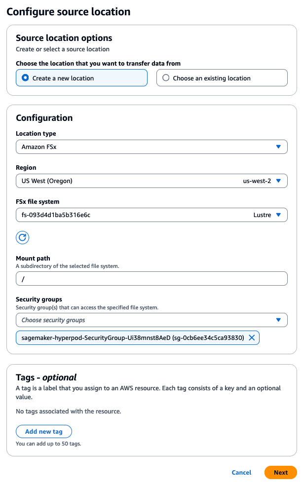
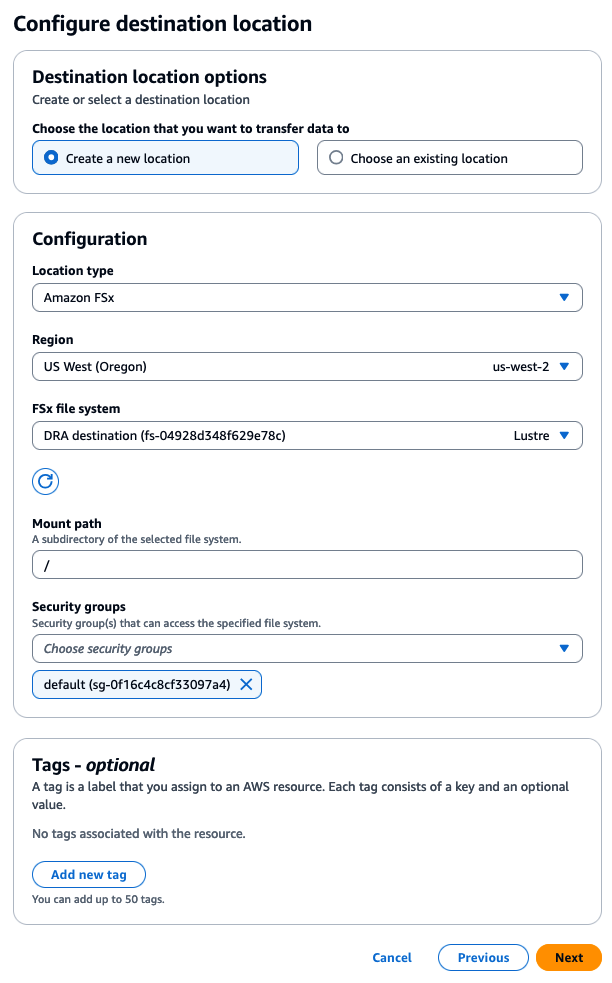
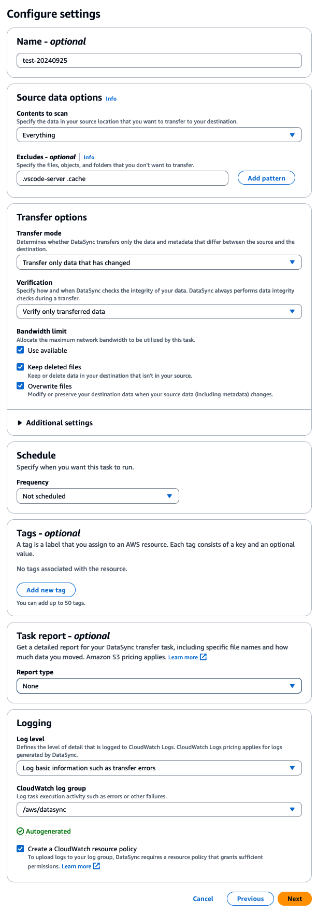
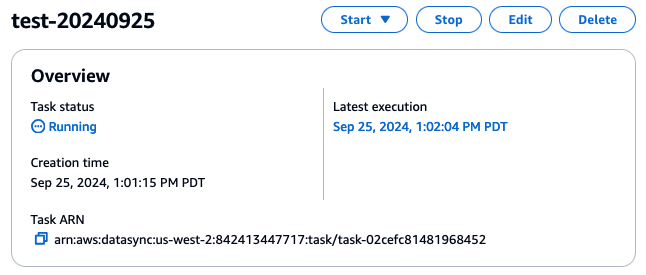

# How to replace FSxL file system - HyperPod

1. Create a new FSxL file system with a CF template. 
    
    > **Note:** use same security group and subnet as your exiting FSxL filesystem.

      ``` yaml
      AWSTemplateFormatVersion: '2010-09-09'
      
      Parameters:
      
        Capacity:
          Description: Storage capacity in GiB (1200 or increments of 2400)
          Type: Number
          Default: 1200
      
        PerUnitStorageThroughput:
          Description: Provisioned Read/Write (MB/s/TiB)
          Type: Number
          Default: 250
          AllowedValues:
            - 125
            - 250
            - 500
            - 1000
      
        Compression:
          Description: Data compression type
          Type: String
          AllowedValues:
            - "LZ4"
            - "NONE"
          Default: "LZ4"
      
        LustreVersion:
          Description: Lustre software version
          Type: String
          AllowedValues:
            - "2.15"
            - "2.12"
          Default: "2.15"
      
        SecurityGroup:
          Description: Security group
          Type: String
          Default: ""
      
        Subnet:
          Description: Subnet
          Type: String
          Default: ""
      
      
      Resources:
        FSxLFilesystem:
          Type: AWS::FSx::FileSystem
          DeletionPolicy: Delete
          UpdateReplacePolicy: Delete
          Properties:
            FileSystemType: LUSTRE
            StorageType: SSD
            FileSystemTypeVersion: !Ref LustreVersion
            StorageCapacity: !Ref Capacity
            SecurityGroupIds:
              - !Ref SecurityGroup
            SubnetIds:
              - !Ref Subnet
            LustreConfiguration:
              DataCompressionType: !Ref Compression
              DeploymentType: PERSISTENT_2
              PerUnitStorageThroughput: !Ref PerUnitStorageThroughput
              MetadataConfiguration:
                Mode: AUTOMATIC
      
      Outputs:
        FSxLustreFilesystemMountname:
          Description: The ID of the FSxL filesystem that has been created
          Value: !GetAtt FSxLFilesystem.LustreMountName
          Export:
            Name: !Sub ${AWS::StackName}-FSxLustreFilesystemMountname
        FSxLustreFilesystemDNSname:
          Description: The DNS of the FSxL filesystem that has been created
          Value: !GetAtt FSxLFilesystem.DNSName
          Export:
            Name: !Sub ${AWS::StackName}-FSxLustreFilesystemDNSname
        FSxLustreFilesystemId:
          Description: The ID of the FSxL filesystem that has been created
          Value: !Ref FSxLFilesystem
          Export:
            Name: !Sub ${AWS::StackName}-FSxLustreFilesystemId
      ```

1. Migrate data
    1. Refer to "[How to transfer data by DataSync](#how-to-transfer-data-by-datasync)" section in this doc.
1. Update the lifecycle configuration script.
    
    > **Note:** this step is necessary so that newly created instances (instance replacement, scale-up, etc) mount the new filesystem.
    
    1. Update FSx related fields in the provisioning_parameters.json

        ```
        "fsx_dns_name": "fs-093d4d1ba5b316e6c.fsx.us-west-2.amazonaws.com",
        "fsx_mountname": "jyd6bbev"
        ```
    1. Upload it to S3, same place as you used when creating the cluster.

1. Switch the file system
    1. Put following script under `/fsx`  (e.g., `/fsx/ubuntu/hyperpod_replace_fsx.py`)
    1. Edit “fsxl_old” and “fsxl_new”.
    
        ``` python
        fstab_path = "/etc/fstab"
        remount_script_path = "/opt/ml/scripts/check_mount.sh"
        
        
        class FsxLustreInfo:
            def __init__(self, dns_name, mount_name):
                self.dns_name = dns_name
                self.mount_name = mount_name
        
        fsxl_old = FsxLustreInfo( "fs-0a97c6b8b75f3bfe7.fsx.us-west-2.amazonaws.com", "vchi7bev" )
        fsxl_new = FsxLustreInfo( "fs-093d4d1ba5b316e6c.fsx.us-west-2.amazonaws.com", "jyd6bbev" )
        
        
        def replace_fsxl_info(filename):
        
            print(f"Updating {filename}")
        
            with open(filename) as fd:
                s = fd.read()
                s = s.replace(fsxl_old.dns_name, fsxl_new.dns_name)
                s = s.replace(fsxl_old.mount_name, fsxl_new.mount_name)
        
            with open(filename,"w") as fd:
                fd.write(s)
        
        
        def main():
            replace_fsxl_info(fstab_path)
            replace_fsxl_info(remount_script_path)
        
        
        if __name__ == "__main__":
            main()
        ```

    1. Run the script for all worker nodes.

        ``` bash
        srun -N 2 sudo python3 hyperpod_replace_fsx.py
        ```
    
    1. Run the script for head node and login nodes

        ```
        sudo python3 hyperpod_replace_fsx.py
        ```

    1. Reboot worker nodes, head node, and login nodes to reflect the change.


    See also : https://catalog.workshops.aws/sagemaker-hyperpod/en-US/05-advanced/12-mount-additional-fsx


---

# How to transfer data by DataSync

1. Create source location
    

1. Create destination location
    
    
1. Configure setting
    

1. Review the configurations and click “Create task”

1. Click “Start” > “Start with default”
    

1. Wait until the status changes “Launching” → “Running” → “Verifying” → “Succeeded”
    
    > **Note** You may see verification failure (*“Transfer and verification completed. Verification detected mismatches. See a list of files with mismatches in CloudWatch logs. If no files are listed in CloudWatch logs, contact AWS Support.”*) due to timestamp mismatch. If this is not acceptable for you, please re-run the task. Pending root cause.

